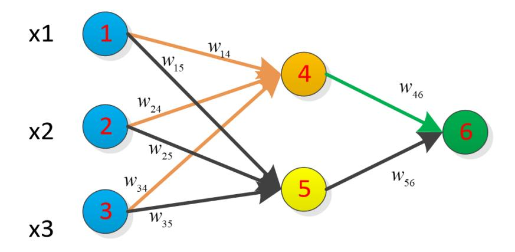

# exam

# The University of Nottingham Ningbo China

## DEPARTMENT OF ELECTRICAL AND ELECTRONIC ENGINEERING

A LEVEL 3 MODULE, 2023-2024

## **Artificial Intelligence Systems**

Time allowed: **TWO Hours**

*Candidates may complete the front cover of their answer sheet and sign their desk card but must NOT write anything else until the start of the examination period is announced.*

## *Answer all ALL questions.*

*Only silent, self-contained, non-programmable calculators with a Single-Line Display or Dual-Line Display are permitted in this examination.*

*Dictionaries are not allowed with one exception. Those whose first language is not English may use a standard translation dictionary to translate between that language and English, provided that neither language is the subject of this examination. Subject-specific translation dictionaries are not permitted.*

*No electronic devices capable of storing and retrieving text, including electronic dictionaries, may be used.*

*DO NOT turn examination paper over until instructed to do so*

## **ADDITIONAL MATERIAL:**

NONE

#### **INFORMATION FOR INVIGILATOR:**

Question papers should be collected at the end of the exam – do not allow candidates to take copies from the exam room.

- 1. There are generally three types machine learning: supervised, unsupervised learning and reinforcement learning.
  - (a) Explain the differentiating characteristics of supervised, unsupervised learning and reinforcement learning. You can organise your answers in a table.

[6 marks]

(a) Which type of learning algorithm would you use for facial recognition application? Explain your choice.

[4 marks]

- 2. Given a dataset in a two-dimensional space consisting of 10 points divided into two categories:
  - Category 1: A(1,1), B(1.5,1.5), C(3,2), D(2.5,2), E(4,4)
  - Category 2: F(3,4), G(4, 4.5), H(5,5), I(6, 5.5), J(6, 6.5)

Now, there is a new point K(3.5, 3.5). When using the K-Nearest Neighbors (KNN) algorithm for classification

(a) Calculate the Euclidean distances from point K to other points:

[5 marks]

(b) Assuming K=3, what are the three nearest neighbors of point K, what categories of K belong to?

[5 marks]

(c) Assuming K=5, what are the five nearest neighbors of point K, what categories of K belong to?

[5 marks]

3. Given the following dataset containing observed values of the independent variable (x) and the dependent variable (y):

| Table Q3 |    |  |  |  |  |  |  |  |
|----------|----|--|--|--|--|--|--|--|
| x        | y  |  |  |  |  |  |  |  |
|          |    |  |  |  |  |  |  |  |
| 2        | 3  |  |  |  |  |  |  |  |
| 4        | 5  |  |  |  |  |  |  |  |
| 5        | 7  |  |  |  |  |  |  |  |
| 6        | 8  |  |  |  |  |  |  |  |
| 8        | 11 |  |  |  |  |  |  |  |

Using the linear regression (least squares method), calculate the parameters (slope and intercept) of the linear regression model and provide the linear regression equation.

[20 marks]

4. In the context of backpropagation learning and a standard 3-2-1 three-layered network, consider a single iteration using the pattern sets presented in Table Q3. The weight (w), bias (b) and desired output (d) are shown in Table Q3.

|                | lable Q4              |                       |                        |                        |                 |                 |                 |                 |                        |                 |                       |                       |                       |                       |
|----------------|-----------------------|-----------------------|------------------------|------------------------|-----------------|-----------------|-----------------|-----------------|------------------------|-----------------|-----------------------|-----------------------|-----------------------|-----------------------|
| X 1 | <b>X</b> 2 | <b>X</b> 3 | <b>W</b> 14 | <b>W</b> 15 | W 24 | W 25 | W 34 | W 35 | <b>W</b> 46 | W 56 | <b>b</b> 4 | <b>b</b> 5 | <b>b</b> 6 | <b>d</b> 6 |
| 1              | 0                     | 1                     | 0.2                    | -0.3                   | 0.4             | 0.1             | -0.5            | 0.2             | -0.3                   | -0.2            | -0.4                  | 0.2                   | 0.1                   | 1                     |

Figure Q4

The activation function is defined as:

$$S(x) = \frac{1}{1+e^{-\lambda x}}$$
 and its derivative as  $S'(x) = \lambda S(x) (1 - S(x))$ ,

where  $\lambda = 1$ ,  $x^k$  is the input,  $\boldsymbol{d_6}$  are the desired outputs for the upper branch and lower branch respectively.

(a) Compute the forward pass values for the network of one iteration (k = 1) using the equations below:

The output of the input layer is,

$$S(x_i^k) = x_i^k$$
, i = 1,2,3

The activation for the hidden layer is,

$$z_h^k = \sum_{i=0}^3 w_{ih}^k S(x_i^k) + b_h = \sum_{i=0}^3 w_{ih}^k x_i^k + b_h, \quad h = 4.5$$

The output signal for the hidden layer is,

$$S(z_h^k) = \frac{1}{1 + e^{-\lambda z_h^k}}, \quad h = 4.5$$

The activation for the output layer is,

$$y_j^k = \sum_{h=0}^2 w_{hj}^k S(z_h^k) + b_j, \quad h = 4.5 \quad j = 6$$

The output signal for the output layer is,

$$S(y_j^k) = \frac{1}{1 + e^{-\lambda y_j^k}}, \quad j = 6$$

[12 marks]

(b)Using the results in one iteration (k=1) that obtained in part (a), employ the following equations to calculate any three of the updated weights or biases for the input to output layer. Assum learning rate  $\eta=0.9$ .

Error at the output layer:

$$e_j^k = d_j^k - S(y_j^k) \quad j = 6$$

Signal slope error product at the output layer:

$$\delta_j^k = e_j^k S(y_j^k) [1 - S(y_j^k)] \quad j = 6$$

Error at the hidden layer:

$$eH_h^k = \delta_6^k w_{h6}^k \quad h = 4,5$$

Signal slope error product at the hidden layer:

$$\delta H_h^k = e H_h^k S'(z_h^k) = e H_h^k \lambda S(z_h^k) [1 - S(z_h^k)] \quad h = 4,5$$

Hidden to output layer weights:

$$w_{hj}^{k+1} = w_{hj}^k + \eta \delta_j^k S(z_h^k) \quad j = 6 \quad h = 4,5$$

Input to hidden layer weights:

$$w_{ih}^{k+1} = w_{ih}^k + \eta \delta H_h^k x_i^k \quad i = 1, 2, 3 \quad h = 4,5$$

where k is the iteration or pattern index, i is the index for the input layer neurons, h is the index for hidden layer neurons, j is the index for the output neurons, w is the weights each layer.

[18 marks]

- 5. Consider a convolutional neural network (CNN) architecture with the following layers:
  - 1. **Input Layer**: A 64x64x3 RGB image.
  - 2. **Convolutional Layer 1**:
    - o 16 filters of size 5x5x3
    - o Stride of 2
    - o Padding of 1
    - o ReLU activation function
  - 3. **Max Pooling Layer 1**:
    - o Pooling window size of 3x3
    - o Stride of 2
    - o No padding
  - 4. **Convolutional Layer 2**:
    - o 32 filters of size 3x3x16
    - o Stride of 1
    - o Padding of 1
    - o ReLU activation function
  - 5. **Max Pooling Layer 2**:
    - o Pooling window size of 2x2
    - o Stride of 2
    - o No padding
  - 6. **Flatten Layer**: Flattens the output from the previous layer into a one-dimensional vector.
  - 7. **Fully Connected Layer**:
    - o 256 neurons
    - o ReLU activation function
  - 8. **Output Layer**:
    - o 10 neurons for a 10-class classification problem
    - o Softmax activation function

Calculate the following, Provide the calculation process and results for each step:

(a) The size of the output feature map after Convolutional Layer 1.

[5 marks]

(b) The size of the output feature map after Max Pooling Layer 1.

[5 marks]

(c) The size of the output feature map after Convolutional Layer 2.

[5 marks]

(d) The size of the output feature map after Max Pooling Layer 2.

[5 marks]

(e) The total number of parameters (weights and biases) in the entire CNN architecture.

[5 marks]

**END**