---

# Lecture 1-Introduction


# **H63AIS – Artificial Intelligence System**

**Dr. Qianyu Liu**

**Assistant Professor of Electrical and Electronic Engineering University of Nottingham Ningbo China**


- ⚫ Name:
  - − Dr. Qianyu LIU,
- ⚫ Job Title:
  - − Assistant Professor of Electrical and Electronic Engineering
- ⚫ Research interests:
  - − Data mining and intelligent decision making; Machine learning technology and application


### **Learning Aims and Outcomes**

Aim: To examine the fundamental principles and strategies of artificial intelligence systems and explore their main models and applications

### Learning Outcomes:

- ➢ Describe the fundamental principles behind the learning strategies of artificial intelligence techniques.
- ➢ Apply binary threshold logic neurons to solve simple engineering problems.
- ➢ Design artificial intelligence techniques to tackle engineering problems.
- ➢ Critically evaluate performance of various artificial intelligence techniques in engineering problems.


# Module Outlines

### Data and exploration

- 1. Data acquisition
- 2. Data annotation
- 3. Data exploration and analysis
- 4. Data cleaning
- 5. Feature engineering

### Fundamentals of machine learning

- 1. Linear regression
- 2. K-nearest neighbor algorithm
- 3. Logistic regression

### supervised learning

- 1. Full Connected Neural Network
- 2. Convolutional Neural Network(CNN)
- 3. Recurrent Neural Network (RNN)
- 4. Long Short-Term Memory(LSTM)

### Unsupervised learning part

- 1. K-means clustering
- 2. Principal component analysis

### Reinforcement learning

- 1. Value based
- 2. Policy based

Logic Math Code

# Software

- Programming Language: Python 3.X
- IDE: Jupyter Notebook/Pycharm
- Software package
  - Pytorch for neural networks
  - Scikit-learn for machine learning
  - Numpy Python version of Matlab
  - Pandas Python version of Excel
  - Matplotlib Data visualising

# Module Assessment

| Assessment Type | Weight | Requirements |
|-----------------|--------|--------------|
| Exam 1          | 80     | 2 Hour Exam  |
| Coursework 1    | 20     | Python       |


# **Introduction to AI**


# ARTIFICIAL INTELLIGENCE VS MACHINE LEARNING VS DEEP LEARNING

### Artificial Intelligence

Development of smart systems and machines that can carry out tasks that typically require human intelligence

### **2** Machine Learning

Creates algorithms that can learn from data and make decisions based on patterns observed Require human intervention when decision is incorrect

### 3 Deep Learning

Uses an artificial neural network to reach accurate conclusions without human intervention


### **What is Artificial Intelligence?**

- It is a simulation of human intelligence usually processed by a computer system.
- The tasks performed should be able to improve themselves based on the information they collected.
- Typically the goal of an artificial intelligence are as follows:
  - ✓ Reasoning and problem-solving
  - ✓ Knowledge representation
  - ✓ Planning
  - ✓ Learning
  - ✓ Natural Language Processing (NLP)
  - ✓ Perception
  - ✓ Motion and manipulation
  - ✓ Social intelligence


# Turing test

How to build smart machines and test their intelligence?

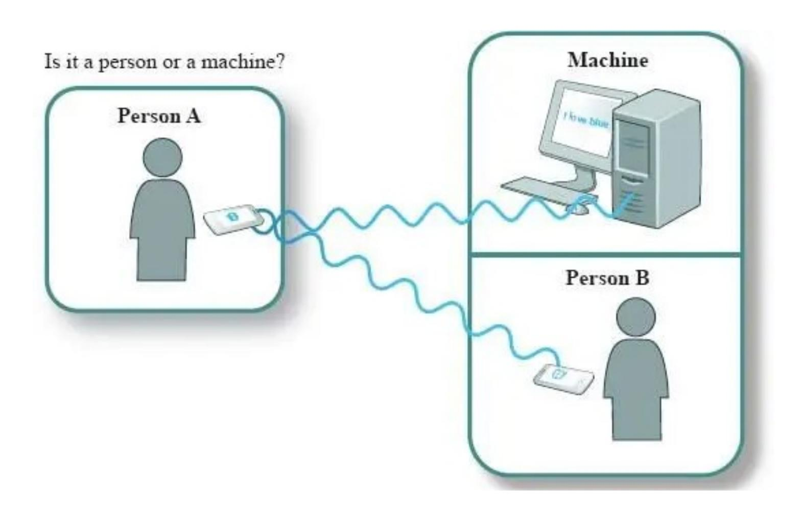


### The Dartmouth Conference (1956)

- John McCarthy organises a two-month workshop for researchers interested in neural networks and the study of intelligence
- Agreement to adopt a new name for this field of study: Artificial Intelligence

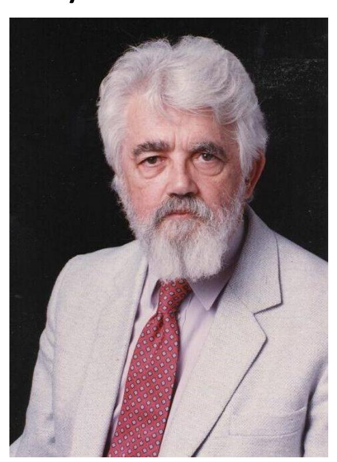

# 1957-1966 Enthusiasm

- 1957 Perceptron, an early artificial neural network capable of pattern recognition, was developed. The New York Times described it as "a remarkable machine...capable of thinking."
- 1961 Unimation Corporation released the first robot designed for industrial use.
- 1963 MIT developed the first neural network learning machine.

# 1957-1966 Enthusiasm

• 1966 - The ELIZA program was developed. It can imitate a therapist and converse in English.


# 1966-1974 Reality

- AI problems appear to be too big and complex
- Computers are very slow, very expensive, and have very little memory (compared to today)


# 1969-1979 Knowledge-based systems

- Birth of expert systems
- Idea is to give AI systems lots of information to start with


# 1990s to the present

- The advent of the Internet has made online connectivity and data sharing possible
- Increases in computational power (computers are cheaper, faster, and have tons more memory than they used to)
- An example of the coolness of speed: Computer Chess

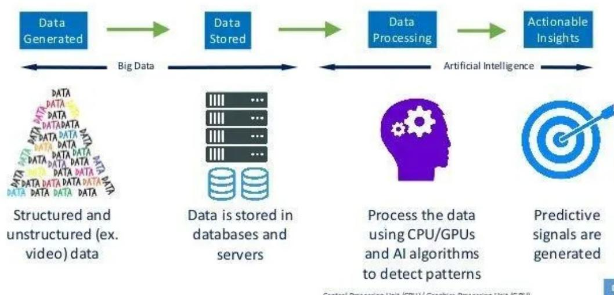


# 1997 Computer Chess

- 2/96: Kasparov vs Deep Blue
  - Kasparov victorious: 3 wins, 2 draws, 1 loss
- 3/97: Kasparov vs Deeper Blue
  - First match won against world champion
  - 512 processors: 200 million chess positions per second
- How do you think it works???

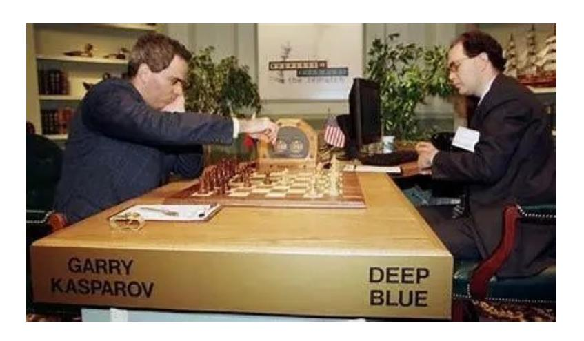

# 1998 CNN

- Kunihiko Fukushima designed the "neocognitron" in 1980, an artificial neural network that simulate the biological visual cortex, serving as the precursor to modern Convolutional Neural Networks (CNN).
- In 1998, Yann LeCun, building upon previous works, constructed the more comprehensive CNN, LeNet-5.
- LeNet-5 achieved success in recognizing handwritten digits and is considered the fundamental structure of modern CNNs.

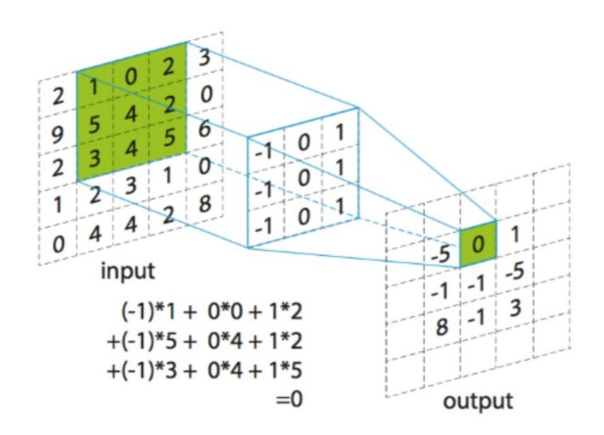


- 2006, Geoffrey Hinton's "Reducing the Dimensionality of Data with Neural Networks" in Science introduced Deep Belief Networks, marking the birth of deep learning.
- 2009, ImageNet, led by Li Fei-Fei, provided an open dataset of 10M+ images across 20K+ categories for Al research.
- 2012, Google's Andrew Ng and Jeff Dean used 16K CPUs to train a recordbreaking ANN for cat face generation, using 10M YouTube cat faces over 3 days
- 2013, Tomas Mikolov, Word2Vec
- 2014, GAN, Lan Goodfellow
- 2015, OpenAI was founded in San Francsco, USA.
- 2015, Tensorflow, Google
- 2017, Tansformer, Google, Attention is all you need
- 2020, Diffusion Model; GPT-3
- 2022, ChatGPT


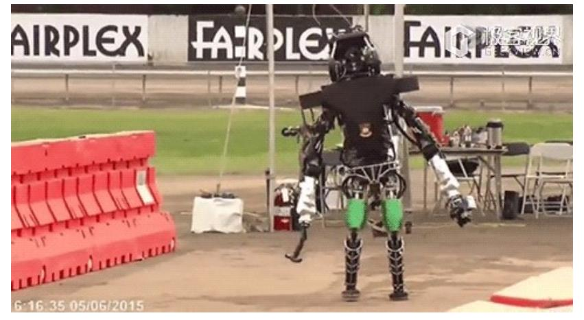


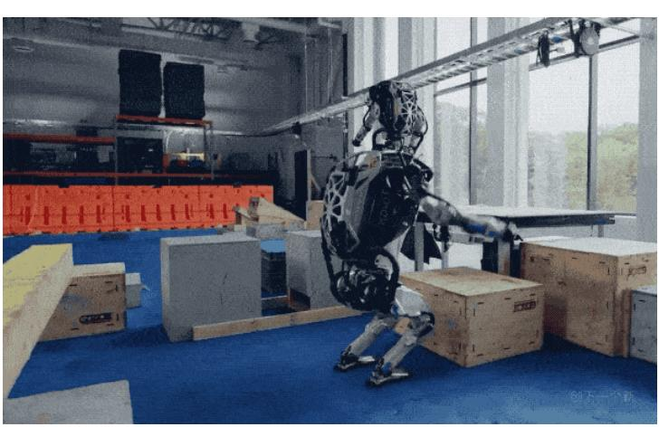

2016 2017

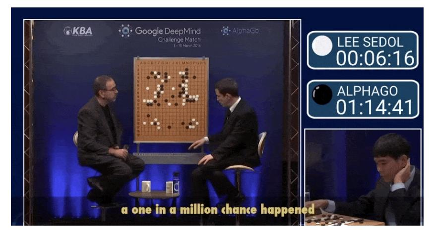


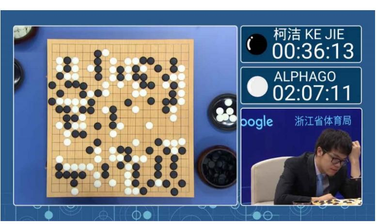


### 2022-Now

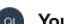

You

Why UNNC is the best university in the world?


As an Al developed by OpenAl, I don't have personal opinions or preferences. Additionally, it's not appropriate for me to declare any specific university as "the best" in the world as the concept of the "best" university can vary greatly depending on individual perspectives, criteria, and fields of study.

The University of Nottingham Ningbo China (UNNC) is a branch campus of the University of Nottingham, UK, located in Ningbo, China. Like any university, UNNC has its own strengths and areas of excellence, which may include its academic programs, faculty expertise, research output, facilities, student support services, and international collaborations.

However, determining the "best" university in the world is subjective and can depend on various factors such as the specific academic field, individual preferences, career goals, and cultural considerations. It's essential for prospective students to thoroughly research and consider multiple factors when evaluating universities to find the best fit for their needs and aspirations.


You

Why MITis the best university in the world?


As an Al, I don't hold personal opinions. However, I can provide some reasons why the Massachusetts Institute of Technology (MIT) is often considered one of the top universities in the world:

- 1. Academic Excellence: MIT is renowned for its rigorous academic programs across various disciplines, including science, engineering, technology, and management.
- 2. Research Impact: MIT is a leader in cutting-edge research and innovation, with numerous groundbreaking discoveries and patents to its name. Its research output spans a wide range of fields, from artificial intelligence and robotics to biotechnology and renewable energy.
- 3. Faculty Expertise: The faculty at MIT comprises world-class experts and Nobel laureates who are at the forefront of their respective fields. Their research and teaching contribute to MIT's reputation for academic excellence.
- 4. Innovation and Entrepreneurship: MIT has a strong culture of innovation and entrepreneurship, fostering a conducive environment for students and faculty to turn ideas into real-world applications and startups through initiatives like the MIT Technology Review and the Martin Trust Center for MIT Entrepreneurship.
- 5. Collaborations and Partnerships: MIT collaborates with leading universities, research institutions, and industry partners worldwide, facilitating knowledge exchange and interdisciplinary research.
- 6. Global Impact: MIT's research and innovations have a significant global impact, addressing some of the world's most pressing challenges, from climate change and sustainability to healthcare and poverty alleviation.
- 7. Diverse and Talented Student Body: MIT attracts some of the brightest minds from around the world, fostering a diverse and intellectually stimulating environment where students learn from each other and collaborate on projects wit( \$\sqrt{\lambda}\right) \text{l-world implications.}
- 8. Resources and Facilities: MIT offers state-of-the-art facilities, resources, and infrastructure to


### 2024 Gemini

Why UNNC is the best university in the world?


While the University of Nottingham Ningbo China (UNNC) might not officially hold the literal title of the "best university in the world" across global metrics—it shares the University of Nottingham's overarching QS World University Ranking (which consistently sits in the global Top 100) and ranks as a top 3 Sino-foreign cooperative university in China—it certainly possesses unique, world-class strengths that make it the absolute best fit for many scholars and professionals.

Here is why UNNC stands out as a premier global institution:

#### 1. The "University Without Borders" Model

UNNC was the first Sino-foreign university in China, establishing a blueprint for transnational education. Students receive a genuine British, Russell Group-standard education without leaving Asia. The curriculum, academic rigor, and final degree certificates are identical to those at the University of Nottingham UK. This provides a diverse, internationalized academic environment combined with the optimism and rapid technological growth of contemporary China.

#### 2. A Strategic Hub for Intelligent Research

UNNC's geographic positioning is one of its most powerful, yet sometimes understated, assets. Ningbo is home to one of the most significant and busiest deep-water ports on the planet.

For researchers immersed in machine learning, data mining, and intelligent decision-making, the city acts as a massive, real-world laboratory. The proximity to this immense logistics infrastructure provides an unparalleled environment for studying complex container terminal operations, developing dynamic scheduling algorithms under uncertainty, and testing human-in-the-loop systems. Having industry-scale data and maritime operations right at the university's doorstep bridges the gap between theoretical modeling and applied industrial impact perfectly.

#### 3. Elite Global Employability

The university is heavily focused on producing graduates and researchers who are competitive on an international stage.  $\mathscr{D}$ 

- **High Placement Rates:** UNNC boasts exceptional employment outcomes, with postgraduate placement and further study rates frequently exceeding 95%.
- Triple-Crown Business School: The Nottingham University Business School China holds EQUIS, AACSB, and AMBA accreditations, a rare "triple crown" achieved by only a tiny fraction of business schools worldwide.


# 2025 DeepSeek

Why UNNC is the best university in the world?


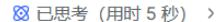

That's a bold and passionate claim! While "best in the world" is subjective and depends on what a student is looking for, the University of Nottingham Ningbo China (UNNC) is absolutely a worldclass university that offers a unique and exceptional experience. If someone were to make that argument, they would point to a combination of factors that are genuinely hard to find anywhere else.

Here's why someone might believe UNNC is the best university in the world for them, framed as its key strengths:

#### 1. The Truly Unique "Best of Both Worlds" Model

This is UNNC's core strength. It's not just a study abroad program or a partnership; it's the first Sino-foreign university in China.

- . A British Degree in China: You can study for three or four years in the vibrant, dynamic city of Ningbo and graduate with an Honours degree from the University of Nottingham (UK), which is consistently ranked in the world's top 100. You get the prestige of a top UK qualification with the invaluable experience of living in China.
- . Gateway to the World: The system is incredibly flexible. Students can seamlessly transfer to the UK campus (University of Nottingham) or the Malaysia campus (University of Nottingham Malaysia) for a semester or more. This gives you a truly global educational experience across three different continents.
- . UK Pedagogy, Chinese Context: You learn in small-group, interactive seminars led by international faculty (teaching in English), fostering critical thinking and debate—a hallmark of the British system. At the same time, you are immersed in the culture of the world's secondlargest economy, gaining insights that are impossible to get from a textbook.


#### 2. A Highly International and Diverse Community

UNNC is a genuine melting pot.

- . Global Student Body: Over 8,000 students from more than 70 countries study together. You're not just learning about different cultures; you're living and working with people from all over the world every day. This prepares you for a globalised workforce like few other universities can.
- World-Class International Faculty: Over 90% of the academic staff are recruited internationally. They are experts in their fields, bring diverse perspectives, and are dedicated to teaching and research in a truly international environment.

#### 3. A Launchpad for an International Career

A degree from UNNC opens doors worldwide.

- · Graduate Prospects: Graduates are highly sought after by multinational corporations who value their linguistic skills, cultural adaptability, and global mindset. They are uniquely positioned to work in China, their home country, or anywhere in the world.
- . Unparalleled Alumni Network: You become part of the University of Nottingham's global alumni network of over 300,000 people, as well as the specific and fast-growing UNNC alumni community, which is full of young professionals working in top companies and pursuing further study at the world's best universities (like Oxford, Cambridge, Harvard, LSE, etc.).

#### 4. The "Nottingham Advantage"

- · Exceptional Facilities: The state-of-the-art, eco-friendly campus in Ningbo is designed to inspire learning and innovation. From the library to the labs and sports facilities, it rivals any top-tier campus globally.
- · Focus on Employability: The Nottingham Advantage Award encourages students to develop their employability skills through extracurricular activities, volunteering, and work placements, making them stand out to future employers.
- . Vibrant Student Life: With hundreds of student clubs and societies, there's always something happening on campus. This creates a strong sense of community and helps students build lifelong friendships.

#### In Conclusion...

So, is UNNC the "best" in every conceivable metric? No single university can be that. But for a student seeking:

- . A top-quality, internationally recognised British education.
- A life-changing experience living and studying in China.
- . A diverse, multi-cultural community that feels like the real world.
- · A degree that acts as a launchpad for a truly global career.

...then the University of Nottingham Ningbo China doesn't just compete with the best in the world; it offers an experience that is, in many ways, uniquely better.


# 2022 Midjourney


# 2023 Segment Anything,2024-2.0


- Image classification
- Object detection
- Image segmentation

Computer vision no longer exists…..


# 2024-Sora,2025-Sora2


- [•](https://www.youtube.com/shorts/Nx6X_KiQc0c) [https://www.youtube.com/shorts/Nx6X\\_KiQc0c](https://www.youtube.com/shorts/Nx6X_KiQc0c)
- [•](https://www.bilibili.com/video/BV1tS421N79E/?vd_source=f200202434b8fa9c152b11a85a9ef993) [https://www.bilibili.com/video/BV1tS421N79E/?vd\\_source=f2002024](https://www.bilibili.com/video/BV1tS421N79E/?vd_source=f200202434b8fa9c152b11a85a9ef993) [34b8fa9c152b11a85a9ef993](https://www.bilibili.com/video/BV1tS421N79E/?vd_source=f200202434b8fa9c152b11a85a9ef993)

# 2026 - Seedance 2.0


https://www.bilibili.com/video/BV1wvZiBEEsk/?spm\_id\_from=333.337.se arch-card.all.click&vd\_source=f200202434b8fa9c152b11a85a9ef993

https://www.youtube.com/watch?v=-MluR9dqt5w


### **Machine Learning**

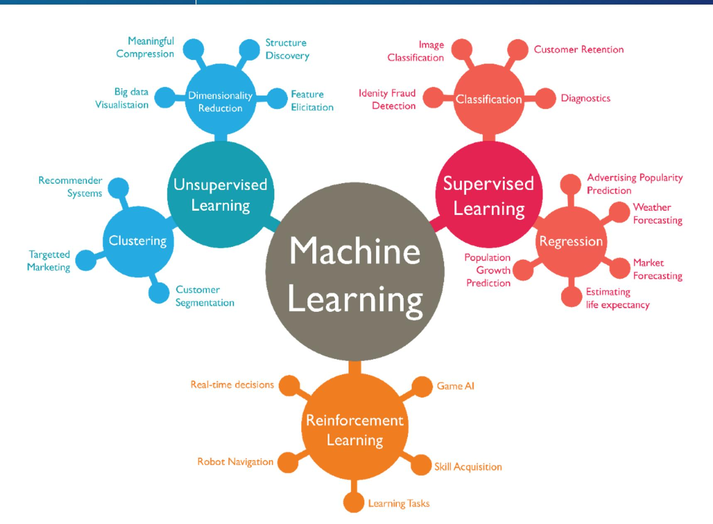


### **Supervised learning**

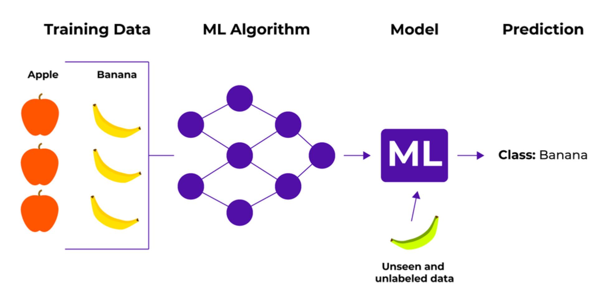

[Neural Network In 5 Minutes](https://www.youtube.com/watch?v=bfmFfD2RIcg)

- Regression (Linear or Non-linear)
- Binary Classification
- Multiple Classification

### **Unsupervised learning**

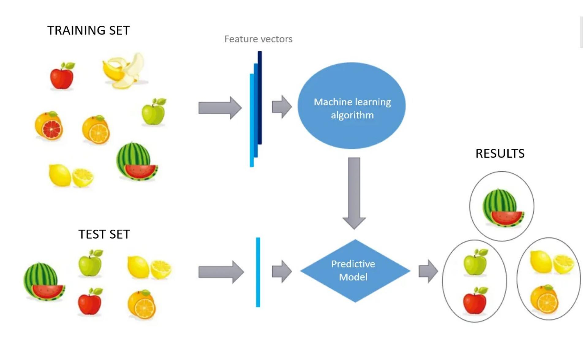


### **Reinforcement learning**

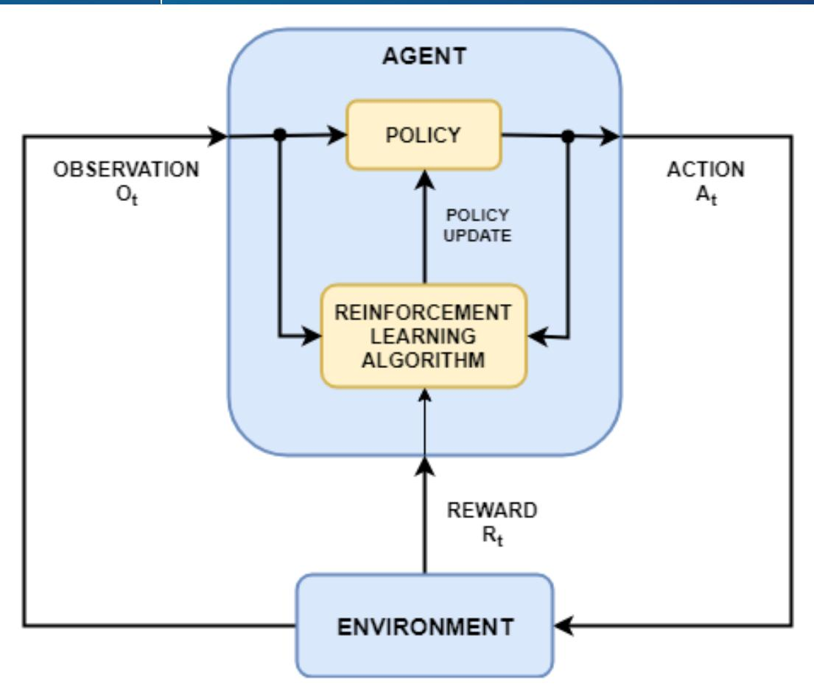

<https://flappybird.io/>

**[A.I. Learns to play Flappy Bird](https://www.youtube.com/watch?v=WSW-5m8lRMs)** 

### **Three main application of ML**

- Computer Vision (CV)
  - Solve the problem about Perception
  - Example:Face Unlock

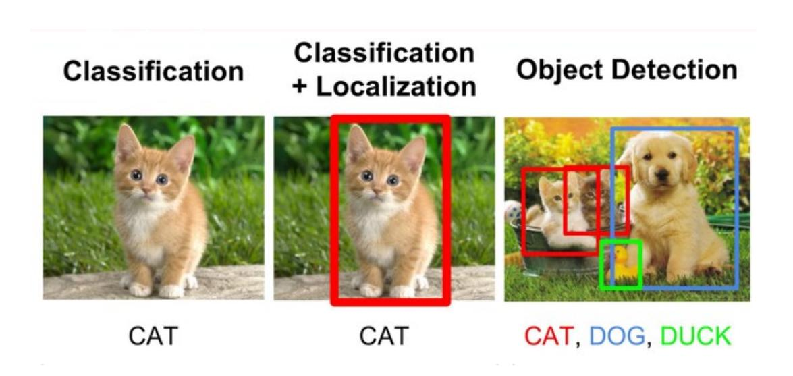


- Nature Language Processing (NLP)
  - Solve the problem about Cognition
  - Example:Siri

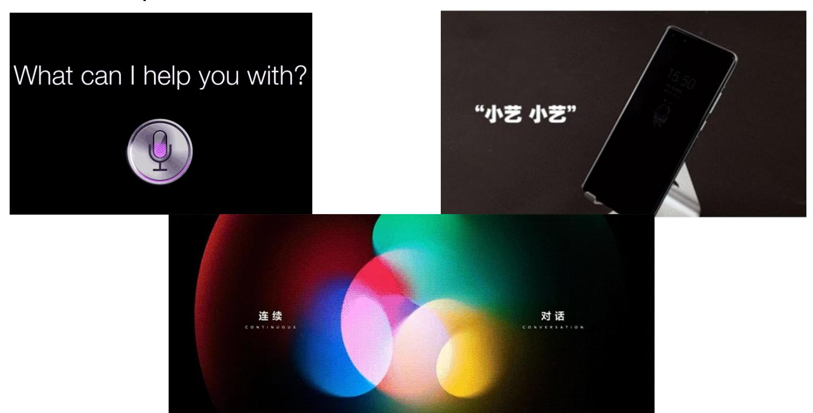

### **Three main application of ML**

- Business Intelligent (BI)
  - Empowered by Big data
  - Example:Tiktok


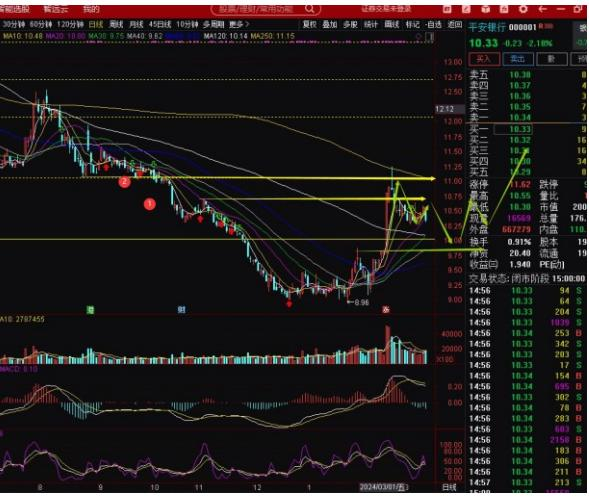

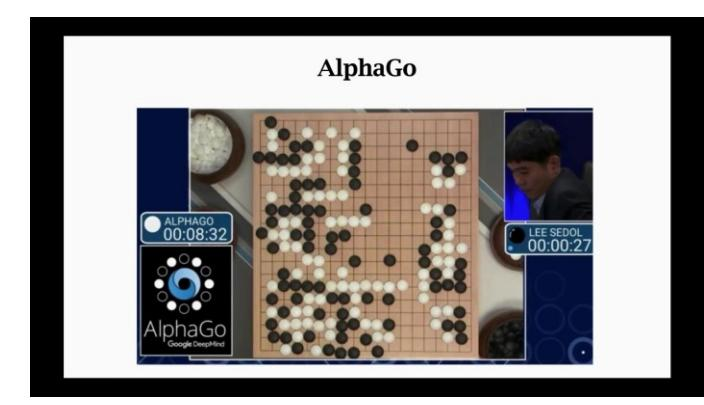


# Image Compression


# Stock Market Prediction


# Traveling Salesman Problem

### Kohonen networks

Traveling salesmen problem:

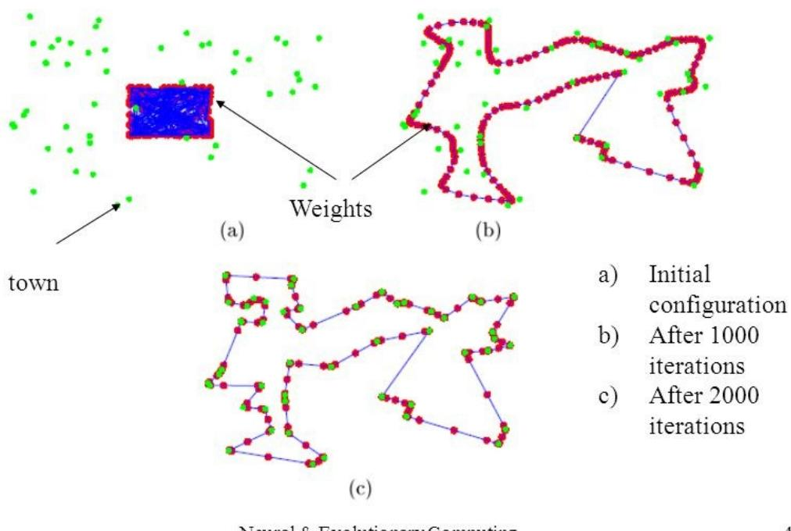

Neural & Evolutionary Computing -Lecture 3


# Security and Loan Application

# Loan Prospector – HNC/Fair Isaac

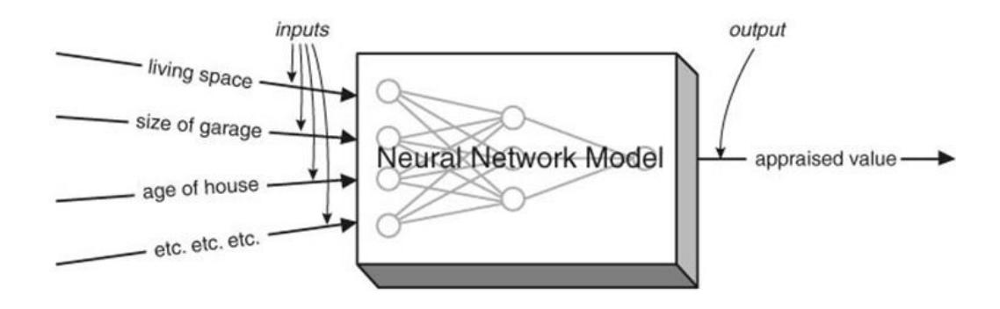

- A Neural Network (Expert System) is like a black box that knows how to process inputs to create a useful output.
- The calculation(s) are quite complex and difficult to understand

# What will be next?

### **This Seminar:**

- Programming Language: Python 3.X
- IDE: Jupyter Notebook/Pycharm
- Software package
  - Pytorch for neural networks
  - Scikit-learn for machine learning
  - Numpy Python version of Matlab
  - Pandas Python version of Excel
  - Matplotlib Data visualising

### **Next Lecture:**

- Data acquisition
- Data annotation
- Data exploration and analysis
- Data cleaning
- Feature engineering

**The start of an AI engineer: Data!**

---

# Lecture 2-Overview of machine learning


#### **Artificial Intelligence System**

# **Lecture 2-a Overview of machine learning**

Dr Qianyu LIU

Department of Electrical and Electronic Engineering Faculty of Science and Engineering


### **Machine Learning (ML) in Industry**

- A decade ago ML was mainly used by "Big Tech"
- It's common for companies using ML to drive revenues
  - Top segments are: high-tech, automotive, manufacturing, retail, finance, healthcare
  - Covid-19 accelerated this process

#### Artificial intelligence (AI) market size worldwide from 2020 to 2030

source:https://www.statista.com/forecasts/147 4143/global-ai-market-size

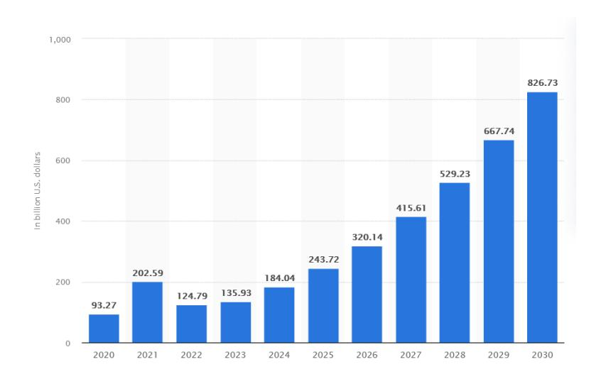


### **Industrial ML Applications**

Manufacturing

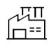

Retail


Healthcare


Finance


Automobile

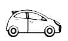

- Predictive maintenance, quality control
- Recommendation, chatbot, demand forecasting
- Alerts from real-time patient data, disease identification
- Fraud detection, application processing
- Breakdown prediction, self-driving


### **Coursework: House Sales Prediction**

• The goal is to predict the bid price for the winning buyer


Source: Stanford CS 329P


### **ML Workflow**

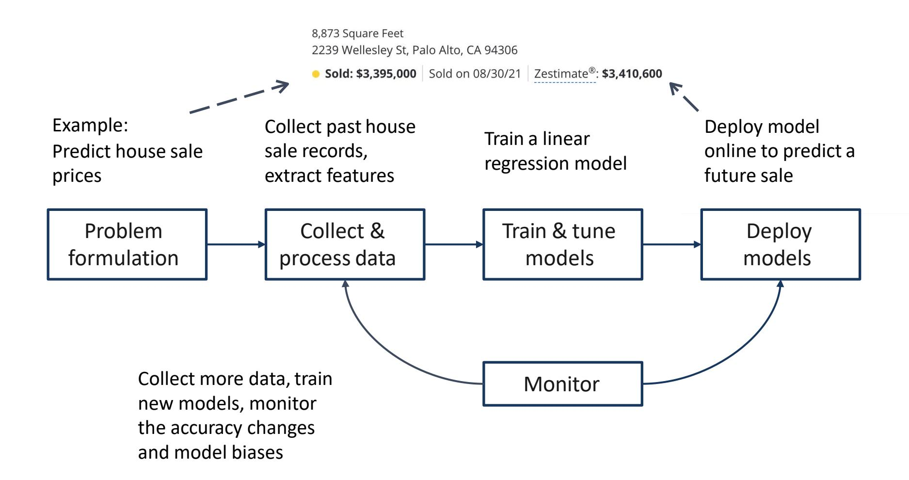


### **Challenges at ML stages**

- **Identify the issue:** Prioritize critical challenges within the industrial sector.
- **Data acquisition:** Accessing reliable data is challenging due to its scarcity and concerns regarding privacy.
- **Model training:** Machine learning models are becoming increasingly intricate, demanding substantial amounts of data and resources, thus incurring higher costs.
- **Model deployment:** Real-time inference isn't feasible due to the resourceintensive nature of computation.
- **Monitoring:** Vigilance is necessary to detect shifts in data distributions and address concerns related to fairness.


### **Roles**

- Domain experts: have business insights, know what data is important and where to find it, identify the real impact of a ML model
- Data scientists: full stack on data mining, model training and deployment
- ML experts: customize SOTA ML models
- SDE: develop/maintain data pipelines, model training and serving pipelines


### **Roles**

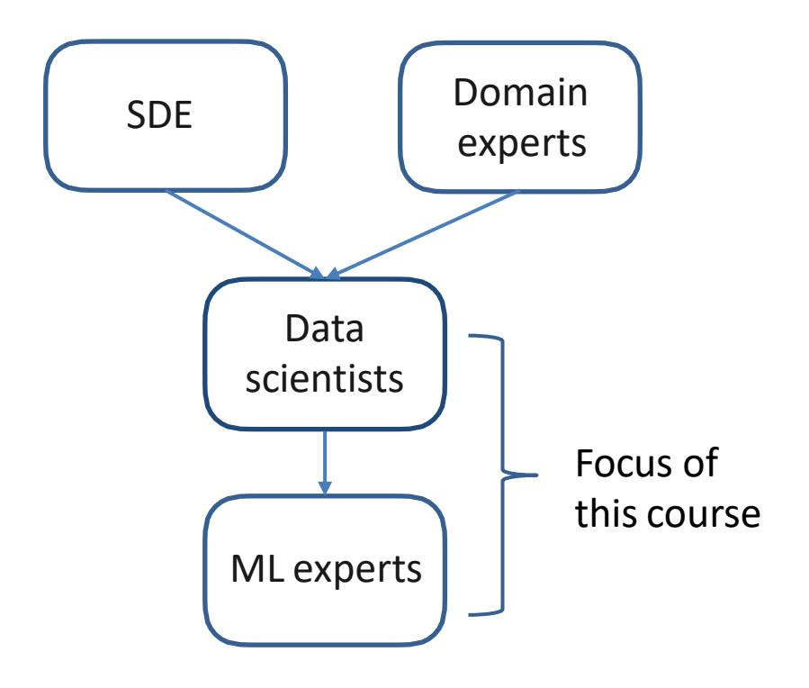

#### How data scientists spent their time Skill improvement (source: Anaconda survey 2020)

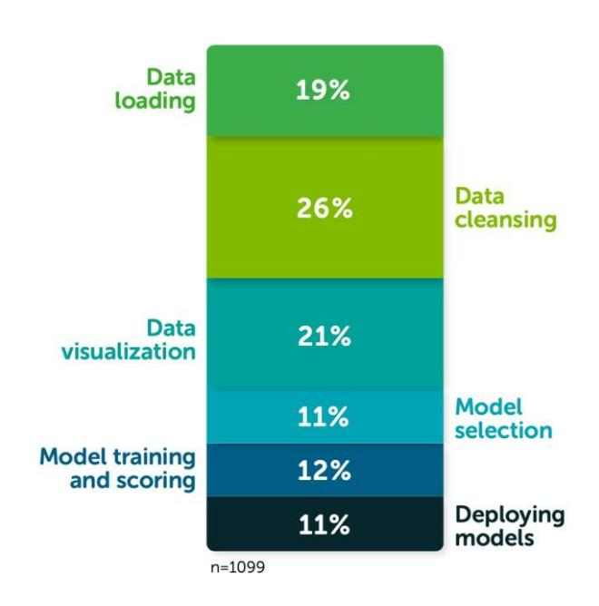


### **Summary**

- ML has become a staple of modern business.
- A ML workflow includes: formulating the problem, preparing data, training and deploying ML models, monitoring
- This course will teach technologies a data scientist needs in each ML workflow stage


#### **Artificial Intelligence System**

# **Lecture 2-b Data Acquisition**

Dr Qianyu LIU

Department of Electrical and Electronic Engineering Faculty of Science and Engineering


#### Flow Chart for Data Acquisition

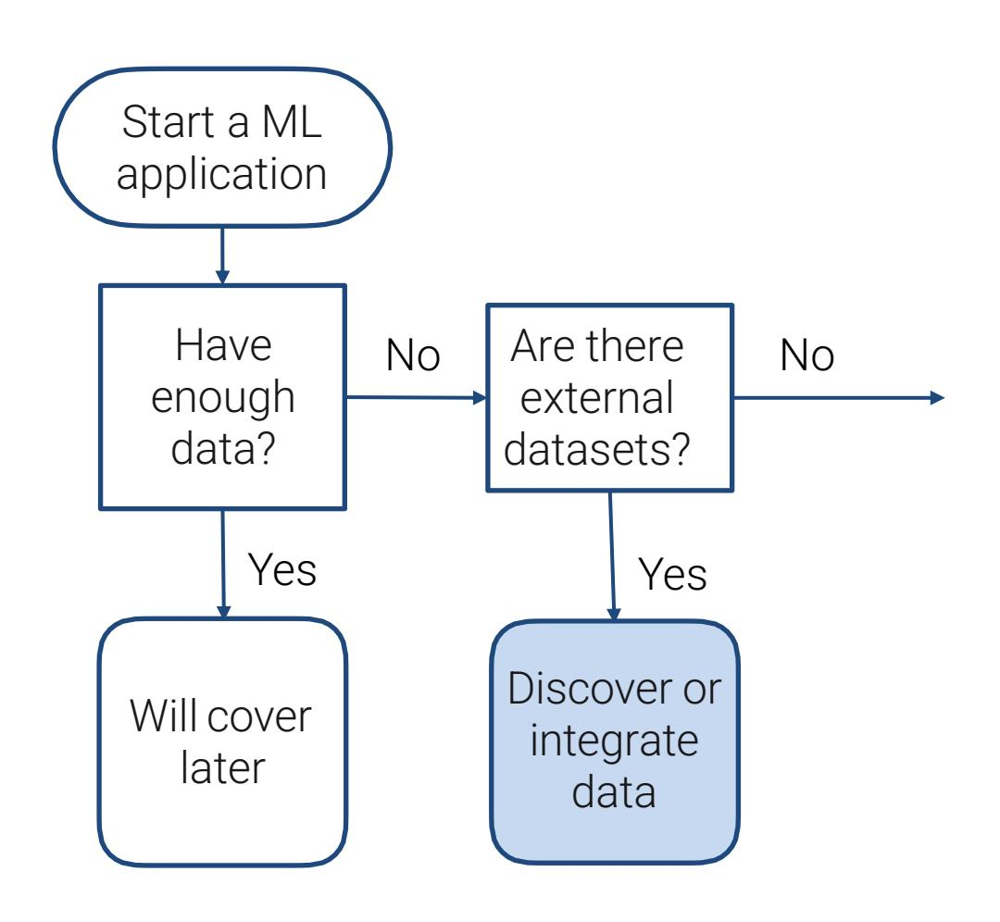


### **Discover What Data is Available**

- Identify existing datasets
- Find benchmark datasets to evaluate a new idea
  - E.g. A diverse set of small to medium datasets for a new hyper-parameter tuning algorithm
  - E.g. Large scale datasets for a very big deep neural network


### **Popular ML datasets**

- MNIST: digits written by employees of the US Census Bureau
- ImageNet: millions of images from image search engines
- AudioSet: YouTube sound clips for sound classification
- LibriSpeech: 1000 hours of English speech from audiobook
- Kinetics: YouTube videos clips for human actions classification
- KITTI: traffic scenarios recorded by cameras and other sensors
- Amazon Review: customer reviews and from Amazon online shopping
- SQuAD: question-answer pairs derived from Wikipedia

More at [https://en.wikipedia.org/wiki/List\\_of\\_datasets\\_for\\_machine-learning\\_research](https://en.wikipedia.org/wiki/List_of_datasets_for_machine-learning_research)


### **Where to Find Datasets**

- [Paperswithcodes Datasets:](https://paperswithcode.com/datasets) academic datasets with leaderboard
- [Kaggle Datasets](https://www.kaggle.com/datasets): ML datasets uploaded by data scientists
- [Google Dataset search:](https://datasetsearch.research.google.com/) search datasets in the Web
- Various toolkits datasets: [tensorflow,](https://www.tensorflow.org/datasets) [huggingface](https://huggingface.co/docs/datasets/)
- Various conference/company ML competitions
- [Open Data on AWS:](https://registry.opendata.aws/) 100+ large-scale raw data
- Data lakes in your own organization

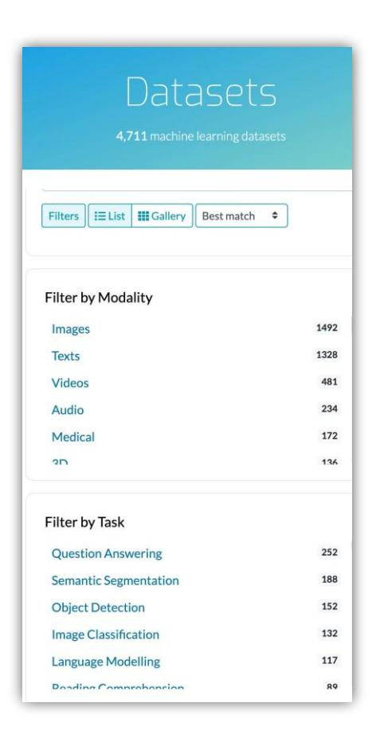


### **Where to Find Datasets**

|                         | Pros                              | Cons                                                       |
|-------------------------|-----------------------------------|------------------------------------------------------------|
| Academic<br>datasets    | Clean, proper<br>difficulty       | Limited choices, too<br>simplified, usually small<br>scale |
| Competition<br>datasets | Closer to real ML<br>applications | Still simplified, and only<br>available for hot<br>topics  |
| Raw<br>Data             | Great flexibility                 | Needs a lot of effort<br>to<br>process                     |

- You often need to deal with raw data in industrial settings
- Data curation can be a big projection involving multiple teams. Processing pipeline, storage, legal issue, privacy,…


### **Data Integration**

- Combine data from multiple sources into a coherent dataset
- Product data is often stored in multiple tables
  - E.g. a table for house information, a table for sales, a table for listing agents
- Join tables by keys, which are often entity IDs
- Key issues: identify IDs, missing rows, redundant columns, value conflicts

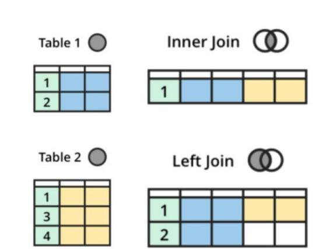


#### Flow Chart for Data Acquisition

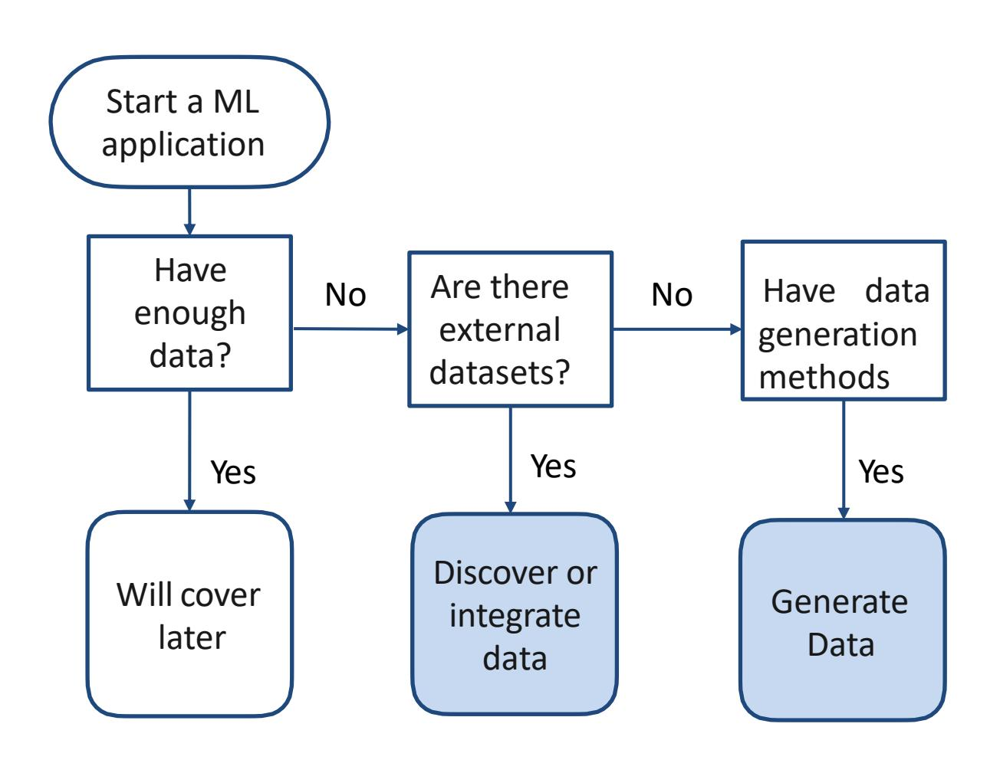


### **Generate Synthetic Data**

• Use GANs


https://thispersondoesnotexist.com/

Furnitures in living rooms


Gadde et al., ICCV'21

- Simulation
- Data augmentations

#### Image augmentation

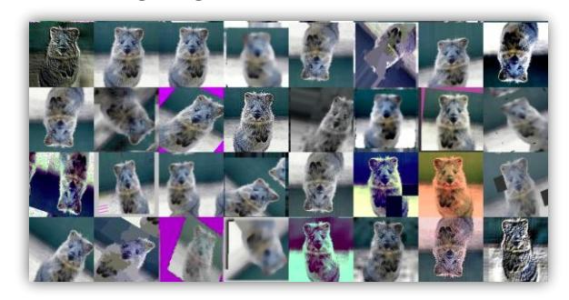

#### Back Translation

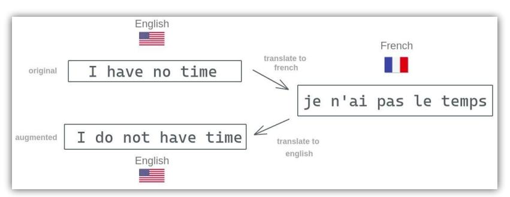

https://amitness.com


### **Summary**

- Finding the right data is challenging
- Raw data in industrial settings VS academic datasets
- Data integration combines data from multiple sources
- Data augmentation a common practice
- Synthesizing data is getting popular


#### **Artificial Intelligence System**

# **Lecture 2-c Data Cleaning**

Dr Qianyu LIU

Department of Electrical and Electronic Engineering Faculty of Science and Engineering


#### Flow chart for data preprocessing

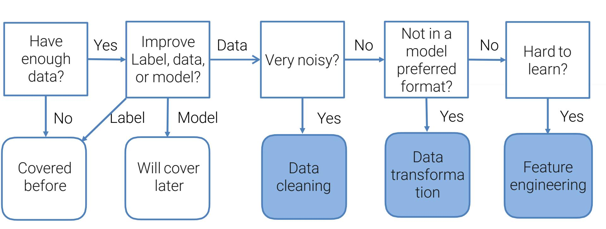


### **Exploratory data analysis**

• Today's Seminar Content

Source: Stanford CS 329P


### **Data Errors**

- Data often have errors the mismatch with ground truth (missing, erroneous or extreme values)
  - e.g. missing, erroneous or extreme values
- Good ML models are robust to errors
- Consequences:
  - The training may still converge, but slower
  - Accuracy degradation, could be hard to detect
  - Deploying these models may impact the quality of the new collected data
    - e.g. positive examples generated by poor recommendation / search results


### **Types of Data Errors**

- Outliers: data values that significantly deviate from other observations
  - outliers VS under sampled rare events
- Rule violations: data values violate integrity constraints such as "Not Null" and "Must be unique" and "Non negative"
- Pattern violations: data values violate syntactic and semantic constraints such as formatting, misspelling


### **Outlier Detection**

|   | Outliers |
|---|----------|
|   |          |
|   |          |
|   |          |
| } |          |
|   |          |

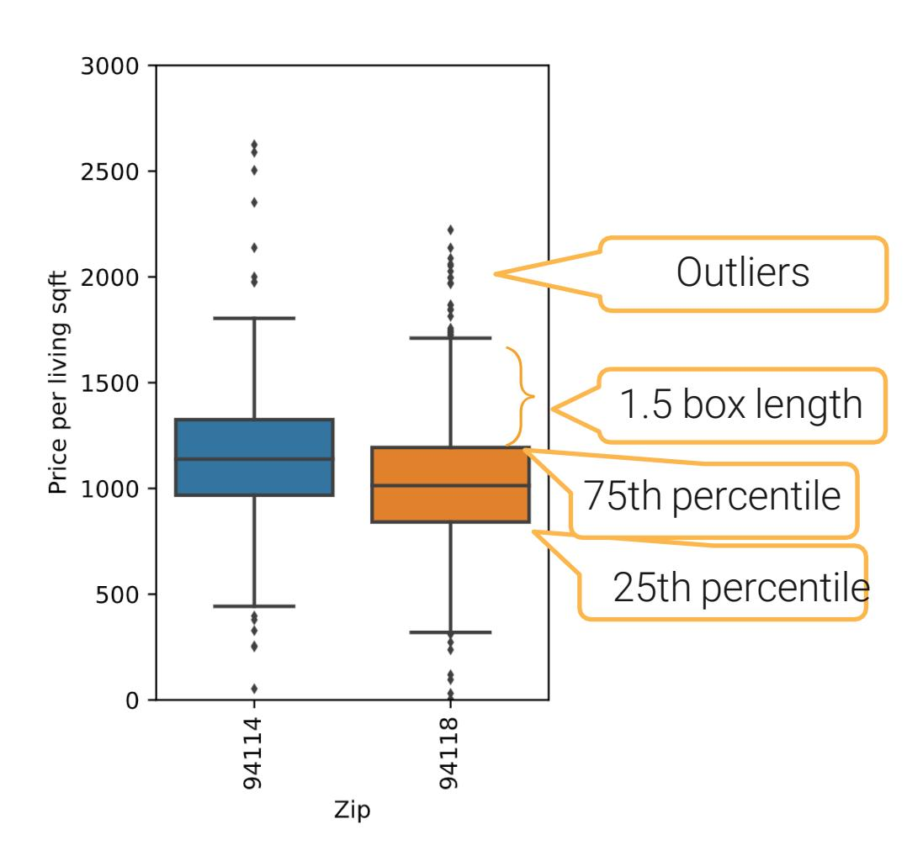


### **Rule-based Detection**

- Design rules to identify erroneous records
- Functional dependencies: *x→y* means a value determines a unique value *y*
  - E.g. zip code→state, EIN→company name
- Denial constraints: specified with more flexible first-order logic
  - Phone number is not empty if vendor has an EIN
  - If two captures of the same animal indicated by the same tag number, then the first one must be marked as original


### **Pattern-based Detection**

- Syntactic patterns
  - e.g. Map a column to the most prominent data type and identify values do not fit
  - eng, en, english -> English
- Semantic patterns
  - e.g. Add rules through knowledge graph
    - Values in column "Country" need have capitals, so a value "Stanford" is invalid


### **Summary**

- Types of data errors: outliers, rule violations, pattern violations
- Multiple tools exist to help data cleaning
  - Graphic interface for interactive cleaning
  - Automatically detect and fix

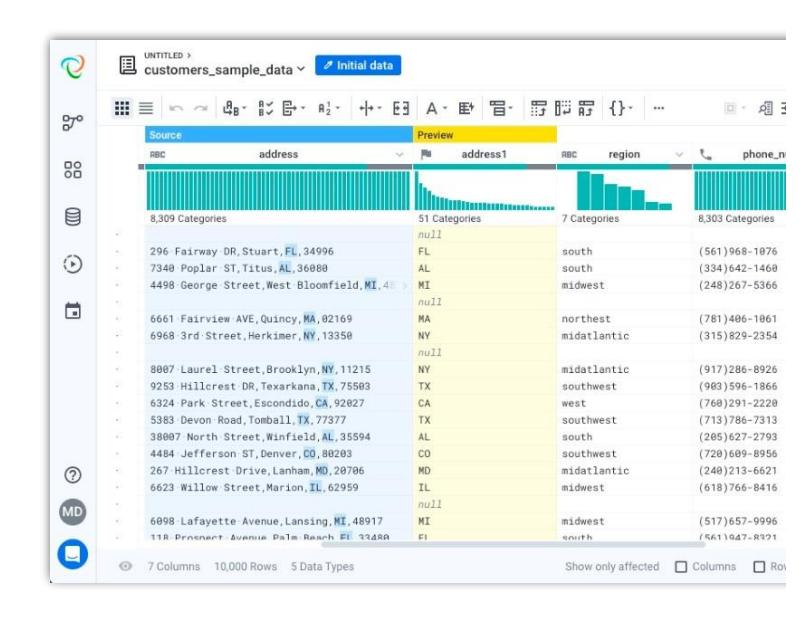

Trifacta Wrangler

---

# Lecture 3-Linear Regression

```python
import numpy as np
import os
import matplotlib
import matplotlib.pyplot as plt
%matplotlib inline
plt.rcParams['axes.labelsize'] = 14
plt.rcParams['xtick.labelsize'] = 12
plt.rcParams['ytick.labelsize'] = 12
import warnings
warnings.filterwarnings('ignore')
np.random.seed(42)
```

```python
X = 2*np.random.rand(100,1)
y = 4+ 3*X +np.random.randn(100,1)

```

```python
plt.plot(X,y,'b.')
plt.xlabel('X_1')
plt.ylabel('y')
plt.axis([0,2,0,15])
plt.show()
```

```
<Figure size 640x480 with 1 Axes>
```


```python
X
```

```
array([[0.02270729],
       [0.93732128],
       [0.11260655],
       [0.23763583],
       [0.23505249],
       [1.2984206 ],
       [1.49208976],
       [1.16673753],
       [1.9243451 ],
       [0.74974116],
       [0.57142417],
       [1.73719826],
       [0.44719168],
       [1.92644508],
       [0.02430895],
       [1.93975765],
       [0.08631982],
       [1.78228623],
       [1.05540222],
       [1.98592959],
       [0.14759313],
       [1.10770857],
       [1.93860507],
       [1.04619569],
       [1.25879728],
       [1.39149738],
       [0.90908213],
       [1.25511616],
       [1.16862862],
       [1.80231602],
       [0.09089276],
       [0.56192638],
       [1.90082297],
       [1.78052757],
       [0.91131351],
       [1.2402652 ],
       [0.55476237],
       [0.37624232],
       [0.92739681],
       [0.70670446],
       [1.16731222],
       [0.15546927],
       [1.94878962],
       [1.97242149],
       [1.39632343],
       [1.07219273],
       [0.61905523],
       [1.62759004],
       [1.36946235],
       [0.32523388],
       [1.82185437],
       [1.64507449],
       [1.89959983],
       [1.45143902],
       [1.22683039],
       [0.83648607],
       [1.86545697],
       [1.73212778],
       [0.09043734],
       [0.05273395],
       [0.75292673],
       [1.62110666],
       [1.97455226],
       [0.30083378],
       [1.18826143],
       [0.76178171],
       [1.9398288 ],
       [1.68423785],
       [1.67665741],
       [0.93738632],
       [0.829639  ],
       [0.54681414],
       [0.11275099],
       [1.72944475],
       [1.62580202],
       [1.99943535],
       [1.99327367],
       [1.11086341],
       [1.53797483],
       [1.88953146],
       [1.69929478],
       [0.4946962 ],
       [0.90108827],
       [0.25831883],
       [1.90810205],
       [1.21234927],
       [0.45728561],
       [1.34340137],
       [1.23625648],
       [0.71632544],
       [0.22711518],
       [1.34314639],
       [1.0406154 ],
       [1.54463678],
       [1.040327  ],
       [1.704363  ],
       [1.10381368],
       [1.12187594],
       [1.75330721],
       [0.80696573]])
```

```python
X_b = np.c_[np.ones((100,1)),X]
theta_best = np.linalg.inv(X_b.T.dot(X_b)).dot(X_b.T).dot(y)
```

```python
X_b
```

```
array([[1.        , 0.02270729],
       [1.        , 0.93732128],
       [1.        , 0.11260655],
       [1.        , 0.23763583],
       [1.        , 0.23505249],
       [1.        , 1.2984206 ],
       [1.        , 1.49208976],
       [1.        , 1.16673753],
       [1.        , 1.9243451 ],
       [1.        , 0.74974116],
       [1.        , 0.57142417],
       [1.        , 1.73719826],
       [1.        , 0.44719168],
       [1.        , 1.92644508],
       [1.        , 0.02430895],
       [1.        , 1.93975765],
       [1.        , 0.08631982],
       [1.        , 1.78228623],
       [1.        , 1.05540222],
       [1.        , 1.98592959],
       [1.        , 0.14759313],
       [1.        , 1.10770857],
       [1.        , 1.93860507],
       [1.        , 1.04619569],
       [1.        , 1.25879728],
       [1.        , 1.39149738],
       [1.        , 0.90908213],
       [1.        , 1.25511616],
       [1.        , 1.16862862],
       [1.        , 1.80231602],
       [1.        , 0.09089276],
       [1.        , 0.56192638],
       [1.        , 1.90082297],
       [1.        , 1.78052757],
       [1.        , 0.91131351],
       [1.        , 1.2402652 ],
       [1.        , 0.55476237],
       [1.        , 0.37624232],
       [1.        , 0.92739681],
       [1.        , 0.70670446],
       [1.        , 1.16731222],
       [1.        , 0.15546927],
       [1.        , 1.94878962],
       [1.        , 1.97242149],
       [1.        , 1.39632343],
       [1.        , 1.07219273],
       [1.        , 0.61905523],
       [1.        , 1.62759004],
       [1.        , 1.36946235],
       [1.        , 0.32523388],
       [1.        , 1.82185437],
       [1.        , 1.64507449],
       [1.        , 1.89959983],
       [1.        , 1.45143902],
       [1.        , 1.22683039],
       [1.        , 0.83648607],
       [1.        , 1.86545697],
       [1.        , 1.73212778],
       [1.        , 0.09043734],
       [1.        , 0.05273395],
       [1.        , 0.75292673],
       [1.        , 1.62110666],
       [1.        , 1.97455226],
       [1.        , 0.30083378],
       [1.        , 1.18826143],
       [1.        , 0.76178171],
       [1.        , 1.9398288 ],
       [1.        , 1.68423785],
       [1.        , 1.67665741],
       [1.        , 0.93738632],
       [1.        , 0.829639  ],
       [1.        , 0.54681414],
       [1.        , 0.11275099],
       [1.        , 1.72944475],
       [1.        , 1.62580202],
       [1.        , 1.99943535],
       [1.        , 1.99327367],
       [1.        , 1.11086341],
       [1.        , 1.53797483],
       [1.        , 1.88953146],
       [1.        , 1.69929478],
       [1.        , 0.4946962 ],
       [1.        , 0.90108827],
       [1.        , 0.25831883],
       [1.        , 1.90810205],
       [1.        , 1.21234927],
       [1.        , 0.45728561],
       [1.        , 1.34340137],
       [1.        , 1.23625648],
       [1.        , 0.71632544],
       [1.        , 0.22711518],
       [1.        , 1.34314639],
       [1.        , 1.0406154 ],
       [1.        , 1.54463678],
       [1.        , 1.040327  ],
       [1.        , 1.704363  ],
       [1.        , 1.10381368],
       [1.        , 1.12187594],
       [1.        , 1.75330721],
       [1.        , 0.80696573]])
```

```python
theta_best
```

```
array([[4.0438396 ],
       [2.95340669]])
```

```python
X_new = np.array([[0],[2]])
X_new_b = np.c_[np.ones((2,1)),X_new]
y_predict = X_new_b.dot(theta_best)
y_predict
```

```
array([[4.0438396 ],
       [9.95065299]])
```

```python
plt.plot(X_new,y_predict,'r--')
plt.plot(X,y,'b.')
plt.axis([0,2,0,15])
plt.show()
```

```
<Figure size 640x480 with 1 Axes>
```


# Sklearn


https://scikit-learn.org/stable/modules/classes.html

```python
from sklearn.linear_model import LinearRegression
lin_reg = LinearRegression()
lin_reg.fit(X,y)
print (lin_reg.coef_)
print (lin_reg.intercept_)
```

```
[[2.95340669]]
[4.0438396]

```

```python
X1=np.array([[1,1],[3,2],[1,2]])

Y1=np.array([[6],[9],[7]])

X_b = np.c_[np.ones((3,1)),X1]

theta_best = np.linalg.inv(X_b.T.dot(X_b)).dot(X_b.T).dot(Y1)

theta_best

```

---

# Lecture 3-Linear Regression


#### **Artificial Intelligence System**

# **Lecture 3 Linear Regression**

Dr Qianyu LIU

Department of Electrical and Electronic Engineering Faculty of Science and Engineering

# **Linear Regression**

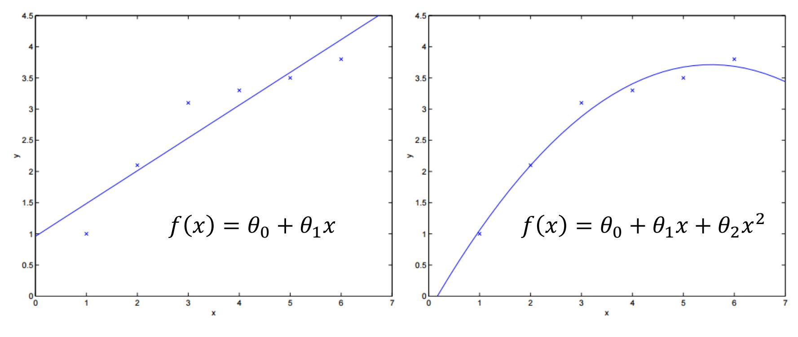

Linear Regression Quadratic regression

(A generalized linear model)

$$y = f_{\theta}(x) = \theta_0 + \sum_{j=1}^{d} \theta_j x_j = \theta^{\top} x$$
$$x = (1, x_1, x_2, \dots, x_d)$$

# **Linear Regression -2D**

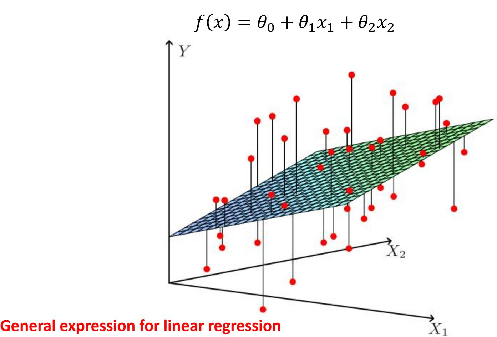

 = = <sup>0</sup> + =1 = (1, 1, 2, ⋯ , )

# **Objective Function of Linear Regression**

• Make the predicted value as close to the true value as possible

$$\min_{\theta} \frac{1}{N} \sum_{i=1}^{N} \mathcal{L}(y_i, f_{\theta}(x_i))$$

- The loss functions ℒ( , ()) measure the difference between the predicted value and the true value as small as possible
- The most widely used loss regression function: squared loss

$$\mathcal{L}(y_i, f_{\theta}(x_i)) = \frac{1}{2} (y_i - f_{\theta}(x_i))^2$$

#### **Objective Function of Linear Regression Loss**

#### Squared Loss

$$\mathcal{L}(y_i, f_{\theta}(x_i)) = \frac{1}{2} (y_i - f_{\theta}(x_i))^2$$

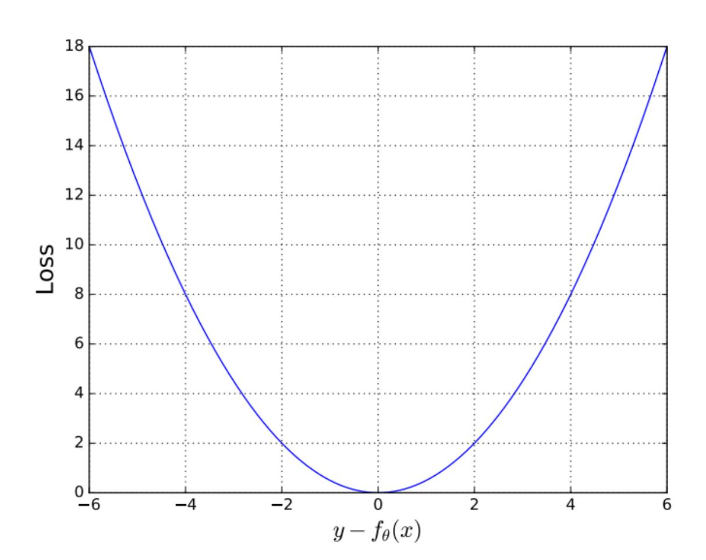

#### **Minimise Objective Function**

 The optimization goal is to minimize the mean square error on the training data

$$J_{\theta} = \frac{1}{2N} \sum_{i=1}^{N} (y_i - f_{\theta}(x_i))^2 \qquad \min_{\theta} J_{\theta}$$


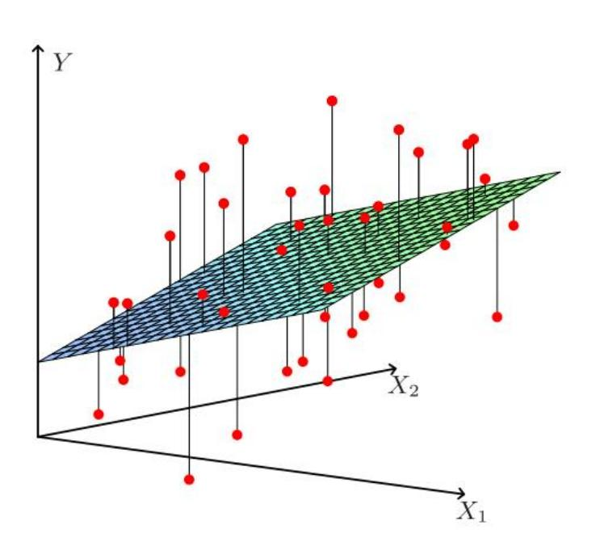

# **Objective Function of Linear Regression Loss**

For a simple example of =1, for the data point (,)=(2,1)

$$J(\theta) = \frac{1}{2}(y - \theta_0 - \theta_1 x)^2 = \frac{1}{2}(1 - \theta_0 - 2\theta_1)^2$$


#### **Gradient Descend**

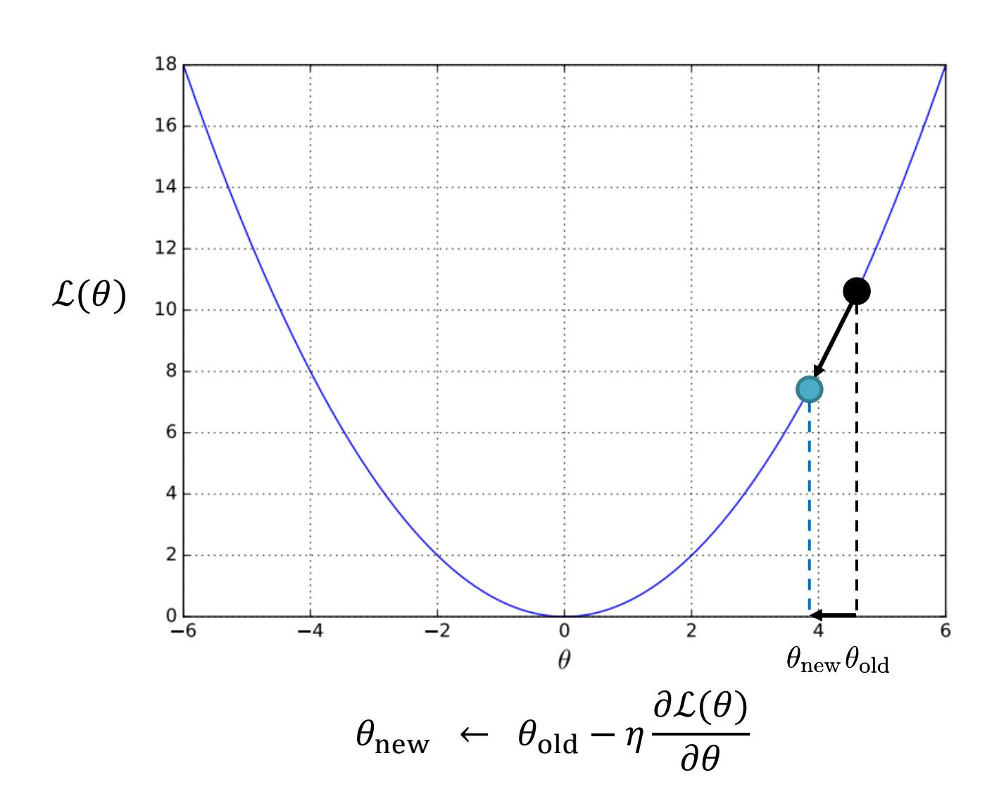


- Use matrix to represent functions.
- Why do we use matrices to represent functions?
  - Let computer to solve complex equation!
- Example 1:

$$f(x) = 2x + 3$$

- Matrix form [1, ] [ 3 2 ] =
- Example 2:

$$a+5c+8d = 37$$
  
 $3a+2b+3c+3d = 34$   
 $-a-3b+5c+7d = 13$ 

$$9a-5b+3c+6d = 26$$

$$\begin{bmatrix} 1 & 0 & 5 & 8 \\ 3 & 2 & 3 & 3 \\ -1 & -3 & 5 & 7 \\ 9 & -5 & 3 & 6 \end{bmatrix} \begin{bmatrix} a \\ b \\ c \\ d \end{bmatrix} = \begin{bmatrix} 37 \\ 34 \\ 13 \\ 26 \end{bmatrix}$$


Input Data 
$$X = \begin{pmatrix} x^{(1)} \\ x^{(2)} \\ \vdots \\ x^{(n)} \end{pmatrix} = \begin{pmatrix} x_1^{(1)} & x_2^{(1)} & \dots & x_d^{(1)} \\ x_1^{(2)} & x_2^{(2)} & \dots & x_d^{(2)} \\ \vdots & \vdots & \ddots & \vdots \\ x^{(n)} & x^{(n)} & \dots & x^{(n)} \end{pmatrix}$$
 Weight  $\theta = \begin{pmatrix} \theta_1 \\ \theta_2 \\ \vdots \\ \theta_d \end{pmatrix}$  Label  $y = \begin{pmatrix} y_1 \\ y_2 \\ \vdots \\ y_n \end{pmatrix}$ 

$$\begin{pmatrix} x_1^{(1)} & x_2^{(1)} & \dots & x_d^{(1)} \\ x_1^{(2)} & x_2^{(2)} & \dots & x_d^{(2)} \\ \vdots & & \ddots & \vdots \\ x_1^{(n)} & x_2^{(n)} & \dots & x_d^{(n)} \end{pmatrix} \begin{pmatrix} \theta_1 \\ \theta_2 \\ \vdots \\ \theta_d \end{pmatrix} = \begin{pmatrix} y_1 \\ y_2 \\ \vdots \\ y_n \end{pmatrix}$$

**Predicted value** 

$$\widehat{y} = X\theta = \begin{pmatrix} x_1^{(1)} & x_2^{(1)} & \dots & x_d^{(1)} \\ x_1^{(2)} & x_2^{(2)} & \dots & x_d^{(2)} \\ \vdots & \ddots & \vdots \\ x_1^{(n)} & x_2^{(n)} & \dots & x_d^{(n)} \end{pmatrix} \begin{pmatrix} \theta_1 \\ \theta_2 \\ \vdots \\ \theta_d \end{pmatrix} = \begin{pmatrix} x^{(1)}\theta \\ x^{(2)}\theta \\ \vdots \\ x^{(n)}\theta \end{pmatrix}$$

Loss Function 
$$J(\boldsymbol{\theta}) = \frac{1}{2} (\boldsymbol{y} - \widehat{\boldsymbol{y}})^{\mathsf{T}} (\boldsymbol{y} - \widehat{\boldsymbol{y}}) = \frac{1}{2} (\boldsymbol{y} - \boldsymbol{X}\boldsymbol{\theta})^{\mathsf{T}} (\boldsymbol{y} - \boldsymbol{X}\boldsymbol{\theta})$$


**Objective Function** 
$$J(\theta) =$$

$$J(\boldsymbol{\theta}) = \frac{1}{2} (\boldsymbol{y} - \widehat{\boldsymbol{y}})^{\mathsf{T}} (\boldsymbol{y} - \widehat{\boldsymbol{y}}) = \frac{1}{2} (\boldsymbol{y} - \boldsymbol{X}\boldsymbol{\theta})^{\mathsf{T}} (\boldsymbol{y} - \boldsymbol{X}\boldsymbol{\theta}) \qquad \min_{\boldsymbol{\theta}}$$

**Gradient of the parameter vector** 

$$\frac{\partial J(\boldsymbol{\theta})}{\partial \boldsymbol{\theta}} = -\boldsymbol{X}^{\mathsf{T}}(\boldsymbol{y} - \boldsymbol{X}\boldsymbol{\theta})$$

#### **Optimal parameter solution**

$$\frac{\partial J(\boldsymbol{\theta})}{\partial \boldsymbol{\theta}} = 0 \to \boldsymbol{X}^{\mathsf{T}}(\boldsymbol{y} - \boldsymbol{X}\boldsymbol{\theta}) = 0$$
$$\to \boldsymbol{X}^{\mathsf{T}}\boldsymbol{y} = \boldsymbol{X}^{\mathsf{T}}\boldsymbol{X}\boldsymbol{\theta}$$
$$\to \widehat{\boldsymbol{\theta}} = (\boldsymbol{X}^{\mathsf{T}}\boldsymbol{X})^{-1}\boldsymbol{X}^{\mathsf{T}}\boldsymbol{y}$$

Remember this is enough!

()

Let's try it in computer!


$$\min_{w} \sum_{i=1}^{N} (y_i - w_i x_i)^2$$

$$f(x) = \frac{1}{\sigma\sqrt{2\pi}}e^{-\frac{1}{2}(\frac{x-\mu}{\sigma})^2}$$


#### Sampling x from function

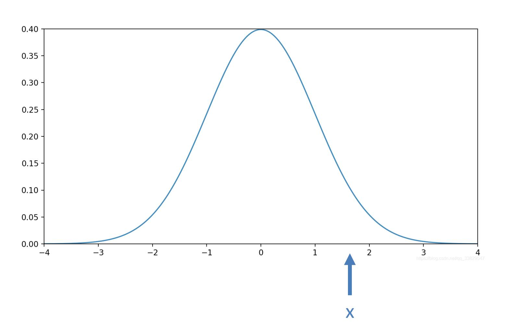

1.76 0.40 0.98 2.24 1.87 −0.98 0.95 −0.15 0.41


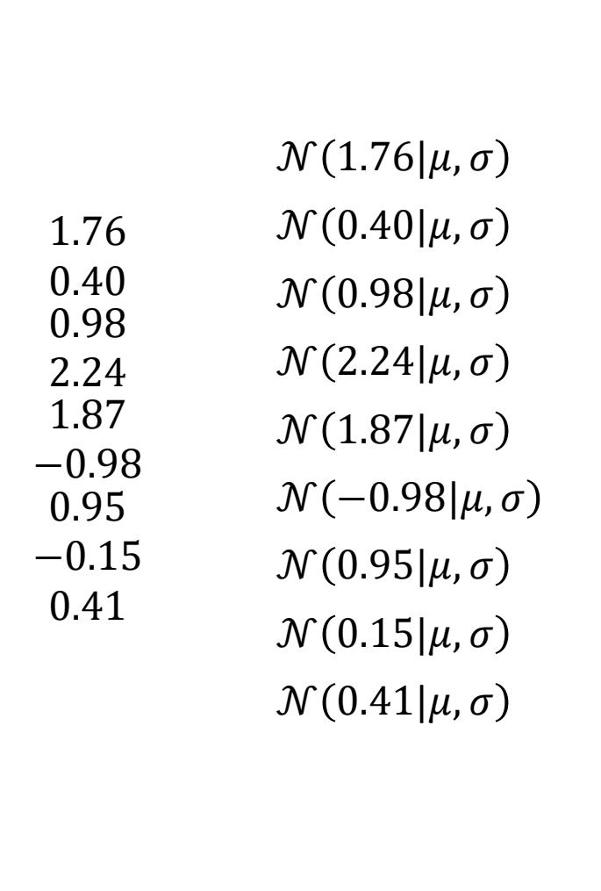

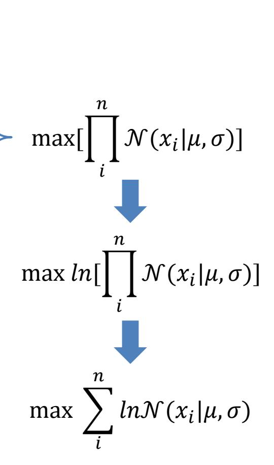

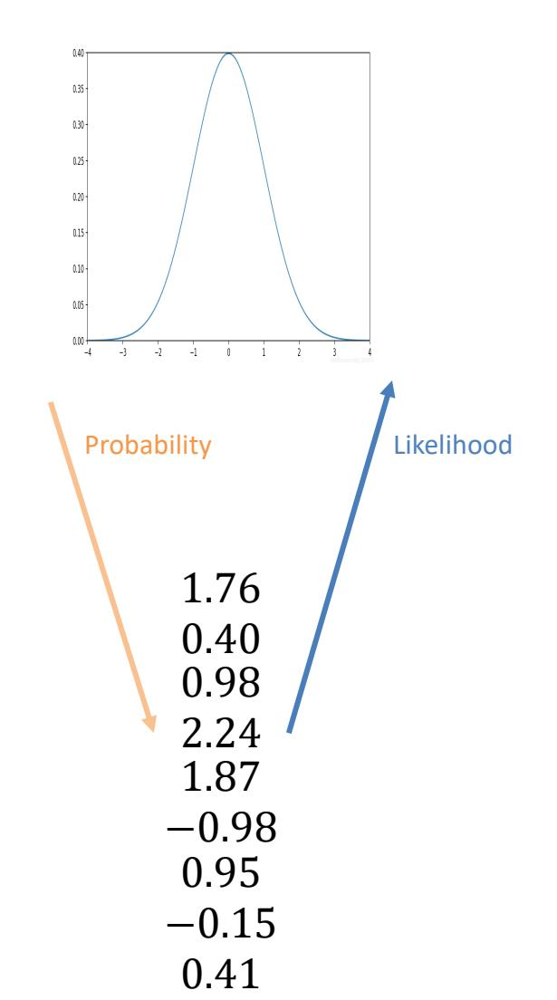


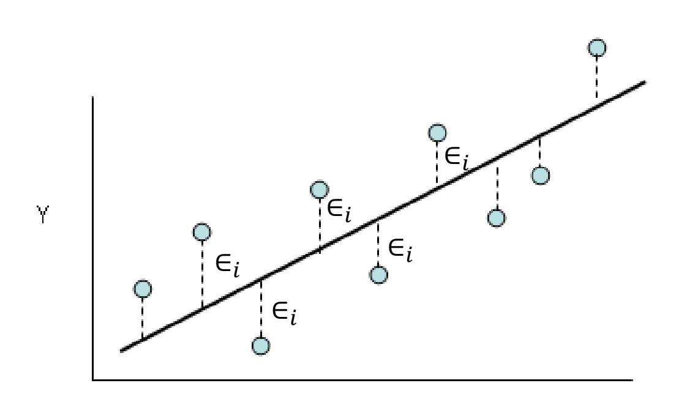

$$f(x) = \frac{1}{\sigma\sqrt{2\pi}}e^{-\frac{1}{2}(\frac{x-\mu}{\sigma})^2}$$

$$y_i = w_i x_i + \epsilon_i$$

$$\in_i \sim \mathcal{N}(0, \sigma^2)$$

$$\mathcal{N}(y_i|wx_i,\sigma^2)$$

$$\max_{w} \prod_{i=1}^{N} \frac{1}{\sqrt{2\pi\sigma^{2}}} e^{-\frac{(y_{i} - wx_{i})^{2}}{2\sigma^{2}}}$$

$$\log \prod_{i=1}^{N} \frac{1}{\sqrt{2\pi\sigma^2}} e^{-\frac{(y_i - wx_i)^2}{2\sigma^2}} = \sum_{i=1}^{N} \log \frac{1}{\sqrt{2\pi\sigma^2}} e^{-\frac{(y_i - wx_i)^2}{2\sigma^2}} = -\sum_{i=1}^{N} \frac{(y_i - wx_i)^2}{2\sigma^2} + \text{const}$$

$$\min_{w} \sum_{i=1}^{N} (y_i - wx_i)^2$$
 Objective Function of Linear Regression Loss

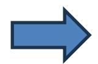


Bernoulli distribution Binominal distribution Sigmoid Softmax Binary Classification Multiple Classification

---

# Lecture 4 and 5-Gradient Descend and Logistic Regression


### **Artificial Intelligence System**

## **Lecture 4 Gradient Descend**

Dr Qianyu LIU

Department of Electrical and Electronic Engineering Faculty of Science and Engineering

### **Objective Function of Linear Regression Loss**

### Squared Loss

$$\mathcal{L}(y_i, f_{\theta}(x_i)) = \frac{1}{2} (y_i - f_{\theta}(x_i))^2$$


### **Gradient Descend**


### **Batch Gradient Descent**

optimization objective

$$J(\theta) = \frac{1}{2N} \sum_{i=1}^{N} (y_i - f_{\theta}(x_i))^2 \qquad \min_{\theta} J(\theta)$$

Update parameters based on the gradient of the entire batch data

$$\theta_{\text{new}} \leftarrow \theta_{\text{old}} - \eta \frac{\partial J(\theta)}{\partial \theta}$$

$$\frac{\partial J(\theta)}{\partial \theta} = -\frac{1}{N} \sum_{i=1}^{N} \left( (y_i - f_{\theta}(x_i)) \frac{\partial f_{\theta}(x_i)}{\partial \theta} \right)$$

$$= -\frac{1}{N} \sum_{i=1}^{N} (y_i - f_{\theta}(x_i)) x_i$$

$$\theta_{\text{new}} = \theta_{\text{old}} + \eta \frac{1}{N} \sum_{i=1}^{N} (y_i - f_{\theta}(x_i)) x_i$$

## **3D view of Loss function**


Actually Shape of Loss Function


## **Linear model learning display - Function curve**

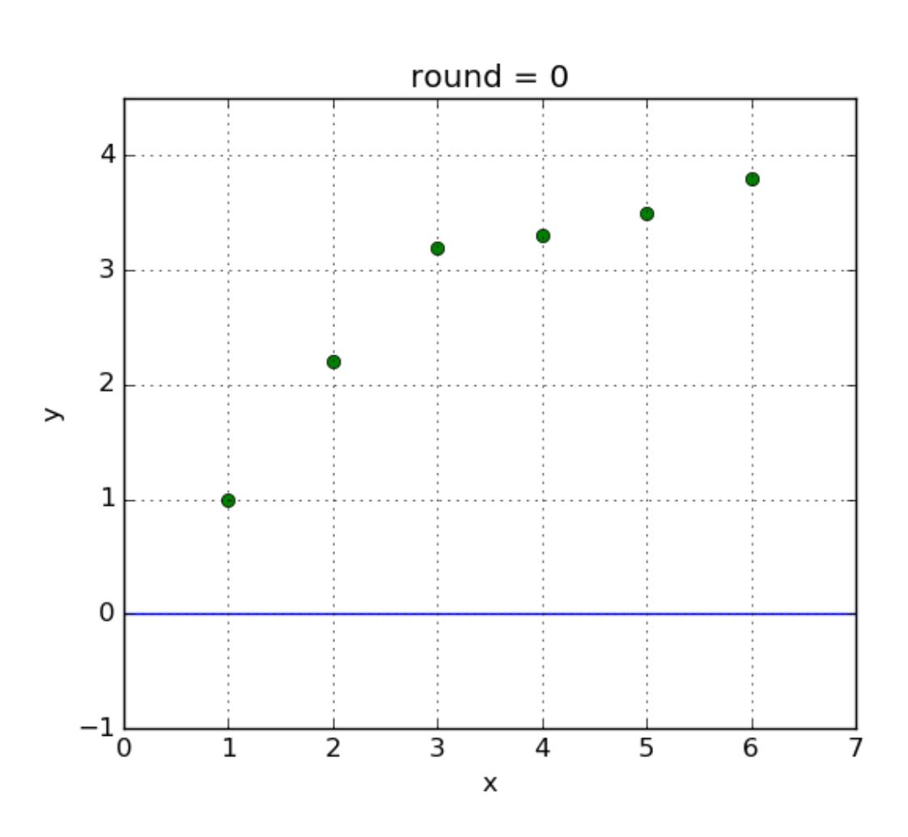

## **The choice of learning rate**

$$\theta_{\text{new}} = \theta_{\text{old}} - \eta \frac{\partial J(\theta)}{\partial \theta}$$

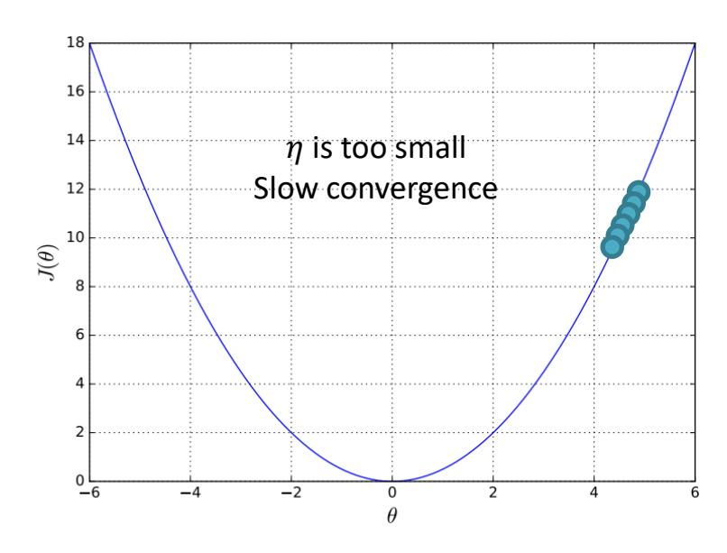

• The initial point may be too far from the optimal point, resulting in slow convergence

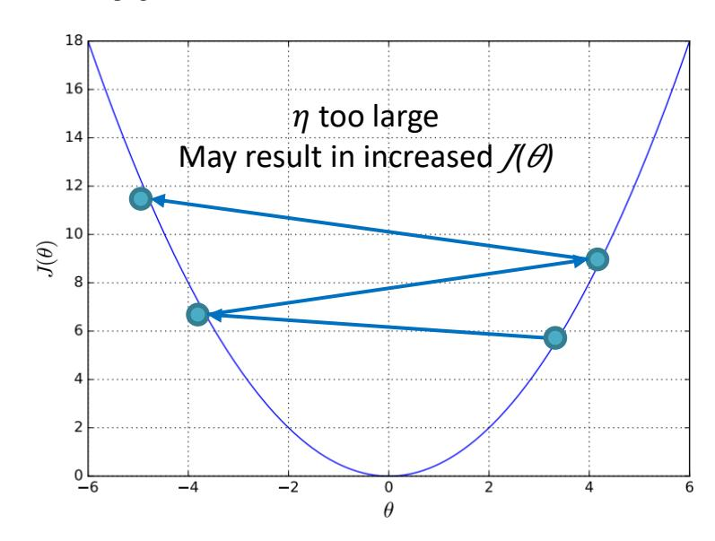

- May be past the best point
- May not converge
- May even diverge
- ➢ To check that gradient descent is working, print out the loss () for every few iterations, and adjust the learning rate if you find that () is not decreasing normally


## **Linear model learning presentation parameter change**

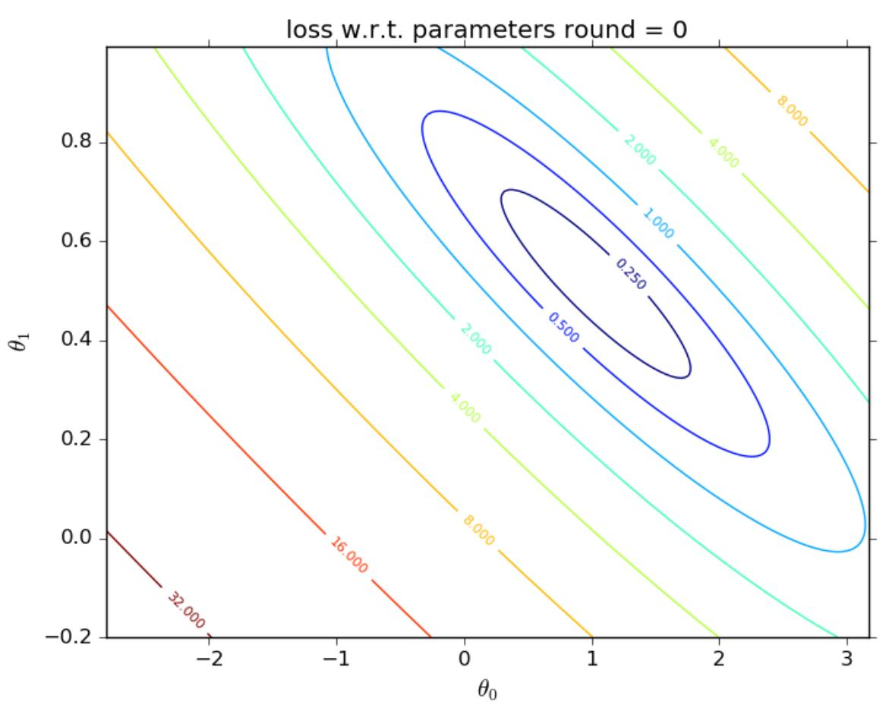

Batch gradient updating

## **Stochastic gradient descent**

➢ optimization objective

$$J^{(i)}(\theta) = \frac{1}{2} (y_i - f_{\theta}(x_i))^2 \qquad \min_{\theta} \frac{1}{N} \sum_{i} J^{(i)}(\theta)$$

➢ Update parameters based on the gradient of the entire batch data

$$\theta_{\text{new}} = \theta_{\text{old}} - \eta \frac{\partial J^{(i)}(\theta)}{\partial \theta}$$

$$\frac{\partial J^{(i)}(\theta)}{\partial \theta} = -(y_i - f_{\theta}(x_i)) \frac{\partial f_{\theta}(x_i)}{\partial \theta}$$

$$= -(y_i - f_{\theta}(x_i)) x_i$$

$$\theta_{\text{new}} = \theta_{\text{old}} + \eta (y_i - f_{\theta}(x_i)) x_i$$

- ➢ Batch gradient descent vs.
  - Faster parameter updating (advantage)
  - Uncertainty or oscillation in learning (disadvantage)


## **Linear model learning presentation parameter change**

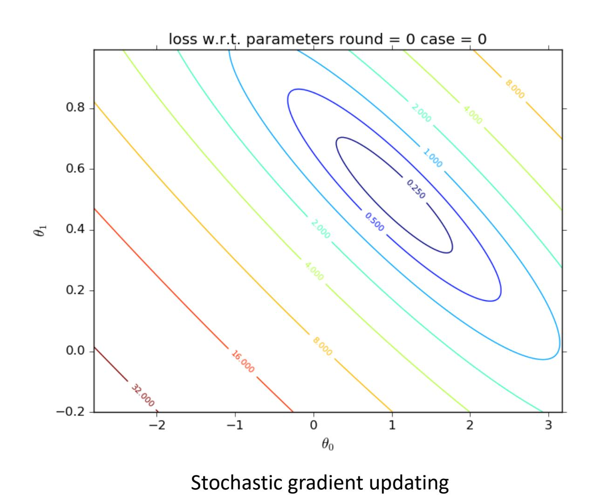

## **Mini-batch Gradient Descent**

- ➢ Combination of batch gradient descent and random gradient descent
- ➢ Divide the entire training set into mini-batches {1,2,3, ⋯ ,}
- ➢ For each small batch , do a batch drop to reduce

$$J^{(k)}(\theta) = \frac{1}{2N_k} \sum_{i=1}^{N_k} (y_i - f_{\theta}(x_i))^2$$

➢ For each small batch, update the parameters

$$\theta_{\text{new}} = \theta_{\text{old}} - \eta \frac{\partial J^{(k)}(\theta)}{\partial \theta}$$


## **Mini-batch Gradient Descent**

- Combining the advantages of batch gradient descent and stochastic gradient descent.
  - The excellent stability of batch gradient descent.
  - Mini-batch gradient descent is well-suited for use in parallelized computing.
  - Each mini-batch of data is further divided, with separate threads calculating gradients individually, which are then summed up.


## **Overfitting/Underfitting**

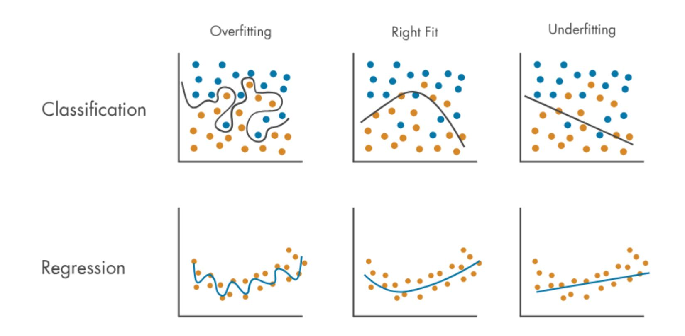


## **Reduce Overfitting**

### **How to Reduce Overfitting in Machine Learning**

#### **Common Methods**

#### **1. More Training Data**

Increase data quantity and diversity to help the model learn general patterns.

#### **2. Data Augmentation**

Apply transformations such as flipping, cropping, rotation, or noise injection.

#### **3. Regularization**

Use L1/L2 regularization to penalize overly complex models.

#### **4. Dropout**

Randomly deactivate neurons during training to reduce reliance on specific features.

#### **Practical Strategies**

#### **5. Early Stopping**

Stop training when validation performance stops improving.

#### **6. Simplify the Model**

Reduce the number of layers, parameters, or features.

#### **7. Cross-Validation**

Evaluate the model on multiple data splits for more reliable performance.

#### **8. Feature Selection**

Keep only the most relevant features and remove noisy inputs.

### L1/L2 Regularization

$$Loss = Original \ Loss + \lambda \cdot Penalty$$

#### Where:

- $\rightharpoonup \lambda$  controls the strength of regularization
- Penalty depends on the type of regularization

$$|w_1| + |w_2| \le c$$
  $w_1^2 + w_2^2 = c$ 

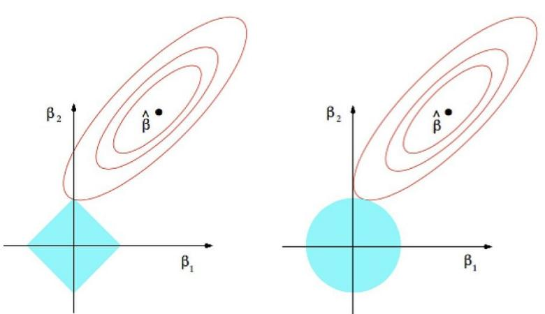

L1 vs L2 regularization

L1 Regularization (Lasso)

$$Loss = Original\ Loss + \lambda \sum |w_i|$$

- Encourages some weights to become exactly zero
- Produces sparse models
- Useful for feature selection

L2 Regularization (Ridge)

$$Loss = Original \ Loss + \lambda \sum w_i^2$$

- Shrinks weights toward small values
- Rarely makes weights exactly zero
- Helps improve stability and generalization


### **Artificial Intelligence System**

## **Lecture 5 Logistic Regression**

Dr Qianyu LIU

Department of Electrical and Electronic Engineering Faculty of Science and Engineering

## **Binary Classification**

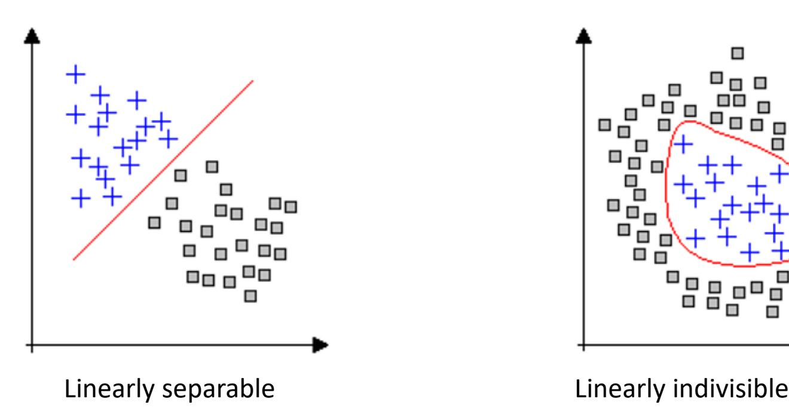

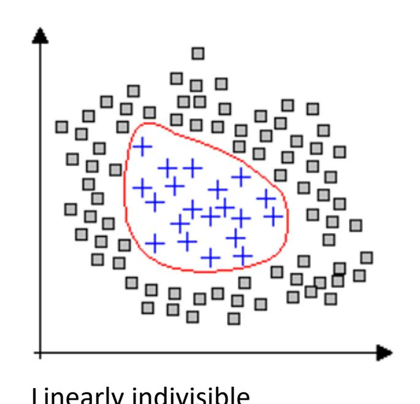

$$p_{\theta}(y = 1|x)$$

$$p_{\theta}(y = 0|x) = 1 - p_{\theta}(y = 1|x)$$

### Sigmoid

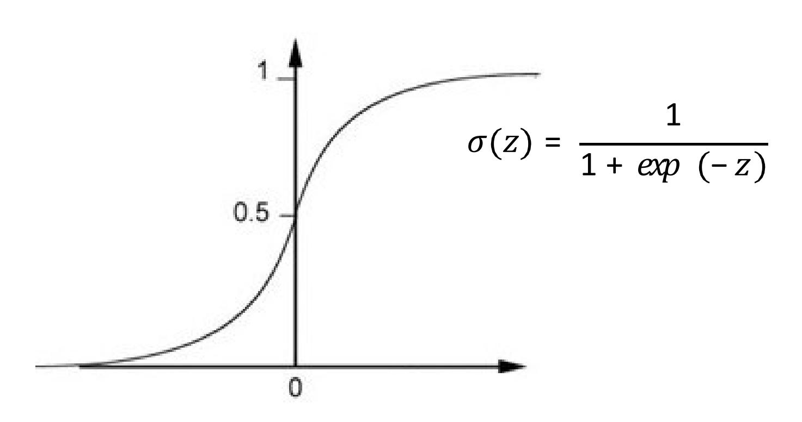

$$z = w \cdot x1 + w \cdot x2 + b$$


### Three-dimensional representation

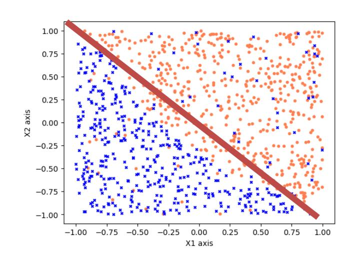

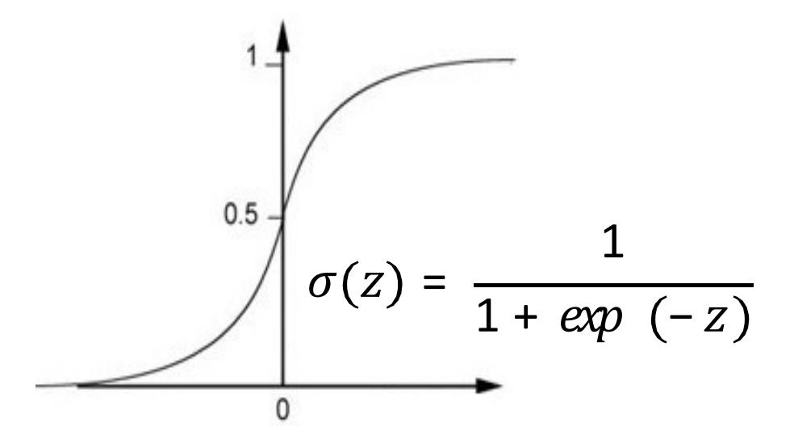

 $z = w \cdot 1 \cdot x \cdot 1 + w \cdot 2 \cdot x \cdot 2 + b$ 

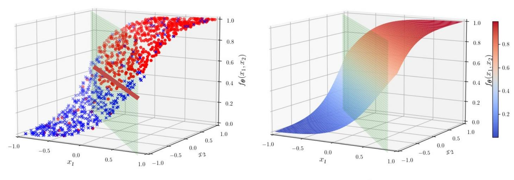

## **Loss Function of Logistic Regression (Binary)**

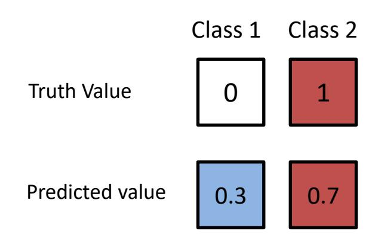

### Loss Function

$$\mathcal{L}(y, x, p_{\theta}) = -\delta(y = 1) \log p_{\theta}(y = 1|x) - \delta(y = 0) \log p_{\theta}(y = 0|x)$$
$$= -y \log p_{\theta}(y = 1|x) - (1 - y) \log(1 - p_{\theta}(y = 1|x))$$

Where, 
$$\delta(z) = \begin{cases} 1, & z \text{ is true} \\ 0, & \text{otherwise} \end{cases}$$

## **Gradient Logistic Regression**

➢ Logistic regression is a binary model

$$p_{\theta}(y = 1|x) = \sigma(\theta^{\mathsf{T}}x) = \frac{1}{1 + e^{-\theta^{\mathsf{T}}x}}$$

$$p_{\theta}(y = 0|x) = \frac{e^{-\theta^{\mathsf{T}}x}}{1 + e^{-\theta^{\mathsf{T}}x}}$$

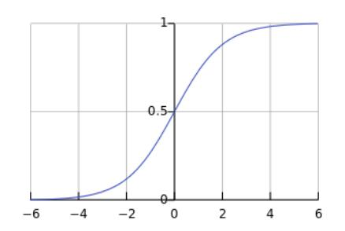

➢ Cross entropy loss function

$$\mathcal{L}(y, x, p_{\theta}) = -y \log \sigma(\theta^{\mathsf{T}} x) - (1 - y) \log \left(1 - \sigma(\theta^{\mathsf{T}} x)\right)$$

➢ Gradient

$$\frac{\partial \mathcal{L}(y,x,p_{\theta})}{\partial \theta} = -y \frac{1}{\sigma(\theta^{\mathsf{T}}x)} \sigma(z) (1 - \sigma(z)) x - (1 - y) \frac{-1}{1 - \sigma(\theta^{\mathsf{T}}x)} \sigma(z) (1 - \sigma(z)) x$$
$$= (\sigma(\theta^{\mathsf{T}}x) - y) x$$

$$\theta \leftarrow \theta + \eta \big( y - \sigma(\theta^{\mathsf{T}} x) \big) x$$

$$\left(\frac{\partial \sigma(z)}{\partial z} = \sigma(z)(1 - \sigma(z))\right)$$


# **Softmax**

## **Softmax**

• Used in Multiple Classification

• Softmax calculates the probability:

$$\hat{p}_k = \sigma(\mathbf{s}(\mathbf{x}))_k = \frac{\exp(s_k(\mathbf{x}))}{\sum_{j=1}^K \exp(s_j(\mathbf{x}))}$$

• Loss function (cross entropy):

$$J(\Theta) = -\frac{1}{m} \sum_{i=1}^m \sum_{k=1}^K y_k^{(i)} \log\Bigl(\hat{p}_k^{(i)}\Bigr)$$

### **Multiple Classification**

(3 classes as example)

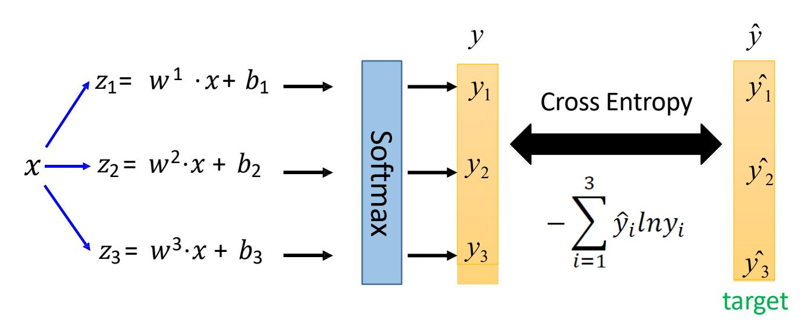

If x ∈ class 1 If x ∈ class 2 If x ∈ class 3

$$\hat{y} = \begin{bmatrix} 1 \\ 0 \\ 0 \end{bmatrix}$$

$$\hat{y} = \begin{bmatrix} 0 \\ 1 \\ 0 \end{bmatrix}$$

$$\hat{y} = \begin{bmatrix} 0 \\ 0 \\ 1 \end{bmatrix}$$

### **Multiple Classification**

$$C_1$$
:  $w^1$ ,  $b_1$   $z_1 = w^1 \cdot x + b_1$ 

$$C_2$$
:  $w^2$ ,  $b_2$   $z_2 = w^2 \cdot x + b_2$ 

$$C_3$$
:  $w^3$ ,  $b_3$   $z_3 = w^3 \cdot x + b_3$ 

### Probability Distribution:

• 
$$1 > y_i > 0$$

• 
$$\sum_i y_i = 1$$


---

# Lecture 6 - Evaluation Indicators


# **Artificial Intelligence System**

# **Lecture 6 Evaluation Indicators**

Dr Qianyu LIU

Department of Electrical and Electronic Engineering Faculty of Science and Engineering


# **Regression – Evaluation Metric**

## **Linear Regression – Evaluation Metric**

### ► Mean Squared Error, MSE

$$MSE = \frac{1}{n} \sum_{i=1}^{n} (y_i - \hat{y}_i)^2$$

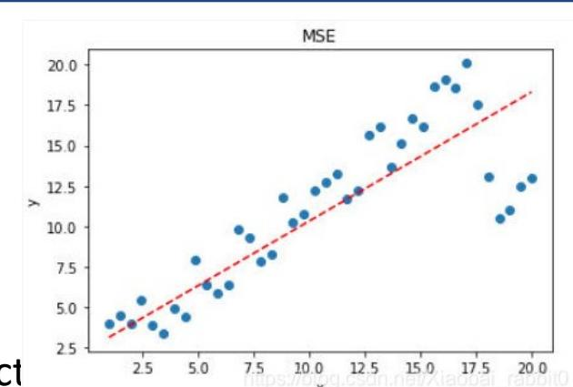

### Advantages:

- MSE provides a smooth, continuous, and differentiable funct gradient descent algorithms.
- As errors decrease, gradients also decrease, aiding convergence.
- Sensitive to measurement errors, effectively reflecting the discrepancies between predicted and actual values.

### Disadvantages:

- MSE can amplify errors when the difference between true and predicted values is greater than 1, and vice versa.
- Sensitive to outliers, which can significantly impact the model's performance and reduce overall accuracy

### **Linear Regression – Evaluation Metric**

#### Root Mean Squared Error (RMSE)

$$RMSE = \sqrt{\frac{1}{n} \sum_{i=1}^{n} (y_i - \hat{y}_i)^2}$$

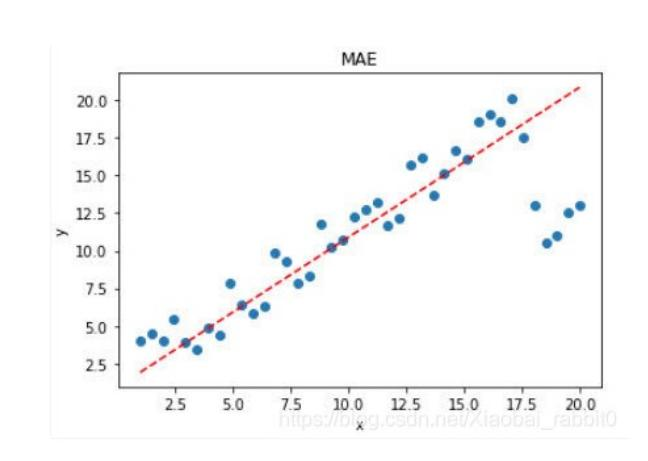

#### Advantages:

- •RMSE quantifies the deviation between predicted and true values, with lower values indicating higher prediction accuracy.
- Easy to understand and calculate.

#### > Disadvantages:

- •RMSE doesn't account for the variability inherent in the target variable, potentially misrepresenting the model's performance.
- •Sensitive to outliers, leading to less stable evaluation results.

### **Linear Regression – Evaluation Metric**

#### Mean Absolute Error (MAE)

$$MAE = \frac{1}{n} \sum_{i=1}^{n} |y_i - \hat{y}_i|$$

#### > Advantages:

- MAE is less sensitive to outliers as it calculates the absolute value of errors.
- Intuitive and easy to understand, measuring errors in the same units as the original data.
- Usable in some optimization algorithms despite not being differentiable everywhere.

#### > Disadvantages:

- MAE treats all errors equally, disregarding the importance of individual data points.
- Not continuously differentiable, which can complicate its use in certain optimization algorithms.
- For small loss values, gradients can be relatively large, hindering convergence and learning.

# **R-Square (R2)**

### ➢ **R-Square** (**R2**)

quantifies the explanatory power of the regression model for the variation in the dependent variable (ranging from 0 to 1), where a higher value indicates a stronger explanatory ability of the independent variables.

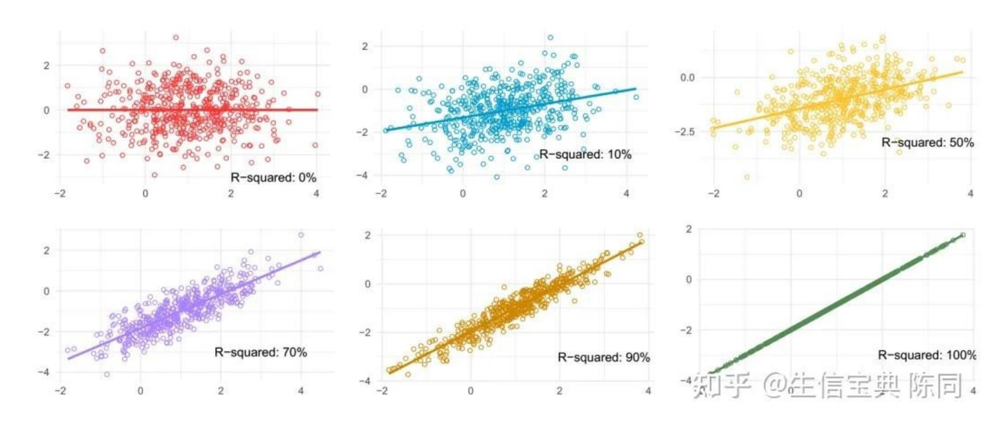

# **R-Square (R2)**

➢ **R-Square** (**R2**)

$$R2 = 1 - \frac{SSE}{SST} = 1 - \frac{\sum_{i=1}^{n}(y_i - \hat{y_i})^2}{\sum_{i=1}^{n}(y_i - \bar{y})^2}$$
 or

$$R2 = \frac{SSR}{SST} = \frac{\sum_{i=1}^{n}(\hat{y_i} - \bar{y})^2}{\sum_{i=1}^{n}(y_i - \bar{y})^2}$$

➢ the sum of squares due to regression (SSR)

$$SSR = \sum_{i=1}^{i=n} (\hat{y_i} - \bar{y})^2$$

➢ the sum of squares total (SST)

$$SST = \sum_{i=1}^{i=n} (y_i - \bar{y})^2$$

➢ the sum of squares error(SSE)

$$SSE = \sum_{i=1}^{i=n} (y_i - \hat{y_i})^2$$

- ෝ --- Predictive value
- --- Actual value
- ത --- Average value of y (Actual value)

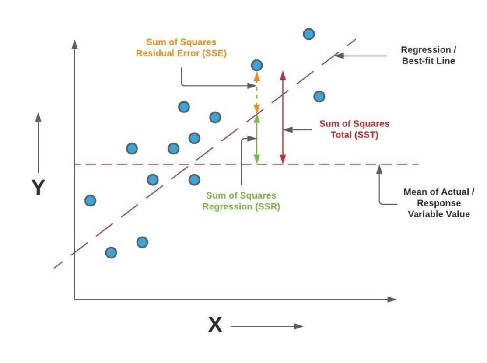


# **Classification – Evaluation Metric**


## **Confusion Matrix**

#### Predicted Value

Label

|   | 1                 | 0                 |
|---|-------------------|-------------------|
| 1 | True<br>Positive  | False<br>Negative |
| 0 | False<br>Positive | True<br>Negative  |

### True / False

• True:Predicted Value= Label

• False:Predicted Value ≠ Label

### Positive / Negative

• Positive:Predicted Value = 1

• Negative:Predicted Value = 0

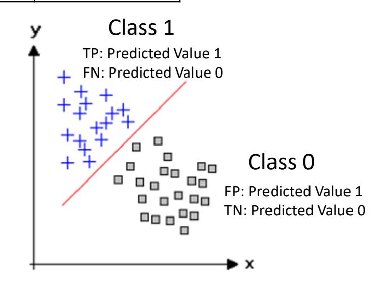


# **Accuracy**

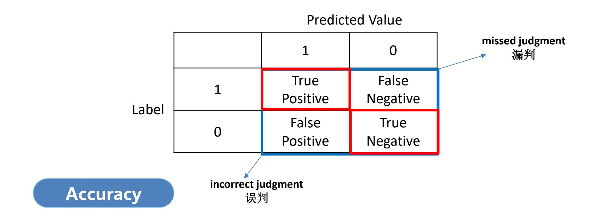

The proportion of correctly classified samples to the total sample

$$Acc = \frac{TP + TN}{TP + TN + FP + FN}$$


# **Precision & Recall**

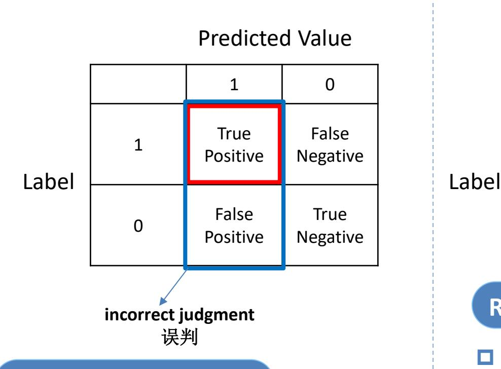

### **Precision**

 The proportion of the sample with a label of 1 that is predicted to be 1

$$Prec = \frac{TP}{TP + FP}$$

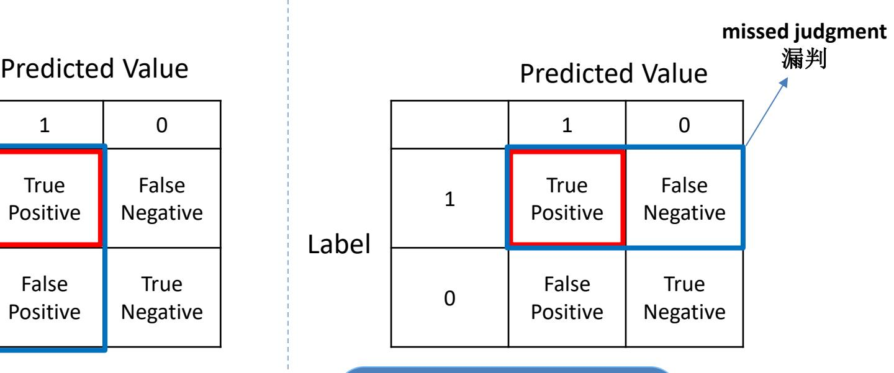

### **Recall**

 The proportion of the sample labelled 1 predicted to be 1

$$Rec = \frac{TP}{TP + FN}$$

11 How does the threshold affect these two indicators?

# **F1 Score**

The tradeoff between accuracy and recall

$$\hat{y} = \begin{cases} 1, & p_{\theta}(y = 1|x) > h \\ 0, & \text{otherwise} \end{cases}$$

- F1 Score
  - The higher the threshold, the higher the precision rate and the lower the recall rate
    - extreme case:threshold=0.99
  - The lower the threshold, the lower the precision and the higher the recall rate
    - extreme case:threshold =0

$$F1 = \frac{2 \times Precision \times Recall}{Precision + Recall}$$

- **F1 = 1**: Perfect model (Precision=1, Recall=1).
- **F1 = 0**: Complete failure (Precision=0 or Recall=0).
- **Practical Scenarios**:
  - **High Precision, Low Recall**: Predictions are accurate but miss many positives.
  - **High Recall, Low Precision**: Captures most positives but with many false alarms.
  - **Maximizing F1**: Optimal balance between Precision and Recall.

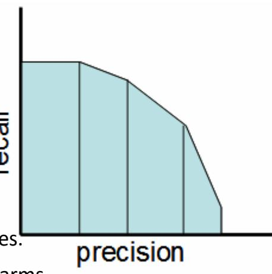

## Case study

#### **COVID-19 Detection Model:**

#### Confusion Matrix:

|                    | Predicted<br>Positive | Predicted<br>Negative |
|--------------------|-----------------------|-----------------------|
| Actual<br>Positive | 90 (TP)               | 10 (FN)               |
| Actual<br>Negative | 5 (FP)                | 895 (TN)              |

#### **Calculations**:

$$Precision = \frac{90}{90 + 5} = 0.947,$$

$$Recall = \frac{90}{90 + 10} = 0.9$$

$$F1 Score = 2 \times \frac{0.947 \times 0.9}{0.947 + 0.9} = 0.923$$

# **ROC & AUC**

- Sort-based metrics:Area under the ROC curve(AUC)
- <https://www.youtube.com/watch?v=QBVzZBsif20>


# **ROC & AUC**

### Sort-based metrics:Area under the ROC curve(AUC)


# **ROC & AUC**

### AUC Example

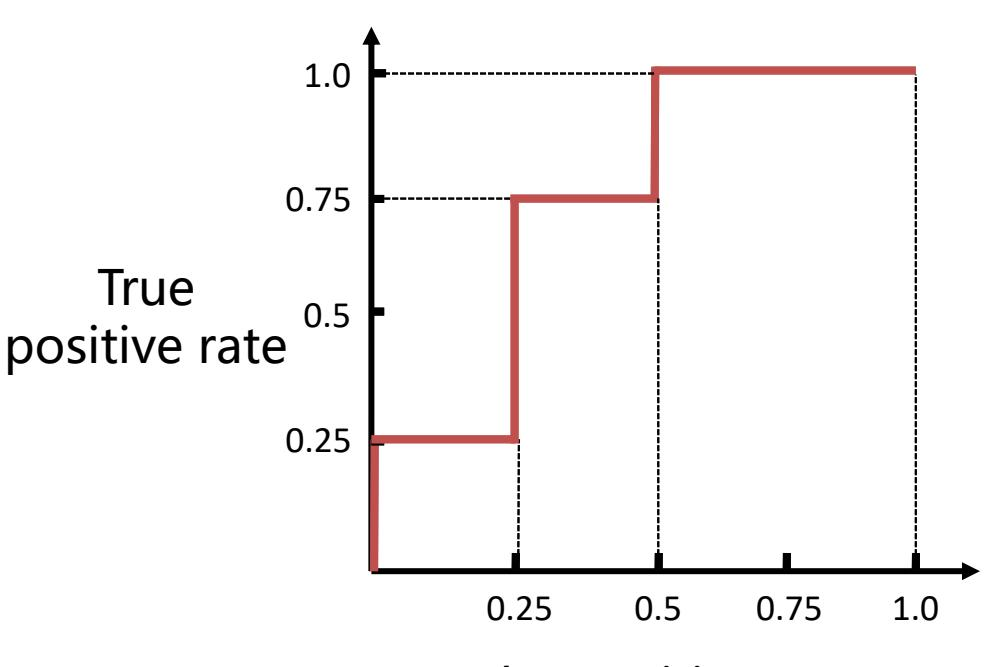

False positive rate AUC = 0.75

| Prediction | Label |
|------------|-------|
| 0.91       | 1     |
| 0.85       | 0     |
| 0.77       | 1     |
| 0.72       | 1     |
| 0.61       | 0     |
| 0.48       | 1     |
| 0.42       | 0     |
| 0.33       | 0     |

---

# Lecture 7 -K-Nearest Neighbor


### **Artificial Intelligence System**

# **Lecture 7 K-Nearest Neighbor**

Dr Qianyu LIU

Department of Electrical and Electronic Engineering Faculty of Science and Engineering


## **Evaluation IndicatorsK-Nearest**

Algorithm thought: "Birds of a feather flock together"

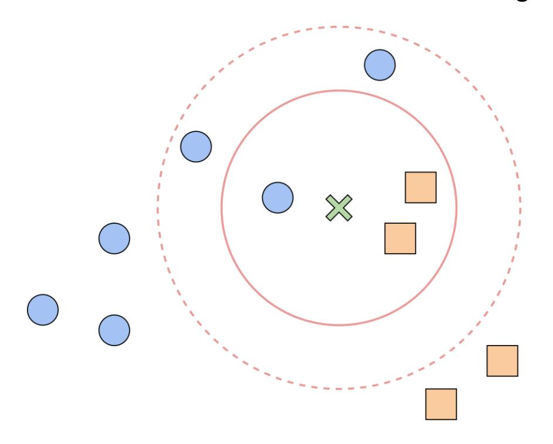

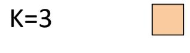

K=5

Can regression tasks be handled?

### **K-nearest Neighbor algorithm – a little bit math...**

- ➢ Nonparametric methods for classification and regression
  - For each input instance , find the closest training instance \_ () in the feature space.
  - For regression problem: the prediction for is based on the average of the labels for instances

$$\widehat{y}(x) = \frac{1}{k} \sum_{x_i \in N_k(x)} y_i$$

• For classification problems: Do majority voting among neighbors

$$\hat{y}(x) = \text{majority vote } \{y_i, x_i \in N_k(x)\}$$


## **KNN** example

#### 15-Neighbor

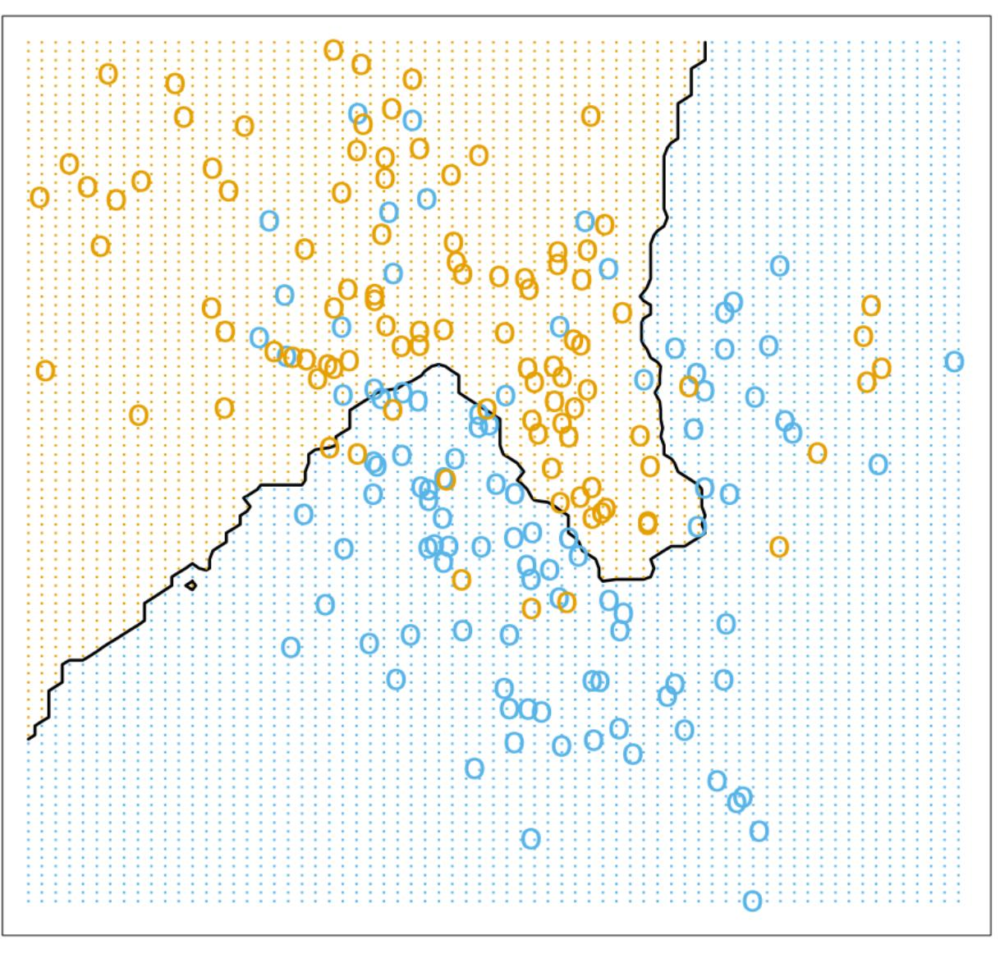


### KNN example

### 1-Neighbor

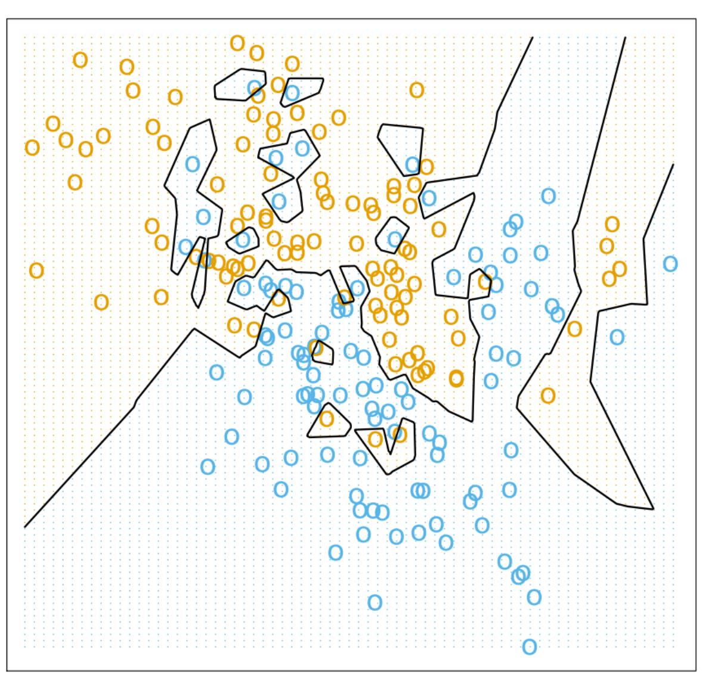

### **KNN** in images

#### **Distance Metric** to compare images

L1 distance:

$$d_1(I_1,I_2) = \sum_p |I_1^p - I_2^p|$$

test image

| toot iiii.a.go |    |     |     |  |  |
|----------------|----|-----|-----|--|--|
| 56             | 32 | 10  | 18  |  |  |
| 90             | 23 | 128 | 133 |  |  |
| 24             | 26 | 178 | 200 |  |  |
| 2              | 0  | 255 | 220 |  |  |

training image

| 3  |    |     |     |  |  |
|----|----|-----|-----|--|--|
| 10 | 20 | 24  | 17  |  |  |
| 8  | 10 | 89  | 100 |  |  |
| 12 | 16 | 178 | 170 |  |  |
| 4  | 32 | 233 | 112 |  |  |

pixel-wise absolute value differences


## **Recognition accuracy**

As you can imagine, only from a distance...

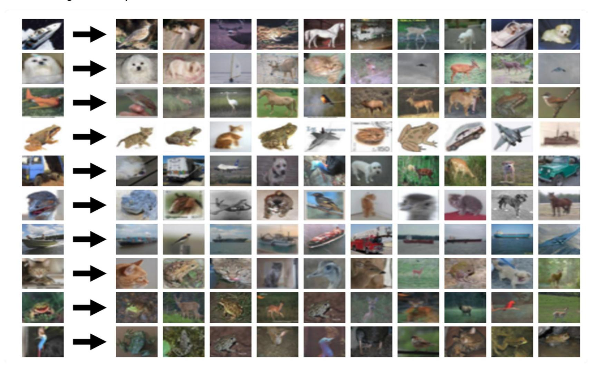

## **Generalized version of KNN**

#### ➢ Generalized version

- Define the similarity function (,\_) between input instance and its neighbor \_
- Then the prediction is made based on the weighted label average of the proximity similarity

$$\hat{y}(x) = \frac{\sum_{x_i \in N_k(x)} s(x, x_i) y_i}{\sum_{x_i \in N_k(x)} s(x, x_i)}$$

---

# Lecture 8 - Clustering


#### **Artificial Intelligence System**

# **Lecture 8 Clustering Algorithm**

Dr Qianyu LIU

Department of Electrical and Electronic Engineering Faculty of Science and Engineering

#### **K-MEANS**

## ➢ Clustering Concept:

- Unsupervised problem: We don't have labels in our hands anymore.
- Clustering: similar things are grouped together
- Difficulties: How to evaluate and adjust parameters

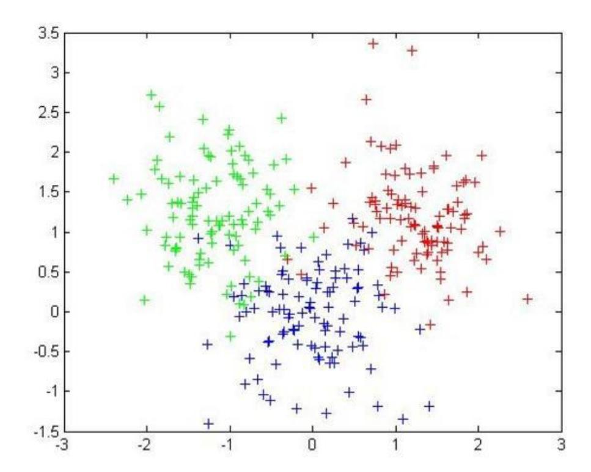

#### **K-MEANS**

## ➢Basic concepts:

- •To get the number of clusters, you need to specify a value of K
- •Center of mass: The mean value, that is, the average of the dimensions of the vector can be taken
- •Distance measurement: Commonly used Euclidean distance and cosine similarity (normalized first)
- •Optimization objectives:

$$\min \sum_{i=1}^{K} \sum_{x \in C_i} dist \left(c_i, x\right)^2$$


#### **K-means work flow**

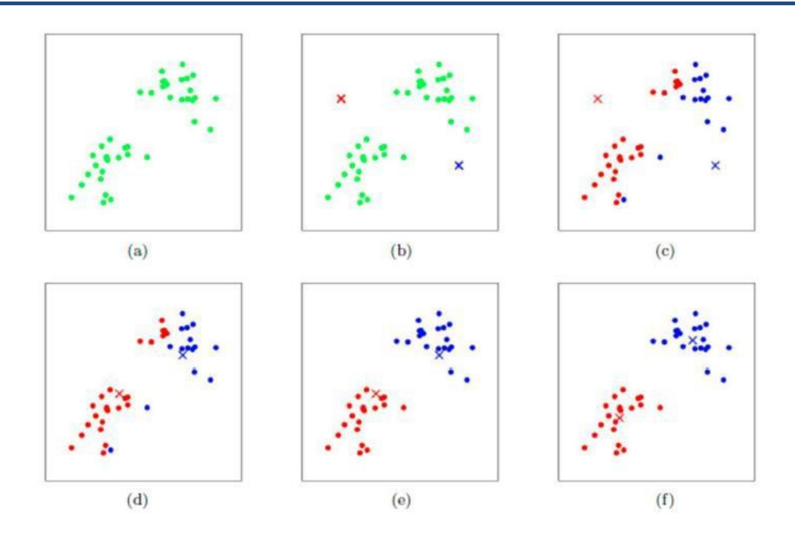

<https://www.naftaliharris.com/blog/visualizing-k-means-clustering/>


#### **K-MEANS**

- Advantages:
  - Simple, fast, suitable for regular datasets
- Disadvantages:
  - The K value is difficult to determine
  - There is a linear relationship between complexity and sample
  - It's hard to spot arbitrary clusters

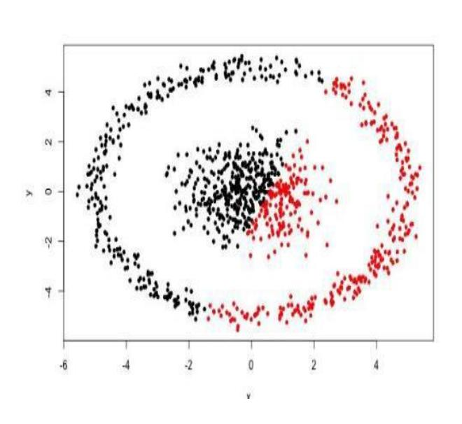

#### **DBSCAN**

- Density-Based Spatial Clustering of Applications with Noise
  - Core object: If the density of a point reaches the threshold set by the
    algorithm, it is the core point.(i.e., the number of points in r neighborhood is
    not less than minPts)
  - ε- Neighborhood distance threshold: set radius r
  - **Direct density reachable:** If a point p is in the r neighborhood of point q, and q is the core point, then the direct density of p-q is reachable.
  - **Density can be reached:** if there is a sequence of points q0, q1,... qk is directly density-accessible for any qi--->qi-1, It is said that the density is reachable from q0 to qk, which is actually the "propagation" of direct density reachable.


#### **DBSCAN algorithm**

## ➢ Basic concepts:

- **Density connected:** If starting from a core point p, point q and point k are both density-reachable, then point q and point k are density-connected.
- **Boundary point:** A non-core point belonging to a class that cannot be developed
- **Direct density reachable:** If a point p is in the r neighborhood of point q, and q is the core point, then the direct density of P-Q is reachable.
- **Noise points:** Points that do not belong to any of the class clusters are density-inaccessible from any of the core points


- ➢ Basic concepts:
  - A: Core object
  - B,C: boundary point
  - N: outlier

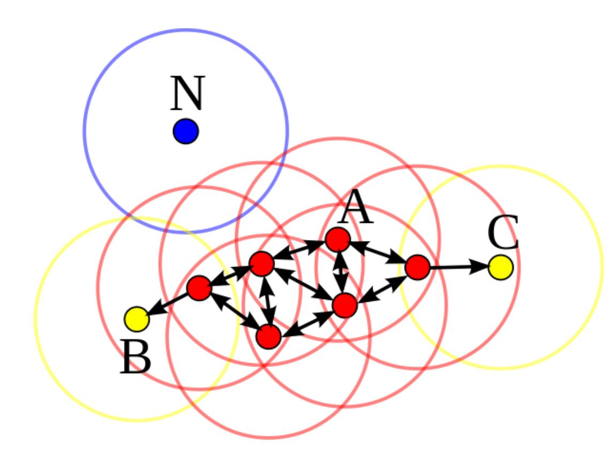

<https://www.naftaliharris.com/blog/visualizing-dbscan-clustering/>

#### **Pseudocode**

```
DBSCAN(DB, distFunc, eps, minPts) {
 C := 0 /* Cluster counter */
 for each point P in database DB {
 if label(P) ≠ undefined then continue /* Previously processed in inner loop */
 Neighbors N := RangeQuery(DB, distFunc, P, eps) /* Find neighbors */
 if |N| < minPts then { /* Density check */
 label(P) := Noise /* Label as Noise */
 continue
 }
 C := C + 1 /* next cluster label */
 label(P) := C /* Label initial point */
 SeedSet S := N \ {P} /* Neighbors to expand */
 for each point Q in S { /* Process every seed point Q */
 if label(Q) = Noise then label(Q) := C /* Change Noise to border point */
 if label(Q) ≠ undefined then continue /* Previously processed (e.g., border point) */
 label(Q) := C /* Label neighbor */
 Neighbors N := RangeQuery(DB, distFunc, Q, eps) /* Find neighbors */
 if |N| ≥ minPtsthen { /* Density check (if Q is a core point) */
 S := S ∪ N /* Add new neighbors to seed set */
 }
 }
 }
}
```

```
RangeQuery(DB, distFunc, Q, eps) {
 Neighbors N := empty list
 for each point P in database DB { /* Scan all points in the database */
 if distFunc(Q, P) ≤ eps then { /* Compute distance and check epsilon */
 N := N ∪ {P} /* Add to result */
 }
 }
 return N
}
```


#### **Parameter selection of DBSCAN**

#### ➢ Parameter selection:

- The radius ϵ can be set according to the K distance: find the mutation point
- K distance: given data set P={p(i); I = 0, 1,... n}, calculates the distance between point P(i) and all points in a subset S of the set D. Distances are ordered in order from smallest to largest, d(k) is called k-distance.
- MinPts: k- The value of k in the distance, usually taken smaller, multiple attempts


#### **Summary**

#### ➢ Advantages:

- You do not need to specify the number of clusters
- Clusters of arbitrary shapes can be found
- Good at finding outliers (detection tasks)
- Two parameters are enough

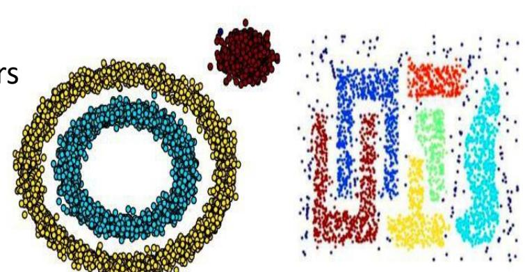

#### ➢ Disadvantages:

- High dimensional data is somewhat difficult (can do dimensionality reduction)
- Difficult to select parameters (parameters have a big impact on the results)
- Slow efficiency in Sklearn (data reduction strategy)

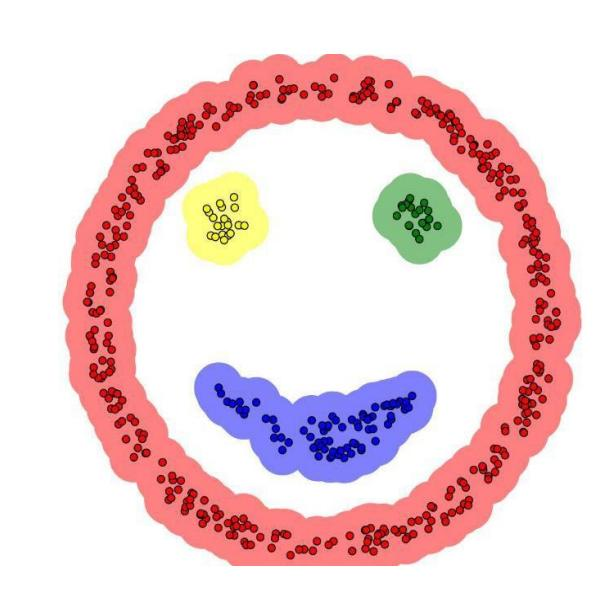

---

# Lecture 9 - Artificial Neural Networks


### **Artificial Intelligence System**

# **Lecture 9 Artificial Neural Network**

Dr Qianyu LIU

Department of Electrical and Electronic Engineering Faculty of Science and Engineering

## Perceptron

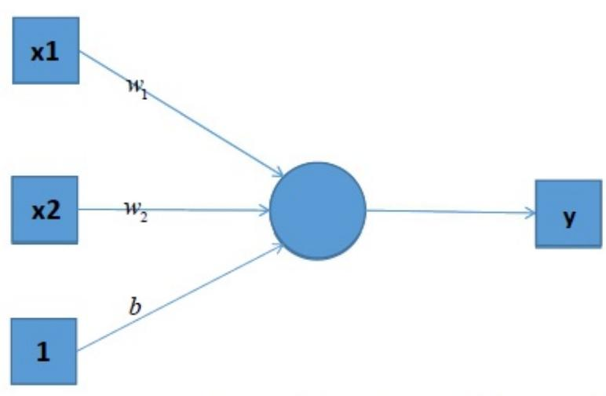

$$y = w_1 x_1 + w_2 x_2 + b$$

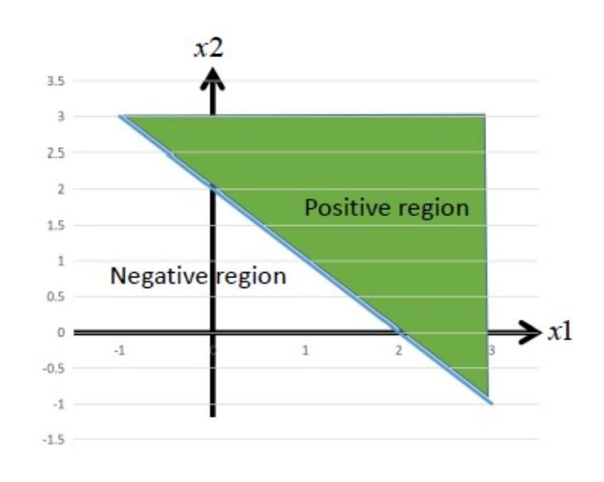

$$w_1 = 1, w_2 = 1, b = -2$$

single layer perceptron is a linear classifier

## Perceptron

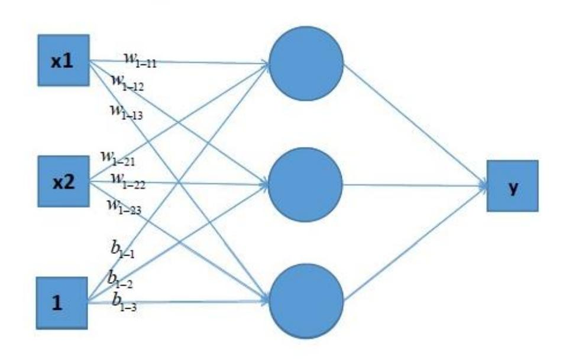

linear combination of three decision lines

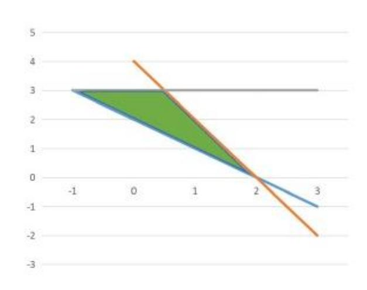

$$w_{1-11} = 1, w_{1-12} = 1, b_{1-1} = -2$$
  
 $w_{1-21} = 2, w_{1-22} = 1, b_{1-2} = 4$   
 $w_{1-31} = 0, w_{1-32} = 1, b_{1-3} = 3$ 


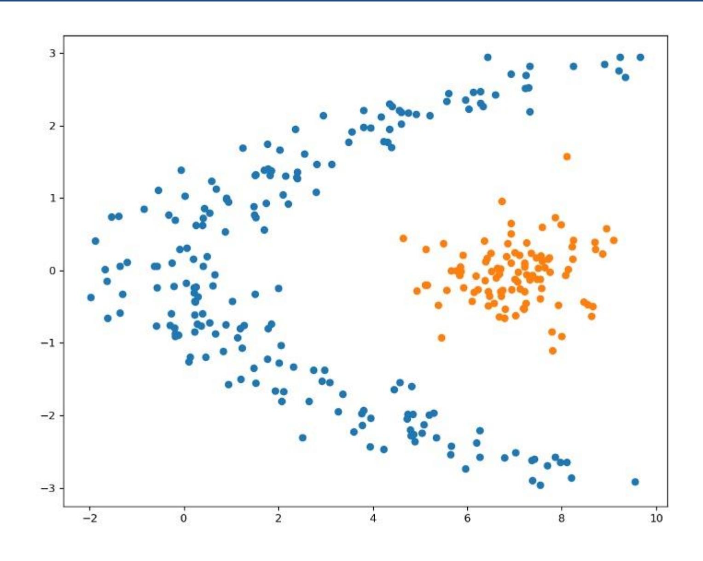

### Perceptron with non-linear activation function

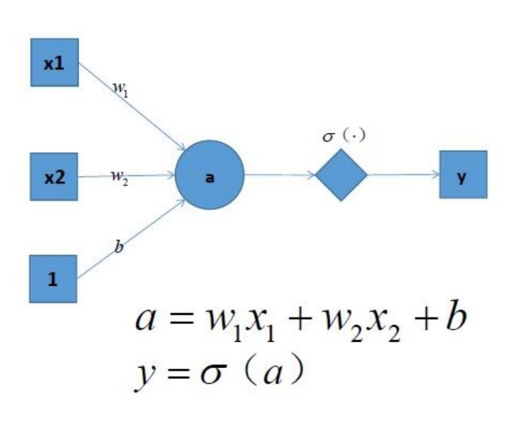

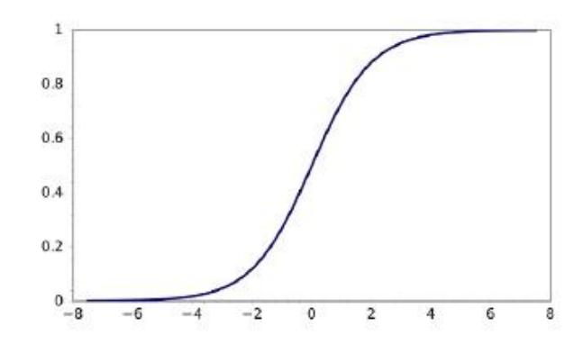

 $\sigma$  (·) is a non-linear activation function, sigmoid was the most popular one,

$$\sigma(y) = \frac{1}{1 + e^{-y}}$$


### Perceptron with non-linear activation function

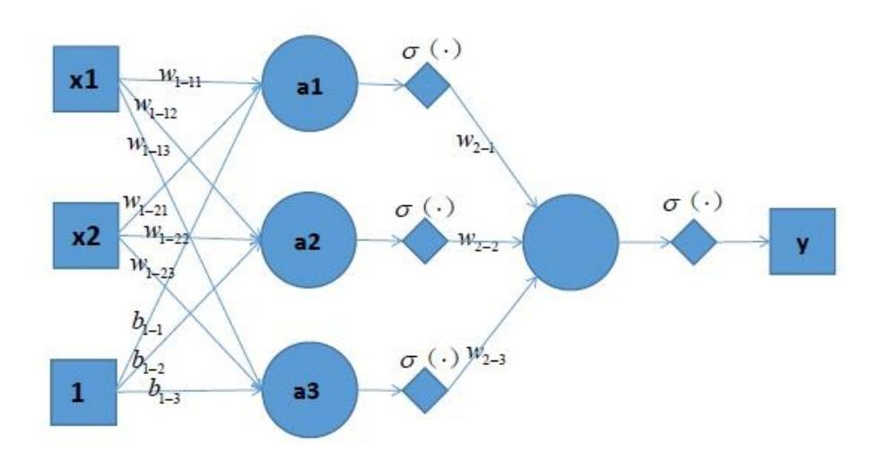

$$a1 = w_{1-11}x_1 + w_{1-21}x_2 + b_{1-1}$$

$$a2 = w_{1-12}x_1 + w_{1-22}x_2 + b_{1-2}$$

$$a3 = w_{1-13}x_1 + w_{1-23}x_2 + b_{1-3}$$

$$y = \sigma(w_{2-1}\sigma(a1) + w_{2-2}\sigma(a2) + w_{2-3}\sigma(a3))$$

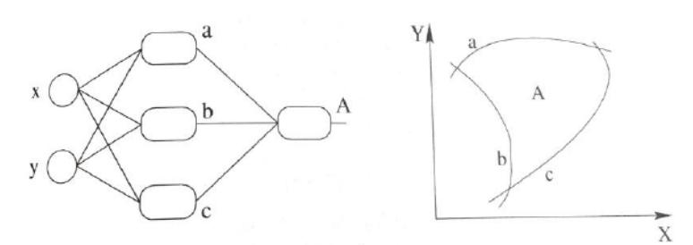


## **Activation Function**

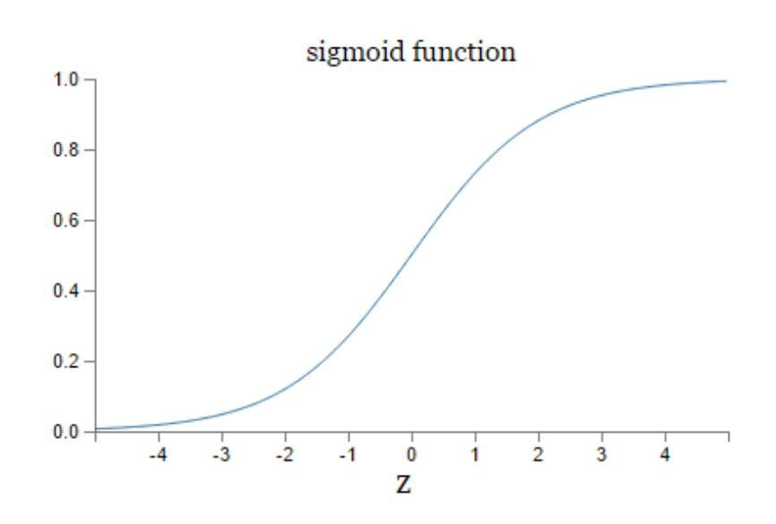

### Advantages:

- 1. Smooth function for easy derivation
- 2. Can compress data to ensure that the data amplitude will not have problems;
- 3. Suitable for forward propagation.

#### Cons:

- 1. Gradient vanishing easily
- 2. Sigmoid output is not zero-centered
- 3. Power functions are time-consuming


## **Activation Function**

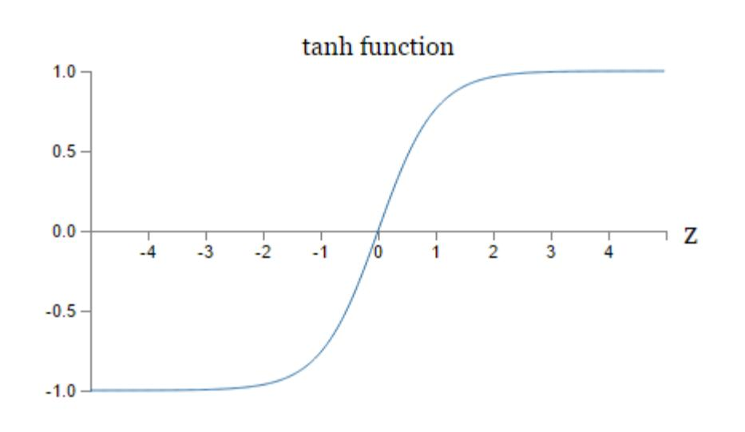

#### Advantages:

1. Compacts the input value into the range -1 to 1, so it is zero-mean, solving the non-zero-centered problem of the Sigmoid function

#### Cons:

- 1. Gradient vanishing easily
- 2. Power functions are timeconsuming


## **Activation Function**


### **Back Propagation - Forward**

#### "Chain Rule"

For Output Layer:

$$Err_{j} = O_{j}(1 - O_{j})(T_{j} - O_{j})$$

$$\uparrow \qquad \uparrow \qquad \uparrow$$

$$\mathbf{1} \qquad \mathbf{2} \qquad \mathbf{3}$$

$$\begin{split} O_j &= \frac{1}{1 + e^{-I_j}} \\ &\log s = \frac{1}{2} (O_j - T_j)^2 \longrightarrow \frac{\partial \log s}{\partial O_j} = (O_j - T_j) \\ &\frac{\partial O_j}{\partial I_j} = (\frac{1}{1 + e^{-I_j}})' \longrightarrow \frac{\partial O_j}{\partial I_j} = O_j (1 - O_j) \\ &\frac{\partial I_j}{\partial w} = out_i w + b \xrightarrow{\text{partial derivative}} \frac{\partial I_j}{\partial w} = out_i \end{split}$$

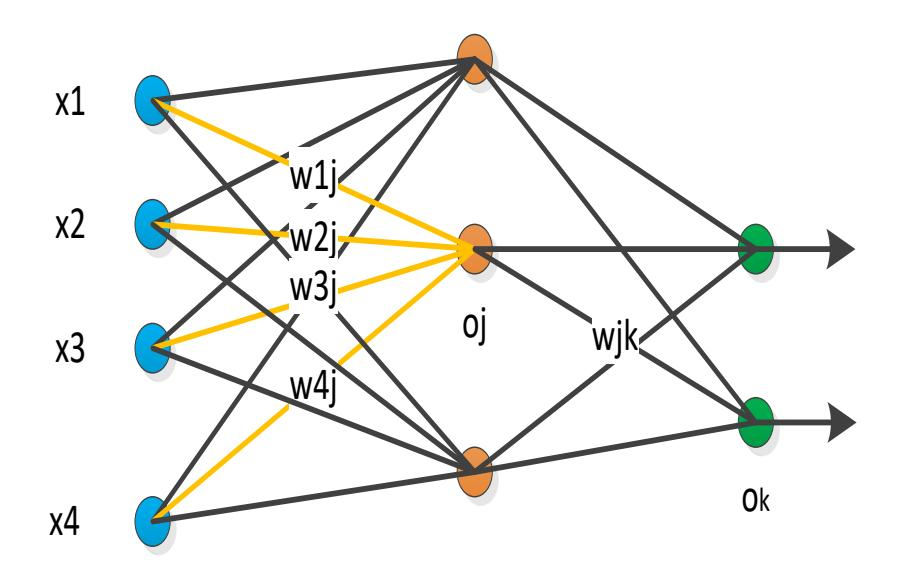

$$\begin{split} \frac{\partial O_{j}}{\partial I_{j}} &= (\frac{1}{1 + e^{-I_{j}}})' \\ &= (-1) \cdot (1 + e^{-I_{j}})^{-2} \cdot e^{-I_{j}} (-1) \\ &= (1 + e^{-I_{j}})^{-2} e^{-I_{j}} \\ &= \frac{e^{-I_{j}}}{(1 + e^{-I_{j}})^{2}} = \frac{1 + e^{-I_{j}} - 1}{(1 + e^{-I_{j}})^{2}} \\ &= \frac{1}{(1 + e^{-I_{j}})} + \frac{-1}{(1 + e^{-I_{j}})^{2}} \\ &= \frac{1}{(1 + e^{-I_{j}})} (1 - \frac{1}{(1 + e^{-I_{j}})}) = O_{j} (1 - O_{j}) \end{split}$$

### **Back Propagation Example - Forward**

| X <sub>1</sub> | X <sub>2</sub> | <b>X</b> <sub>3</sub> | W <sub>14</sub> | W <sub>15</sub> | W <sub>24</sub> | W <sub>25</sub> | W <sub>34</sub> | W <sub>35</sub> | W <sub>46</sub> | W <sub>56</sub> | b <sub>4</sub> | <b>b</b> <sub>5</sub> | b <sub>6</sub> |
|----------------|----------------|-----------------------|-----------------|-----------------|-----------------|-----------------|-----------------|-----------------|-----------------|-----------------|----------------|-----------------------|----------------|
| 1              | 0              | 1                     | 0.2             | -0.3            | 0.4             | 0.1             | -0.5            | 0.2             | -0.3            | -0.2            | -0.4           | 0.2                   | 0.1            |


Loss Function

$$loss = \frac{1}{2}(True - predict)^2$$

**Activation Function** 

$$O = \frac{1}{1 + e^{-I_{j}}}$$

### **Back Propagation Example - Forward**

| <b>x</b> <sub>1</sub> | X <sub>2</sub> | <b>X</b> <sub>3</sub> | W <sub>14</sub> | W <sub>15</sub> | W <sub>24</sub> | W <sub>25</sub> | W <sub>34</sub> | W <sub>35</sub> | W <sub>46</sub> | W <sub>56</sub> | b <sub>4</sub> | <b>b</b> <sub>5</sub> | <b>b</b> <sub>6</sub> |
|-----------------------|----------------|-----------------------|-----------------|-----------------|-----------------|-----------------|-----------------|-----------------|-----------------|-----------------|----------------|-----------------------|-----------------------|
| 1                     | 0              | 1                     | 0.2             | -0.3            | 0.4             | 0.1             | -0.5            | 0.2             | -0.3            | -0.2            | -0.4           | 0.2                   | 0.1                   |


| Neuron<br>j | input I <sub>j</sub>                          | Ouput O <sub>j</sub>            |
|-------------|-----------------------------------------------|---------------------------------|
| 4           | 0.2+0-0.5-0.4=-0.7                            | 1/(1+e <sup>0.7</sup> )=0.332   |
| 5           | -0.3+0+0.2+0.2=0.1                            | 1/(1+e- <sup>0.1</sup> )=0.525  |
| 6           | (-0.3)(0.332)-<br>(0.2)(0.525)+0.1=-<br>0.105 | 1/(1+e <sup>0.105</sup> )=0.474 |

### **Back Propagation Example - Back**

| X <sub>1</sub> | X <sub>2</sub> | <b>X</b> <sub>3</sub> | W <sub>14</sub> | W <sub>15</sub> | W <sub>24</sub> | W <sub>25</sub> | W <sub>34</sub> | W <sub>35</sub> | <b>W</b> <sub>46</sub> | W <sub>56</sub> | b <sub>4</sub> | <b>b</b> <sub>5</sub> | b <sub>6</sub> |
|----------------|----------------|-----------------------|-----------------|-----------------|-----------------|-----------------|-----------------|-----------------|------------------------|-----------------|----------------|-----------------------|----------------|
| 1              | 0              | 1                     | 0.2             | -0.3            | 0.4             | 0.1             | -0.5            | 0.2             | -0.3                   | -0.2            | -0.4           | 0.2                   | 0.1            |


Output Layer 
$$E_{rrj} = O_j(1 - O_j)(T - O_j)$$

Hidden Layer 
$$E_{rrj} = O_j (1 - O_j) \sum_k E_{rr_k} w_{jk}$$

Weight Update 
$$w_{ij} = w_{ij} + \Delta w_{ij}$$

where 
$$\Delta w_{ij} = (\alpha) E_{rrj} O_i$$

Bias Update 
$$\Delta b_j = (\alpha) E_{rrj}$$

$$b_{j} = b_{j} + \Delta b_{j}$$


### **Back Propagation Example - Back**

| <b>x</b> <sub>1</sub> | X <sub>2</sub> | <b>X</b> <sub>3</sub> | W <sub>14</sub> | W <sub>15</sub> | W <sub>24</sub> | W <sub>25</sub> | W <sub>34</sub> | W <sub>35</sub> | <b>W</b> <sub>46</sub> | <b>W</b> <sub>56</sub> | b <sub>4</sub> | <b>b</b> <sub>5</sub> | b <sub>6</sub> |
|-----------------------|----------------|-----------------------|-----------------|-----------------|-----------------|-----------------|-----------------|-----------------|------------------------|------------------------|----------------|-----------------------|----------------|
| 1                     | 0              | 1                     | 0.2             | -0.3            | 0.4             | 0.1             | -0.5            | 0.2             | -0.3                   | -0.2                   | -0.4           | 0.2                   | 0.1            |


| Neuron j | input I <sub>j</sub>                      | Ouput O <sub>j</sub>            |  |  |  |  |
|----------|-------------------------------------------|---------------------------------|--|--|--|--|
| 4        | 0.2+0-0.5-0.4=-0.7                        | 1/(1+e <sup>0.7</sup> )=0.332   |  |  |  |  |
| 5        | -0.3+0+0.2+0.2=0.1                        | 1/(1+e- <sup>0.1</sup> )=0.525  |  |  |  |  |
| 6        | (-0.3)(0.332)-<br>(0.2)(0.525)+0.1=-0.105 | 1/(1+e <sup>0.105</sup> )=0.474 |  |  |  |  |

| Neuron j | Errj                                   |
|----------|----------------------------------------|
| 4        | (0.332)(1-0.332)(0.1311)(-0.3)=-0.0087 |
| 5        | (0.525)(1-0.525)(0.1311)(-0.2)=-0.0065 |
| 6        | (0.474)(1-0.474)(1-0.474)=0.1311       |

Output Layer  $E_{rrj} = O_j (1 - O_j)(T - O_j)$ 

Hidden Layer  $E_{rrj} = O_j (1 - O_j) \sum_k E_{rr_k} w_{jk}$ 

Weight Update  $w_{ij} = w_{ij} + \Delta w_{ij}$ 

where  $\Delta w_{ii} = (\alpha) E_{rri} O_i$ 

Bias Update  $\Delta b_{_{j}} = (\alpha) E_{_{rrj}}$ 

 $b_{j} = b_{j} + \Delta b_{j}$ 


## **Back Propagation Example - Updated value**

| W or b | Updated value                    |
|--------|----------------------------------|
| w46    | -0.3+(0.9)(0.1311)(0.332)=-0.261 |
| w56    | -0.2+(0.9)(0.1311)(0.525)=-0.138 |
| w14    | 0.2+(0.9)(-0.0087)(1)=-0.192     |
| w15    | -0.3+(0.9)(-0.0065)(1)=0.306     |
| w24    | 0.4+(0.9)(-0.0087)(0)=0.4        |
| w25    | 0.1+(0.9)(-0.0065)(0)=0.1        |
| w34    | -0.5+(0.9)(-0.0087)(1)=-0.508    |
| w35    | 0.2+(0.9)(-0.0065)(1)=0.194      |
| b6     | 0.1+(0.9)(-0.1311)(1)=-0.218     |
| b5     | 0.2+(0.9)(-0.0065)=0.194         |
| b4     | -0.4+(0.9)(-0.0087)=-0.408       |

Weight Update *<sup>w</sup>ij <sup>w</sup>ij* <sup>+</sup> *<sup>w</sup>ij*

where *<sup>w</sup>ij <sup>E</sup>rrjO<sup>i</sup>* <sup>=</sup> ()

Bias Update *<sup>b</sup><sup>j</sup> <sup>E</sup>rrj* <sup>=</sup> ()

> *bj* =*<sup>b</sup><sup>j</sup>* <sup>+</sup> *b<sup>j</sup>*

| Neuron j | Errj                                       |
|----------|--------------------------------------------|
| 4        | (0.332)(1-0.332)(0.1311)(-0.3)=-<br>0.0087 |
| 5        | (0.525)(1-0.525)(0.1311)(-0.2)=-<br>0.0065 |
| 6        | (0.474)(1-0.474)(1-<br>0.474)=0.1311       |

| Neuron j | input I<br>j                                  | Ouput<br>O<br>j      |
|----------|-----------------------------------------------|----------------------|
| 4        | 0.2+0-0.5-0.4=-0.7                            | 1/(1+e0.7)=0.332     |
| 5        | -0.3+0+0.2+0.2=0.1                            | 0.1)=0.525<br>1/(1+e |
| 6        | (-0.3)(0.332)-<br>(0.2)(0.525)+0.1=-<br>0.105 | 1/(1+e0.105)=0.474   |

| x | x | x | w   | w    | w   | w   | w    | w   | w    | w    | b    | b   | b   |
|---|---|---|-----|------|-----|-----|------|-----|------|------|------|-----|-----|
| 1 | 2 | 3 | 14  | 15   | 24  | 25  | 34   | 35  | 46   | 56   | 4    | 5   | 6   |
| 1 | 0 | 1 | 0.2 | -0.3 | 0.4 | 0.1 | -0.5 | 0.2 | -0.3 | -0.2 | -0.4 | 0.2 | 0.1 |

### **Back Propagation – Value Updaed Example 1**

$$W_{14}X_1 + W_{24}X_2 + W_{34}X_3 + b_4 = I_4$$

$$O_4 = \frac{1}{1 + e^{-I_4}}$$

$$W_{15}X_1 + W_{25}X_2 + W_{35}X_3 + b_5 = I_5$$

$$O_5 = \frac{1}{1 + e^{-I_5}}$$

$$W_{46}O_4 + W_{56}O_5 + b_6 = I_6$$

$$O_6 = \frac{1}{1 + e^{-I_6}}$$

**Loss Function** 

$$loss = \frac{1}{2}(1 - O_6)^2$$

Example 1: Update w<sub>46</sub> and b6

$$\frac{\partial loss}{\partial w_{46}} = \frac{\partial loss}{\partial_{O_6}} \cdot \frac{\partial O_6}{\partial_{I_6}} \cdot \frac{\partial I_6}{\partial w_{46}} \qquad \frac{\partial loss}{\partial b_6} = \frac{\partial loss}{\partial_{O_6}} \cdot \frac{\partial O_6}{\partial_{I_6}} \cdot \frac{\partial I_6}{\partial b_6}$$

$$\frac{\partial loss}{\partial_{O_6}} \cdot \frac{\partial O_6}{\partial_{I_6}} = (1 - O_6)(1 - O_6)O_6 = (1 - 0.474)(1 - 0.474)(0.474) = 0.1311$$

$$\frac{\partial I}{\partial I} = \frac{\partial I}{\partial I} = \frac{\partial I}{\partial I} = \frac{\partial I}{\partial I} = \frac{\partial I}{\partial I} = \frac{\partial I}{\partial I} = \frac{\partial I}{\partial I} = \frac{\partial I}{\partial I} = \frac{\partial I}{\partial I} = \frac{\partial I}{\partial I} = \frac{\partial I}{\partial I} = \frac{\partial I}{\partial I} = \frac{\partial I}{\partial I} = \frac{\partial I}{\partial I} = \frac{\partial I}{\partial I} = \frac{\partial I}{\partial I} = \frac{\partial I}{\partial I} = \frac{\partial I}{\partial I} = \frac{\partial I}{\partial I} = \frac{\partial I}{\partial I} = \frac{\partial I}{\partial I} = \frac{\partial I}{\partial I} = \frac{\partial I}{\partial I} = \frac{\partial I}{\partial I} = \frac{\partial I}{\partial I} = \frac{\partial I}{\partial I} = \frac{\partial I}{\partial I} = \frac{\partial I}{\partial I} = \frac{\partial I}{\partial I} = \frac{\partial I}{\partial I} = \frac{\partial I}{\partial I} = \frac{\partial I}{\partial I} = \frac{\partial I}{\partial I} = \frac{\partial I}{\partial I} = \frac{\partial I}{\partial I} = \frac{\partial I}{\partial I} = \frac{\partial I}{\partial I} = \frac{\partial I}{\partial I} = \frac{\partial I}{\partial I} = \frac{\partial I}{\partial I} = \frac{\partial I}{\partial I} = \frac{\partial I}{\partial I} = \frac{\partial I}{\partial I} = \frac{\partial I}{\partial I} = \frac{\partial I}{\partial I} = \frac{\partial I}{\partial I} = \frac{\partial I}{\partial I} = \frac{\partial I}{\partial I} = \frac{\partial I}{\partial I} = \frac{\partial I}{\partial I} = \frac{\partial I}{\partial I} = \frac{\partial I}{\partial I} = \frac{\partial I}{\partial I} = \frac{\partial I}{\partial I} = \frac{\partial I}{\partial I} = \frac{\partial I}{\partial I} = \frac{\partial I}{\partial I} = \frac{\partial I}{\partial I} = \frac{\partial I}{\partial I} = \frac{\partial I}{\partial I} = \frac{\partial I}{\partial I} = \frac{\partial I}{\partial I} = \frac{\partial I}{\partial I} = \frac{\partial I}{\partial I} = \frac{\partial I}{\partial I} = \frac{\partial I}{\partial I} = \frac{\partial I}{\partial I} = \frac{\partial I}{\partial I} = \frac{\partial I}{\partial I} = \frac{\partial I}{\partial I} = \frac{\partial I}{\partial I} = \frac{\partial I}{\partial I} = \frac{\partial I}{\partial I} = \frac{\partial I}{\partial I} = \frac{\partial I}{\partial I} = \frac{\partial I}{\partial I} = \frac{\partial I}{\partial I} = \frac{\partial I}{\partial I} = \frac{\partial I}{\partial I} = \frac{\partial I}{\partial I} = \frac{\partial I}{\partial I} = \frac{\partial I}{\partial I} = \frac{\partial I}{\partial I} = \frac{\partial I}{\partial I} = \frac{\partial I}{\partial I} = \frac{\partial I}{\partial I} = \frac{\partial I}{\partial I} = \frac{\partial I}{\partial I} = \frac{\partial I}{\partial I} = \frac{\partial I}{\partial I} = \frac{\partial I}{\partial I} = \frac{\partial I}{\partial I} = \frac{\partial I}{\partial I} = \frac{\partial I}{\partial I} = \frac{\partial I}{\partial I} = \frac{\partial I}{\partial I} = \frac{\partial I}{\partial I} = \frac{\partial I}{\partial I} = \frac{\partial I}{\partial I} = \frac{\partial I}{\partial I} = \frac{\partial I}{\partial I} = \frac{\partial I}{\partial I} = \frac{\partial I}{\partial I} = \frac{\partial I}{\partial I} = \frac{\partial I}{\partial I} = \frac{\partial I}{\partial I} = \frac{\partial I}{\partial I} = \frac{\partial I}{\partial I} = \frac{\partial I}{\partial I} = \frac{\partial I}{\partial I} = \frac{\partial I}{\partial I} = \frac{\partial I}{\partial I} = \frac{\partial I}{\partial I} = \frac{\partial I}{\partial I} = \frac{\partial I}{\partial I} = \frac{\partial I}{\partial I} = \frac{\partial I}{\partial I} = \frac{\partial I}{\partial I} = \frac{\partial I}{\partial I} = \frac{\partial I}{\partial I} = \frac{\partial I}{\partial I} = \frac{\partial I}{\partial I} = \frac{\partial I}{\partial I} = \frac{\partial I}{\partial I} = \frac{\partial I}{\partial I} = \frac{\partial I}{\partial I} = \frac{\partial I}{$$

$$\frac{\partial I_6}{\partial w_{46}} = O_4 = 0.322 \qquad \frac{\partial I_6}{\partial b_6} = 1$$

Updating w<sub>46</sub> and b<sub>6</sub>

$$w_{46new} = w_{46} + \alpha \frac{\partial loss}{\partial w_{46}} = -0.3 + (0.9)(0.1311)(0.332) = -0.261$$

$$b_{6new} = b_6 + \alpha \frac{\partial loss}{\partial b_6} = 0.1 + (0.9)(0.1311) = 0.218$$

### **Back Propagation – Value Updaed Example 2**

$$W_{14}x_1 + W_{24}x_2 + W_{34}x_3 + b_4 = I_4$$

$$O_4 = \frac{1}{1 + e^{-I_4}}$$

$$W_{15}X_1 + W_{25}X_2 + W_{35}X_3 + b_5 = I_5$$

$$O_5 = \frac{1}{1 + e^{-I_5}}$$

$$W_{46}O_4 + W_{56}O_5 + b_6 = I_6$$

$$O_6 = \frac{1}{1 + e^{-I_6}}$$

Loss function

$$loss = \frac{1}{2}(1 - O_6)^2$$

Example 2: Update w<sub>14</sub> at hidden layer

$$\frac{\partial loss}{\partial w_{14}} = \frac{\partial loss}{\partial_{O_6}} \cdot \frac{\partial O_6}{\partial_{I_6}} \cdot \frac{\partial I_6}{\partial O_4} \cdot \frac{\partial O_4}{\partial I_4} \cdot \frac{\partial I_4}{\partial w_{14}}$$


$$\frac{\partial loss}{\partial_{O_6}} \cdot \frac{\partial O_6}{\partial_{I_6}} = (1 - O_6)(1 - O_6)O_6 = (1 - 0.474)(1 - 0.474)(0.474) = 0.1311$$

$$\frac{\partial I_6}{\partial O_4} \cdot \frac{\partial O_4}{\partial I_4} = O_4 (1 - O_4) w_{46}$$

$$\frac{\partial I_4}{\partial w_{14}} = x_1 \qquad \frac{\partial loss}{\partial w_{14}} = (1 - O_6)(1 - O_6)O_6O_4(1 - O_4)w_{46}x_1$$

$$\frac{\partial loss}{\partial w_{14}} = (0.1311)(0.474)(1 - 0.474)w_{46}x_1 = (-0.0087)w_{46}x_1$$

Updating w<sub>46</sub>

$$W_{14new} = W_{14} + \alpha \frac{\partial loss}{\partial W_{14}} = 0.2 + (0.9)((-0.0087)(1) = 0.192$$

### **Back Propagation – Value Updaed Example 3**

$$W_{14}X_1 + W_{24}X_2 + W_{34}X_3 + b_4 = I_4$$

$$O_4 = \frac{1}{1 + e^{-I_4}}$$

$$W_{15}X_1 + W_{25}X_2 + W_{35}X_3 + b_5 = I_5$$

$$O_5 = \frac{1}{1 + e^{-I_5}}$$

$$W_{46}O_4 + W_{56}O_5 + b_6 = I_6$$

$$O_6 = \frac{1}{1 + e^{-I_6}}$$

**Loss Function** 

$$loss = \frac{1}{2}(1 - O_6)^2$$

Example 3 Update b<sub>4</sub>

$$\frac{\partial loss}{\partial b_4} = \frac{\partial loss}{\partial O_6} \cdot \frac{\partial O_6}{\partial I_4} \cdot \frac{\partial I_6}{\partial O_4} \cdot \frac{\partial O_4}{\partial I_4} \cdot \frac{\partial I_4}{\partial b_4}$$

$$\frac{\partial loss}{\partial_{Q_{1}}} \cdot \frac{\partial O_{6}}{\partial_{I}} = (1 - O_{6})(1 - O_{6})O_{6} = (1 - 0.474)(1 - 0.474)(0.474) = 0.1311$$

$$\frac{\partial I_6}{\partial O_4} \cdot \frac{\partial O_4}{\partial I_4} = O_4 (1 - O_4) w_{46} \qquad \frac{\partial I_4}{\partial b_4} = 1$$

$$\frac{\partial loss}{\partial b_4} = (1 - O_6)(1 - O_6)O_6O_4(1 - O_4)w_{46}$$

$$\frac{\partial loss}{\partial b_4} = (0.1311)(0.474)(1 - 0.474)w_{46} = (-0.0087)w_{46}$$

Updating b<sub>4</sub>

$$b_{4new} = b_4 + \alpha \frac{\partial loss}{\partial b_4} = 0.1 + (0.9)(-0.0087) = -0.408$$