---

# Class_Code_CNN

```python
import torch
import torch.nn as nn
import torch.optim as optim
import torchvision
import torchvision.transforms as transforms
from torch.utils.data import DataLoader
import torch.nn.functional as F
```

```python
torch.manual_seed(42)
torch.backends.cudnn.deterministic = True
torch.backends.cudnn.benchmark = False

transform = transforms.Compose([
    transforms.ToTensor(),
    transforms.Normalize((0.5, 0.5, 0.5), (0.5, 0.5, 0.5)),
])


device = torch.device('cuda' if torch.cuda.is_available() else 'cpu')

print(device)
```

```
cuda

```

```python

train_dataset = torchvision.datasets.CIFAR10(root='./data', train=True, download=True, transform=transform)
test_dataset = torchvision.datasets.CIFAR10(root='./data', train=False, download=True, transform=transform)
```

```
Downloading https://www.cs.toronto.edu/~kriz/cifar-10-python.tar.gz to ./data\cifar-10-python.tar.gz

```

```
100.0%

```

```
Extracting ./data\cifar-10-python.tar.gz to ./data
Files already downloaded and verified

```

```python
batch_size = 64
train_loader = DataLoader(train_dataset, batch_size=batch_size, shuffle=True, num_workers=2)
test_loader = DataLoader(test_dataset, batch_size=batch_size, shuffle=False, num_workers=2)
```

```python
class SimpleCNN(nn.Module):
    def __init__(self):
        super(SimpleCNN, self).__init__()
        self.conv1 = nn.Conv2d(3, 64, kernel_size=3, stride=1, padding=1)
        self.conv2 = nn.Conv2d(64, 128, kernel_size=3, stride=1, padding=1)
        self.pool = nn.MaxPool2d(kernel_size=2, stride=2, padding=0)
        self.fc1 = nn.Linear(128 * 8 * 8, 512)
        self.fc2 = nn.Linear(512, 10)

    def forward(self, x):
        x = self.pool(F.relu(self.conv1(x)))
        x = self.pool(F.relu(self.conv2(x)))
        x = x.view(-1, 128 * 8 * 8)
        x = F.relu(self.fc1(x))
        x = self.fc2(x)
        return x
```

```python
def train(model, criterion, optimizer, train_loader, num_epochs=5):
    model.train()
    for epoch in range(num_epochs):
        running_loss = 0.0
        for inputs, labels in train_loader:
            optimizer.zero_grad()
            inputs, labels = inputs.to(device), labels.to(device)
            outputs= model(inputs)
            loss = criterion(outputs, labels)
            loss.backward()
            optimizer.step()
            running_loss += loss.item()
        print(f'Epoch {epoch+1}/{num_epochs}, Loss: {running_loss/len(train_loader)}')
```

```python
def test(model, test_loader):
    model.eval()
    correct = 0
    total = 0
    with torch.no_grad():
        for inputs, labels in test_loader:
            
            inputs, labels = inputs.to(device), labels.to(device)
            outputs = model(inputs)
            _, predicted = torch.max(outputs.data, 1)
            total += labels.size(0)
            correct += (predicted == labels.to(device)).sum().item()
    accuracy = correct / total
    print(f'Test Accuracy: {accuracy * 100:.2f}%')
```

```python
cnn_model = SimpleCNN()
cnn_model.to(device)
criterion = nn.CrossEntropyLoss()
cnn_optimizer = optim.SGD(cnn_model.parameters(), lr=0.001, momentum=0.9)

```

```python
print("Training CNN:")
train(cnn_model.to(device), criterion, cnn_optimizer, train_loader, num_epochs=5)
test(cnn_model.to(device), test_loader)
```

```
Training CNN:
Epoch 1/5, Loss: 1.9747237454899742
Epoch 2/5, Loss: 1.5842009656264653
Epoch 3/5, Loss: 1.4135290305022998
Epoch 4/5, Loss: 1.3003660465597802
Epoch 5/5, Loss: 1.216516911678607
Test Accuracy: 57.63%

```

---

# FCN example

```python
import torch
import torch.nn as nn
import torch.optim as optim
import torchvision
import torchvision.transforms as transforms
import matplotlib.pyplot as plt

# Set device
device = torch.device("cuda" if torch.cuda.is_available() else "cpu")

# Data preparation
transform = transforms.Compose([transforms.ToTensor(), transforms.Normalize((0.5,), (0.5,))])

trainset = torchvision.datasets.MNIST(root='./data', train=True, download=True, transform=transform)
trainloader = torch.utils.data.DataLoader(trainset, batch_size=64, shuffle=True)

testset = torchvision.datasets.MNIST(root='./data', train=False, download=True, transform=transform)
testloader = torch.utils.data.DataLoader(testset, batch_size=64, shuffle=False)


```

```
E:\Anaconda\envs\ml\lib\site-packages\tqdm\auto.py:21: TqdmWarning: IProgress not found. Please update jupyter and ipywidgets. See https://ipywidgets.readthedocs.io/en/stable/user_install.html
  from .autonotebook import tqdm as notebook_tqdm

```

```
Downloading http://yann.lecun.com/exdb/mnist/train-images-idx3-ubyte.gz
Failed to download (trying next):
HTTP Error 404: Not Found

Downloading https://ossci-datasets.s3.amazonaws.com/mnist/train-images-idx3-ubyte.gz
Downloading https://ossci-datasets.s3.amazonaws.com/mnist/train-images-idx3-ubyte.gz to ./data\MNIST\raw\train-images-idx3-ubyte.gz

```

```
9913344it [00:20, 474377.89it/s]                                                                                       

```

```
Extracting ./data\MNIST\raw\train-images-idx3-ubyte.gz to ./data\MNIST\raw

Downloading http://yann.lecun.com/exdb/mnist/train-labels-idx1-ubyte.gz
Failed to download (trying next):
HTTP Error 404: Not Found

Downloading https://ossci-datasets.s3.amazonaws.com/mnist/train-labels-idx1-ubyte.gz
Downloading https://ossci-datasets.s3.amazonaws.com/mnist/train-labels-idx1-ubyte.gz to ./data\MNIST\raw\train-labels-idx1-ubyte.gz

```

```
29696it [00:00, 68416.11it/s]                                                                                          

```

```
Extracting ./data\MNIST\raw\train-labels-idx1-ubyte.gz to ./data\MNIST\raw

Downloading http://yann.lecun.com/exdb/mnist/t10k-images-idx3-ubyte.gz
Failed to download (trying next):
HTTP Error 404: Not Found

Downloading https://ossci-datasets.s3.amazonaws.com/mnist/t10k-images-idx3-ubyte.gz
Downloading https://ossci-datasets.s3.amazonaws.com/mnist/t10k-images-idx3-ubyte.gz to ./data\MNIST\raw\t10k-images-idx3-ubyte.gz

```

```
1649664it [00:04, 411033.96it/s]                                                                                       

```

```
Extracting ./data\MNIST\raw\t10k-images-idx3-ubyte.gz to ./data\MNIST\raw

Downloading http://yann.lecun.com/exdb/mnist/t10k-labels-idx1-ubyte.gz
Failed to download (trying next):
HTTP Error 404: Not Found

Downloading https://ossci-datasets.s3.amazonaws.com/mnist/t10k-labels-idx1-ubyte.gz
Downloading https://ossci-datasets.s3.amazonaws.com/mnist/t10k-labels-idx1-ubyte.gz to ./data\MNIST\raw\t10k-labels-idx1-ubyte.gz

```

```
5120it [00:00, 5117930.52it/s]                                                                                         
E:\Anaconda\envs\ml\lib\site-packages\torchvision\datasets\mnist.py:502: UserWarning: The given NumPy array is not writeable, and PyTorch does not support non-writeable tensors. This means you can write to the underlying (supposedly non-writeable) NumPy array using the tensor. You may want to copy the array to protect its data or make it writeable before converting it to a tensor. This type of warning will be suppressed for the rest of this program. (Triggered internally at  ..\torch\csrc\utils\tensor_numpy.cpp:143.)
  return torch.from_numpy(parsed.astype(m[2], copy=False)).view(*s)

```

```
Extracting ./data\MNIST\raw\t10k-labels-idx1-ubyte.gz to ./data\MNIST\raw

Processing...
Done!

```

```python
def imshow(img):
    img = img / 2 + 0.5  # 反标准化
    npimg = img.numpy()
    plt.imshow(np.transpose(npimg, (1, 2, 0)))
    plt.show()
```

Unnormalize the image: img = img / 2 + 0.5

    The images in the MNIST dataset were normalized during the transformation process to have a mean of 0.5 and a standard deviation of 0.5. This line reverses that normalization to bring the pixel values back to their original range.

Convert the image to a numpy array: npimg = img.numpy()

    PyTorch tensors need to be converted to numpy arrays for visualization using matplotlib.

Transpose the image: plt.imshow(np.transpose(npimg, (1, 2, 0)))

    The image tensor has dimensions [channels, height, width], but matplotlib expects dimensions [height, width, channels]. The np.transpose function rearranges the dimensions accordingly.

Display the image: plt.show()

    This function call actually renders the image using matplotlib.

```python
dataiter = iter(trainloader)
images, labels = next(dataiter)

imshow(torchvision.utils.make_grid(images))
print(' '.join(f'{labels[j].item()}' for j in range(8)))
```

Create an iterator for the DataLoader: dataiter = iter(trainloader)

    This line creates an iterator for the training data loader, which allows you to iterate over batches of data.

Get the next batch of images and labels: images, labels = next(dataiter)

    This line retrieves the next batch of images and their corresponding labels from the data loader.

Visualize the batch of images: imshow(torchvision.utils.make_grid(images))

    The torchvision.utils.make_grid function combines the batch of images into a single grid image. The imshow function defined earlier is then used to display this grid of images.

Print the labels of the displayed images: print(' '.join(f'{labels[j].item()}' for j in range(8)))

    This line prints the labels of the first 8 images in the batch. The labels tensor is iterated over, and each label is converted to an integer and formatted into a string for printing.|

```python
# Define fully connected neural network
class Net(nn.Module):
    def __init__(self):
        super(Net, self).__init__()
        self.fc1 = nn.Linear(28 * 28, 512)
        self.fc2 = nn.Linear(512, 256)
        self.fc3 = nn.Linear(256, 10)
        
    def forward(self, x):
        x = x.view(-1, 28 * 28)  # Flatten the input
        x = torch.relu(self.fc1(x))
        x = torch.relu(self.fc2(x))
        x = self.fc3(x)
        return x

# Initialize model, loss function, and optimizer
net = Net().to(device)
criterion = nn.CrossEntropyLoss()
optimizer = optim.Adam(net.parameters(), lr=0.001)

# Lists to store training and testing loss and accuracy
train_losses = []
test_losses = []
test_accuracies = []

# Train the model
epochs = 5
for epoch in range(epochs):
    running_loss = 0.0
    for inputs, labels in trainloader:
        inputs, labels = inputs.to(device), labels.to(device)
        
        optimizer.zero_grad()
        
        outputs = net(inputs)
        loss = criterion(outputs, labels)
        loss.backward()
        optimizer.step()
        
        running_loss += loss.item()
    
    train_losses.append(running_loss / len(trainloader))
    
    # Test the model
    test_loss = 0.0
    correct = 0
    total = 0
    with torch.no_grad():
        for inputs, labels in testloader:
            inputs, labels = inputs.to(device), labels.to(device)
            outputs = net(inputs)
            loss = criterion(outputs, labels)
            test_loss += loss.item()
            
            _, predicted = torch.max(outputs, 1)
            total += labels.size(0)
            correct += (predicted == labels).sum().item()
    
    test_losses.append(test_loss / len(testloader))
    test_accuracies.append(100 * correct / total)
    
    print(f"Epoch {epoch + 1}, Train Loss: {train_losses[-1]}, Test Loss: {test_losses[-1]}, Test Accuracy: {test_accuracies[-1]}%")

print("Finished Training")

# Plot the training results
plt.figure(figsize=(12, 4))

# Plot loss curves
plt.subplot(1, 2, 1)
plt.plot(train_losses, label='Train Loss')
plt.plot(test_losses, label='Test Loss')
plt.xlabel('Epoch')
plt.ylabel('Loss')
plt.legend()
plt.title('Loss over Epochs')

# Plot accuracy curve
plt.subplot(1, 2, 2)
plt.plot(test_accuracies, label='Test Accuracy')
plt.xlabel('Epoch')
plt.ylabel('Accuracy (%)')
plt.legend()
plt.title('Test Accuracy over Epochs')

plt.show()

```

---

# S1-Software installation process

> [python-docx not installed, skipping S1-Software installation process.docx]

---

# S2-Seminar_code

# Import the required toolkit

```python
import numpy as np
import pandas as pd
import matplotlib.pyplot as plt
import seaborn as sns
from IPython import display

import matplotlib_inline

matplotlib_inline.backend_inline.set_matplotlib_formats('svg')

```

```python
data = pd.read_feather('house_sales.ftr')
```

# Check the shape of the data and the contents of the first few lines

```python
data.shape
```

```
(164944, 1789)
```

```python
data.head()
```

```
           Id                    Address   Sold Price   Sold On  \
0  2080183300            11205 Monterey,   $2,000,000  01/31/20   
1    20926300            5281 Castle Rd,   $2,100,000  02/25/21   
2    19595300           3581 Butcher Dr,   $1,125,000  11/06/19   
3   300472200      2021 N Milpitas Blvd,  $36,250,000  10/02/20   
4  2074492000  LOT 4 Tool Box Spring Rd,     $140,000  10/19/20   

                                             Summary          Type Year built  \
0  11205 Monterey, San Martin, CA 95046 is a sing...  SingleFamily    No Data   
1  Spectacular Mountain and incredible L.A. City ...  SingleFamily       1951   
2  Eichler Style home! with Santa Clara High! in ...  SingleFamily       1954   
3  2021 N Milpitas Blvd, Milpitas, CA 95035 is a ...     Apartment       1989   
4  Beautiful level lot  dotted with pine trees ro...    VacantLand    No Data   

                    Heating            Cooling  \
0                   No Data            No Data   
1                   Central  Central Air, Dual   
2  Central Forced Air - Gas         Central AC   
3                     Other            No Data   
4                   No Data            No Data   

                              Parking  ... Well Disclosure remodeled  DOH2  \
0                            0 spaces  ...            None      None  None   
1          Driveway, Driveway - Brick  ...            None      None  None   
2  Garage, Garage - Attached, Covered  ...            None      None  None   
3                      Mixed, Covered  ...            None      None  None   
4                            0 spaces  ...            None      None  None   

  SerialX Full Baths Tax Legal Lot Number Tax Legal Block Number  \
0    None       None                 None                   None   
1    None       None                 None                   None   
2    None       None                 None                   None   
3    None       None                 None                   None   
4    None       None                 None                   None   

  Tax Legal Tract Number Building Name    Zip  
0                   None          None  95046  
1                   None          None  91011  
2                   None          None  95051  
3                   None          None  95035  
4                   None          None  92561  

[5 rows x 1789 columns]
```

# 30% of the features will be removed with the overhead value

```python
null_sum = data.isnull().sum()
print(null_sum)
```

```
Id                             0
Address                        0
Sold Price                    85
Sold On                        0
Summary                     3117
                           ...  
Tax Legal Lot Number      164943
Tax Legal Block Number    164943
Tax Legal Tract Number    164943
Building Name             164943
Zip                            0
Length: 1789, dtype: int64

```

```python
null_sum = data.isnull().sum()
data.columns[null_sum<len(data)*0.3]
```

```
Index(['Id', 'Address', 'Sold Price', 'Sold On', 'Summary', 'Type',
       'Year built', 'Heating', 'Cooling', 'Parking', 'Bedrooms', 'Bathrooms',
       'Total interior livable area', 'Total spaces', 'Garage spaces',
       'Home type', 'Region', 'Elementary School', 'Elementary School Score',
       'Elementary School Distance', 'High School', 'High School Score',
       'High School Distance', 'Heating features', 'Parking features',
       'Lot size', 'Parcel number', 'Tax assessed value', 'Annual tax amount',
       'Listed On', 'Listed Price', 'Zip'],
      dtype='object')
```

```python
data.drop(columns=data.columns[null_sum>len(data)*0.3],inplace=True)
```

```python
data.shape
```

```
(164944, 32)
```

```python
data.head()
```

```
           Id                    Address   Sold Price   Sold On  \
0  2080183300            11205 Monterey,   $2,000,000  01/31/20   
1    20926300            5281 Castle Rd,   $2,100,000  02/25/21   
2    19595300           3581 Butcher Dr,   $1,125,000  11/06/19   
3   300472200      2021 N Milpitas Blvd,  $36,250,000  10/02/20   
4  2074492000  LOT 4 Tool Box Spring Rd,     $140,000  10/19/20   

                                             Summary          Type Year built  \
0  11205 Monterey, San Martin, CA 95046 is a sing...  SingleFamily    No Data   
1  Spectacular Mountain and incredible L.A. City ...  SingleFamily       1951   
2  Eichler Style home! with Santa Clara High! in ...  SingleFamily       1954   
3  2021 N Milpitas Blvd, Milpitas, CA 95035 is a ...     Apartment       1989   
4  Beautiful level lot  dotted with pine trees ro...    VacantLand    No Data   

                    Heating            Cooling  \
0                   No Data            No Data   
1                   Central  Central Air, Dual   
2  Central Forced Air - Gas         Central AC   
3                     Other            No Data   
4                   No Data            No Data   

                              Parking  ... High School Distance  \
0                            0 spaces  ...                  1.4   
1          Driveway, Driveway - Brick  ...                  1.2   
2  Garage, Garage - Attached, Covered  ...                  0.8   
3                      Mixed, Covered  ...                  0.9   
4                            0 spaces  ...                 25.8   

  Heating features                    Parking features     Lot size  \
0             None                                None         None   
1          Central          Driveway, Driveway - Brick  13,168 sqft   
2  Forced air, Gas  Garage, Garage - Attached, Covered   4,795 sqft   
3            Other                      Mixed, Covered   4.10 Acres   
4             None                                None         None   

  Parcel number Tax assessed value Annual tax amount  Listed On Listed Price  \
0          None               None              None       None         None   
1    5870016003         $1,829,308           $22,330  1/13/2021   $1,950,000   
2      29022100         $1,125,000           $13,472   9/2/2019   $1,299,888   
3      02201015        $14,521,205          $175,211       None         None   
4          None               None              None       None         None   

     Zip  
0  95046  
1  91011  
2  95051  
3  95035  
4  92561  

[5 rows x 32 columns]
```

# check the data types

```python
data.dtypes
```

```
Id                             object
Address                        object
Sold Price                     object
Sold On                        object
Summary                        object
Type                           object
Year built                     object
Heating                        object
Cooling                        object
Parking                        object
Bedrooms                       object
Bathrooms                      object
Total interior livable area    object
Total spaces                   object
Garage spaces                  object
Home type                      object
Region                         object
Elementary School              object
Elementary School Score        object
Elementary School Distance     object
High School                    object
High School Score              object
High School Distance           object
Heating features               object
Parking features               object
Lot size                       object
Parcel number                  object
Tax assessed value             object
Annual tax amount              object
Listed On                      object
Listed Price                   object
Zip                            object
dtype: object
```

```python
data['Id']=data['Id'].astype(int)
data['Elementary School Score']=data['Elementary School Score'].astype(float)
data['Total spaces']=data['Total spaces'].astype(float)
data['Bathrooms']=data['Bathrooms'].astype(float)
data['Elementary School Distance']=data['Elementary School Distance'].astype(float)
data['Bathrooms']=data['Bathrooms'].astype(float)
data['Garage spaces']=data['Garage spaces'].astype(float)
data['Zip']=data['Zip'].astype(int) 
```

```python
data.head()
```

```
           Id                    Address   Sold Price   Sold On  \
0  2080183300            11205 Monterey,   $2,000,000  01/31/20   
1    20926300            5281 Castle Rd,   $2,100,000  02/25/21   
2    19595300           3581 Butcher Dr,   $1,125,000  11/06/19   
3   300472200      2021 N Milpitas Blvd,  $36,250,000  10/02/20   
4  2074492000  LOT 4 Tool Box Spring Rd,     $140,000  10/19/20   

                                             Summary          Type Year built  \
0  11205 Monterey, San Martin, CA 95046 is a sing...  SingleFamily    No Data   
1  Spectacular Mountain and incredible L.A. City ...  SingleFamily       1951   
2  Eichler Style home! with Santa Clara High! in ...  SingleFamily       1954   
3  2021 N Milpitas Blvd, Milpitas, CA 95035 is a ...     Apartment       1989   
4  Beautiful level lot  dotted with pine trees ro...    VacantLand    No Data   

                    Heating            Cooling  \
0                   No Data            No Data   
1                   Central  Central Air, Dual   
2  Central Forced Air - Gas         Central AC   
3                     Other            No Data   
4                   No Data            No Data   

                              Parking  ... High School Distance  \
0                            0 spaces  ...                  1.4   
1          Driveway, Driveway - Brick  ...                  1.2   
2  Garage, Garage - Attached, Covered  ...                  0.8   
3                      Mixed, Covered  ...                  0.9   
4                            0 spaces  ...                 25.8   

   Heating features                    Parking features     Lot size  \
0              None                                None         None   
1           Central          Driveway, Driveway - Brick  13,168 sqft   
2   Forced air, Gas  Garage, Garage - Attached, Covered   4,795 sqft   
3             Other                      Mixed, Covered   4.10 Acres   
4              None                                None         None   

   Parcel number Tax assessed value Annual tax amount  Listed On  \
0           None               None              None       None   
1     5870016003         $1,829,308           $22,330  1/13/2021   
2       29022100         $1,125,000           $13,472   9/2/2019   
3       02201015        $14,521,205          $175,211       None   
4           None               None              None       None   

   Listed Price    Zip  
0          None  95046  
1    $1,950,000  91011  
2    $1,299,888  95051  
3          None  95035  
4          None  92561  

[5 rows x 32 columns]
```

* 将货币从字符串、格式(如$1,000,000)转换为浮点

```python
currency = ['Sold Price', 'Listed Price', 'Tax assessed value', 'Annual tax amount']
for c in currency:
    data[c] = data[c].replace(
        r'[$,-]', '', regex=True).replace(
        r'^\s*$', np.nan, regex=True).astype(float)
```

* 同时转换面积从字符串格式，如1000平方英尺和1英亩为浮点格式。

```python
areas = ['Total interior livable area', 'Lot size']
for c in areas:
    acres = data[c].str.contains('Acres') == True
    col = data[c].replace(r'\b sqft\b|\b Acres\b|\b,\b','', regex=True).astype(float)
    col[acres] *= 43560
    data[c] = col
```

# Check the value of the numeric column

```python
data.describe()
```

```
                 Id    Sold Price      Bathrooms  Total interior livable area  \
count  1.649440e+05  1.648590e+05  141791.000000                 1.465450e+05   
mean   2.791434e+08  1.194842e+06       2.303087                 3.182221e+03   
std    6.424318e+08  3.336365e+06       1.646634                 4.609881e+05   
min    7.387732e+06  1.000000e+00       0.000000                 1.000000e+00   
25%    1.913563e+07  4.350000e+05       2.000000                 1.170000e+03   
50%    2.059865e+07  8.050000e+05       2.000000                 1.558000e+03   
75%    8.923942e+07  1.370000e+06       3.000000                 2.144000e+03   
max    2.147000e+09  8.660000e+08     256.000000                 1.764164e+08   

        Total spaces  Garage spaces  Elementary School Score  \
count  156738.000000  156736.000000            145676.000000   
mean        1.706044       1.607614                 5.654892   
std        28.802242      28.782370                 2.098547   
min       -26.000000     -26.000000                 1.000000   
25%         0.000000       0.000000                 4.000000   
50%         1.000000       1.000000                 6.000000   
75%         2.000000       2.000000                 7.000000   
max      9999.000000    9999.000000                10.000000   

       Elementary School Distance      Lot size  Tax assessed value  \
count               146288.000000  1.358450e+05        1.450650e+05   
mean                     1.260918  9.525061e+05        8.898781e+05   
std                      2.888909  1.357197e+08        3.126888e+06   
min                      0.000000  0.000000e+00        0.000000e+00   
25%                      0.300000  4.800000e+03        2.550000e+05   
50%                      0.500000  6.603000e+03        5.635010e+05   
75%                      1.000000  1.209000e+04        1.033832e+06   
max                     76.400000  4.856770e+10        8.256328e+08   

       Annual tax amount  Listed Price            Zip  
count       1.433500e+05  1.250060e+05  164944.000000  
mean        1.123415e+04  1.197671e+06   93084.811172  
std         3.859389e+04  2.874721e+06    2265.021138  
min         0.000000e+00  1.000000e+00   85611.000000  
25%         3.434250e+03  4.990000e+05   90232.000000  
50%         7.372000e+03  8.490000e+05   94066.000000  
75%         1.321300e+04  1.395000e+06   95053.000000  
max         9.977342e+06  6.250000e+08   96155.000000  
```

```python
areas = ['Total interior livable area', 'Lot size']
abnormal=(data[areas[1]]<10) |(data[areas[1]]>1e4)
data = data[~abnormal]
sum(abnormal)
```

```
41000
```

```python
ax = sns.histplot(np.log10(data['Sold Price']))
ax.set_xlim([3,8])
ax.set_xticks(range(3,9))
ax.set_xticklabels(['%.0e' %a for a in 10**ax.get_xticks()])
```

```
[Text(3, 0, '1e+03'),
 Text(4, 0, '1e+04'),
 Text(5, 0, '1e+05'),
 Text(6, 0, '1e+06'),
 Text(7, 0, '1e+07'),
 Text(8, 0, '1e+08')]
```

```
<Figure size 640x480 with 1 Axes>
```

```python
data['Type'].value_counts()[0:20]
```

```
Type
SingleFamily            74318
Condo                   18749
MultiFamily              6586
VacantLand               6199
Townhouse                5846
Unknown                  5390
MobileManufactured       2588
Apartment                1416
Cooperative               161
Residential Lot            75
Single Family              69
Single Family Lot          56
Acreage                    48
2 Story                    39
3 Story                    25
Hi-Rise (9+), Luxury       21
RESIDENTIAL                19
Duplex                     19
Condominium                19
Mid-Rise (4-8)             17
Name: count, dtype: int64
```

```python
types = data['Type'].isin(['SingleFamily','Condo','MultiFamily','Townhouse'])
sns.displot(pd.DataFrame({'Sold Price':np.log10(data[types]['Sold Price']),'Type':data[types]['Type']}), x='Sold Price', hue='Type',kind='kde')
```

```
<seaborn.axisgrid.FacetGrid at 0x1358d0e2900>
```

```
<Figure size 637.5x500 with 1 Axes>
```

```python
data['Price per living sqft'] = data['Sold Price'] / data['Total interior livable area']
ax = sns.boxplot(x='Type', y='Price per living sqft', data=data[types], fliersize=0)
ax.set_ylim([0, 2000]);
```

```
<Figure size 640x480 with 1 Axes>
```

```python
d = data[data['Zip'].isin(data['Zip'].value_counts()[:20].keys())]
ax = sns.boxplot(x='Zip', y='Price per living sqft', data=d, fliersize=0)
ax.set_ylim([0, 2000])
ax.set_xticklabels(ax.get_xticklabels(), rotation=90);
```

```
C:\Users\z2024121\AppData\Local\Temp\ipykernel_18968\4077285991.py:4: UserWarning: set_ticklabels() should only be used with a fixed number of ticks, i.e. after set_ticks() or using a FixedLocator.
  ax.set_xticklabels(ax.get_xticklabels(), rotation=90);

```

```
<Figure size 640x480 with 1 Axes>
```

```python
_, ax = plt.subplots(figsize=(6,6))
columns = ['Sold Price', 'Listed Price', 'Annual tax amount', 'Price per living sqft', 'Elementary School Score', 'High School Score']
sns.heatmap(data[columns].corr(),annot=True,cmap='RdYlGn', ax=ax);
```

```
<Figure size 600x600 with 2 Axes>
```

---

# S3-Linear Regression

```python
import numpy as np
import os
import matplotlib
import matplotlib.pyplot as plt
%matplotlib inline
plt.rcParams['axes.labelsize'] = 14
plt.rcParams['xtick.labelsize'] = 12
plt.rcParams['ytick.labelsize'] = 12
import warnings
warnings.filterwarnings('ignore')
np.random.seed(42)
```

```python
X = 2*np.random.rand(100,1)
y = 4+ 3*X +np.random.randn(100,1)

```

```python
plt.plot(X,y,'b.')
plt.xlabel('X_1')
plt.ylabel('y')
plt.axis([0,2,0,15])
plt.show()
```

```
<Figure size 640x480 with 1 Axes>
```

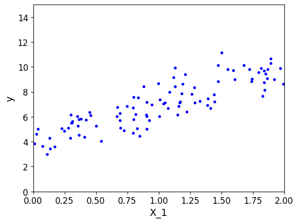

```python
X
```

```
array([[0.02270729],
       [0.93732128],
       [0.11260655],
       [0.23763583],
       [0.23505249],
       [1.2984206 ],
       [1.49208976],
       [1.16673753],
       [1.9243451 ],
       [0.74974116],
       [0.57142417],
       [1.73719826],
       [0.44719168],
       [1.92644508],
       [0.02430895],
       [1.93975765],
       [0.08631982],
       [1.78228623],
       [1.05540222],
       [1.98592959],
       [0.14759313],
       [1.10770857],
       [1.93860507],
       [1.04619569],
       [1.25879728],
       [1.39149738],
       [0.90908213],
       [1.25511616],
       [1.16862862],
       [1.80231602],
       [0.09089276],
       [0.56192638],
       [1.90082297],
       [1.78052757],
       [0.91131351],
       [1.2402652 ],
       [0.55476237],
       [0.37624232],
       [0.92739681],
       [0.70670446],
       [1.16731222],
       [0.15546927],
       [1.94878962],
       [1.97242149],
       [1.39632343],
       [1.07219273],
       [0.61905523],
       [1.62759004],
       [1.36946235],
       [0.32523388],
       [1.82185437],
       [1.64507449],
       [1.89959983],
       [1.45143902],
       [1.22683039],
       [0.83648607],
       [1.86545697],
       [1.73212778],
       [0.09043734],
       [0.05273395],
       [0.75292673],
       [1.62110666],
       [1.97455226],
       [0.30083378],
       [1.18826143],
       [0.76178171],
       [1.9398288 ],
       [1.68423785],
       [1.67665741],
       [0.93738632],
       [0.829639  ],
       [0.54681414],
       [0.11275099],
       [1.72944475],
       [1.62580202],
       [1.99943535],
       [1.99327367],
       [1.11086341],
       [1.53797483],
       [1.88953146],
       [1.69929478],
       [0.4946962 ],
       [0.90108827],
       [0.25831883],
       [1.90810205],
       [1.21234927],
       [0.45728561],
       [1.34340137],
       [1.23625648],
       [0.71632544],
       [0.22711518],
       [1.34314639],
       [1.0406154 ],
       [1.54463678],
       [1.040327  ],
       [1.704363  ],
       [1.10381368],
       [1.12187594],
       [1.75330721],
       [0.80696573]])
```

```python
X_b = np.c_[np.ones((100,1)),X]
theta_best = np.linalg.inv(X_b.T.dot(X_b)).dot(X_b.T).dot(y)
```

```python
X_b
```

```
array([[1.        , 0.02270729],
       [1.        , 0.93732128],
       [1.        , 0.11260655],
       [1.        , 0.23763583],
       [1.        , 0.23505249],
       [1.        , 1.2984206 ],
       [1.        , 1.49208976],
       [1.        , 1.16673753],
       [1.        , 1.9243451 ],
       [1.        , 0.74974116],
       [1.        , 0.57142417],
       [1.        , 1.73719826],
       [1.        , 0.44719168],
       [1.        , 1.92644508],
       [1.        , 0.02430895],
       [1.        , 1.93975765],
       [1.        , 0.08631982],
       [1.        , 1.78228623],
       [1.        , 1.05540222],
       [1.        , 1.98592959],
       [1.        , 0.14759313],
       [1.        , 1.10770857],
       [1.        , 1.93860507],
       [1.        , 1.04619569],
       [1.        , 1.25879728],
       [1.        , 1.39149738],
       [1.        , 0.90908213],
       [1.        , 1.25511616],
       [1.        , 1.16862862],
       [1.        , 1.80231602],
       [1.        , 0.09089276],
       [1.        , 0.56192638],
       [1.        , 1.90082297],
       [1.        , 1.78052757],
       [1.        , 0.91131351],
       [1.        , 1.2402652 ],
       [1.        , 0.55476237],
       [1.        , 0.37624232],
       [1.        , 0.92739681],
       [1.        , 0.70670446],
       [1.        , 1.16731222],
       [1.        , 0.15546927],
       [1.        , 1.94878962],
       [1.        , 1.97242149],
       [1.        , 1.39632343],
       [1.        , 1.07219273],
       [1.        , 0.61905523],
       [1.        , 1.62759004],
       [1.        , 1.36946235],
       [1.        , 0.32523388],
       [1.        , 1.82185437],
       [1.        , 1.64507449],
       [1.        , 1.89959983],
       [1.        , 1.45143902],
       [1.        , 1.22683039],
       [1.        , 0.83648607],
       [1.        , 1.86545697],
       [1.        , 1.73212778],
       [1.        , 0.09043734],
       [1.        , 0.05273395],
       [1.        , 0.75292673],
       [1.        , 1.62110666],
       [1.        , 1.97455226],
       [1.        , 0.30083378],
       [1.        , 1.18826143],
       [1.        , 0.76178171],
       [1.        , 1.9398288 ],
       [1.        , 1.68423785],
       [1.        , 1.67665741],
       [1.        , 0.93738632],
       [1.        , 0.829639  ],
       [1.        , 0.54681414],
       [1.        , 0.11275099],
       [1.        , 1.72944475],
       [1.        , 1.62580202],
       [1.        , 1.99943535],
       [1.        , 1.99327367],
       [1.        , 1.11086341],
       [1.        , 1.53797483],
       [1.        , 1.88953146],
       [1.        , 1.69929478],
       [1.        , 0.4946962 ],
       [1.        , 0.90108827],
       [1.        , 0.25831883],
       [1.        , 1.90810205],
       [1.        , 1.21234927],
       [1.        , 0.45728561],
       [1.        , 1.34340137],
       [1.        , 1.23625648],
       [1.        , 0.71632544],
       [1.        , 0.22711518],
       [1.        , 1.34314639],
       [1.        , 1.0406154 ],
       [1.        , 1.54463678],
       [1.        , 1.040327  ],
       [1.        , 1.704363  ],
       [1.        , 1.10381368],
       [1.        , 1.12187594],
       [1.        , 1.75330721],
       [1.        , 0.80696573]])
```

```python
theta_best
```

```
array([[4.0438396 ],
       [2.95340669]])
```

```python
X_new = np.array([[0],[2]])
X_new_b = np.c_[np.ones((2,1)),X_new]
y_predict = X_new_b.dot(theta_best)
y_predict
```

```
array([[4.0438396 ],
       [9.95065299]])
```

```python
plt.plot(X_new,y_predict,'r--')
plt.plot(X,y,'b.')
plt.axis([0,2,0,15])
plt.show()
```

```
<Figure size 640x480 with 1 Axes>
```

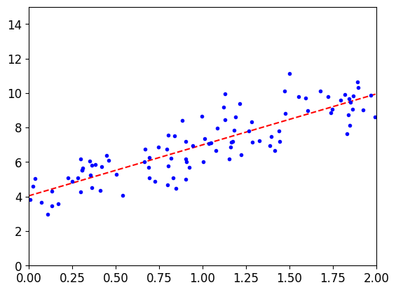

# Sklearn


https://scikit-learn.org/stable/modules/classes.html

```python
from sklearn.linear_model import LinearRegression
lin_reg = LinearRegression()
lin_reg.fit(X,y)
print (lin_reg.coef_)
print (lin_reg.intercept_)
```

```
[[2.95340669]]
[4.0438396]

```

```python
X1=np.array([[1,1],[3,2],[1,2]])

Y1=np.array([[6],[9],[7]])

X_b = np.c_[np.ones((3,1)),X1]

theta_best = np.linalg.inv(X_b.T.dot(X_b)).dot(X_b.T).dot(Y1)

theta_best

```

---

# S5-Logistic Regression-Seminar - Jupyter Notebook

```
import numpy as np\nimport os
%matplotlib inline\nimport matplotlib\nimport matplotlib.pyplot as plt
plt.rcParams['axes.labelsize'] = 14
plt.rcParams['xtick.labelsize'] = 12
plt.rcParams['ytick.labelsize'] = 12\nimport warnings
warnings.filterwarnings('ignore')
np.random.seed(42)
```

# 1 Sigmoid:

```
In [4]:
    t = np.linspace(-10, 10, 100)
    sig = 1 / (1 + np.exp(-t))
    plt.figure(figsize=(9, 3))
    plt.plot([-10, 10], [0, 0], "k-")
    plt.plot([-10, 10], [0.5, 0.5], "k:")
    plt.plot([-10, 10], [1, 1], "k:")
    plt.plot([0, 0], [-1.1, 1.1], "k-")
    plt.plot(t, sig, "b-", linewidth=2, label=r"$\sigma(t) = \frac{1}{1 + e^{-t}}$")
    plt.xlabel("t")
    plt.legend(loc="upper left", fontsize=20)
    plt.axis([-10, 10, -0.1, 1.1])
    plt.title('Figure. Logistic function')
    plt.show()
```

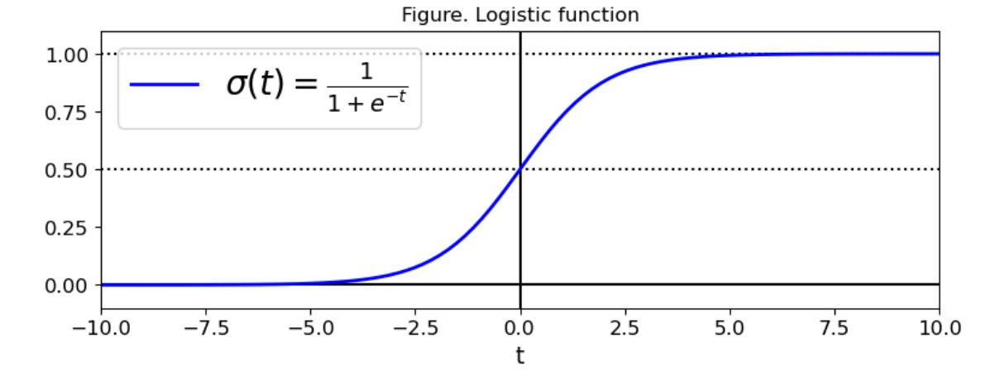

### 2 Iris flower data set:

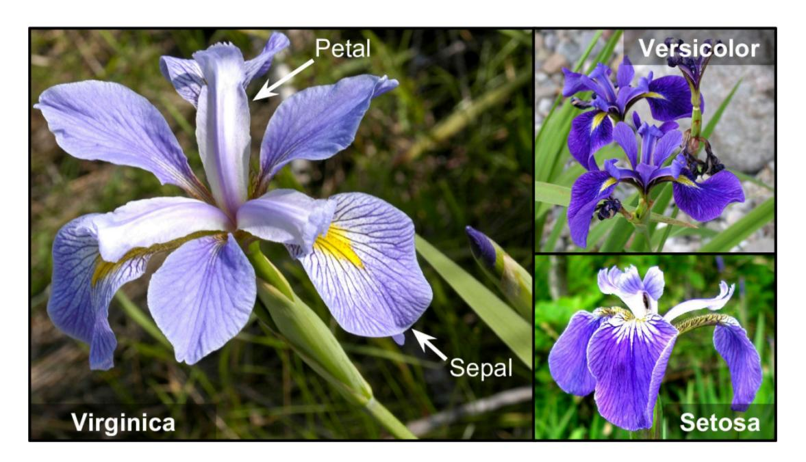

## 3 Load the sklearn built-in dataset

```
In [6]:
```

In [76]: print (iris. DESCR)

.. iris dataset:

Iris plants dataset

\_\_\_\_\_

\*\*Data Set Characteristics:\*\*

:Number of Instances: 150 (50 in each of three classes)

:Number of Attributes: 4 numeric, predictive attributes and the class

:Attribute Information:

- sepal length in cm
- sepal width in cm
- petal length in cm
- petal width in cm
- class:
  - Iris-Setosa
  - Iris-Versicolour
  - Iris-Virginica

#### :Summary Statistics:

| ==========    | ==== | ==== | ====== | ===== | ========  |              |
|---------------|------|------|--------|-------|-----------|--------------|
|               | Min  | Max  | Mean   | SD    | Class Cor | relation<br> |
|               |      |      |        |       |           |              |
| sepal length: | 4.3  | 7.9  | 5.84   | 0.83  | 0. 7826   |              |
| sepal width:  | 2.0  | 4.4  | 3.05   | 0.43  | -0.4194   |              |
| petal length: | 1.0  | 6.9  | 3.76   | 1.76  | 0. 9490   | (high!)      |
| petal width:  | 0.1  | 2.5  | 1.20   | 0.76  | 0. 9565   | (high!)      |
| ===========   | ==== | ==== | ====== | ===== | ========  |              |

:Missing Attribute Values: None

:Class Distribution: 33.3% for each of 3 classes.

:Creator: R.A. Fisher

:Donor: Michael Marshall (MARSHALL%PLU@io.arc.nasa.gov)

:Date: July, 1988

The famous Iris database, first used by Sir R.A. Fisher. The dataset is taken from Fisher's paper. Note that it's the same as in R, but not as in the UCI Machine Learning Repository, which has two wrong data points.

This is perhaps the best known database to be found in the pattern recognition literature. Fisher's paper is a classic in the field and is referenced frequently to this day. (See Duda & Hart, for example.) The data set contains 3 classes of 50 instances each, where each class refers to a type of iris plant. One class is linearly separable from the other 2; the latter are NOT linearly separable from each other.

#### .. topic:: References

- Fisher, R.A. "The use of multiple measurements in taxonomic problems" Annual Eugenics, 7, Part II, 179-188 (1936); also in "Contributions to Mathematical Statistics" (John Wiley, NY, 1950).
- Duda, R.O., & Hart, P.E. (1973) Pattern Classification and Scene Analysis. (Q327.D83) John Wiley & Sons. ISBN 0-471-22361-1. See page 218.
- Dasarathy, B.V. (1980) "Nosing Around the Neighborhood: A New System Structure and Classification Rule for Recognition in Partially Exposed Environments". IEEE Transactions on Pattern Analysis and Machine Intelligence, Vol. PAMI-2, No. 1, 67-71.
- Gates, G.W. (1972) "The Reduced Nearest Neighbor Rule". IEEE Transactions on Information Theory, May 1972, 431-433.
- See also: 1988 MLC Proceedings, 54-64. Cheeseman et al"s AUTOCLASS II

```
conceptual clustering system finds 3 classes in the data. – Many, many more \dots
```

For traditional logistic regression, multiple transformations are required for tags that belong to the current class as 1 and other classes as 0

```
X = iris['data'][:,3:]
  [77]:
           y = (iris['target'] == 2).astype(np.int)
  [78]:
In
Out[78]: array([0, 0, 0, 0, 0, 0, 0, 0, 0, 0, 0, 0, 0, 0
                                                            0,
                                                               0,
                0, 0, 0, 0, 0, 0, 0, 0, 0, 0, 0, 0, 0, 0
                0, 0, 0, 0, 0, 0, 0, 0, 0, 0, 0, 0, 0, 0
                0, 0, 0, 0, 0, 0, 0, 0, 0, 0, 0, 0, 0, 0
                0, 0, 0, 0, 0, 0, 0, 0, 0, 0, 0, 1, 1, 1, 1, 1, 1, 1, 1, 1, 1,
                1, 1, 1, 1, 1, 1, 1, 1, 1, 1, 1, 1, 1, 1
                1, 1, 1, 1, 1, 1, 1, 1, 1, 1, 1, 1, 1, 1
  [79]:
           from sklearn. linear model import LogisticRegression
           log res = LogisticRegression()
           log_res.fit(X, y)
Out[79]: LogisticRegression(C=1.0, class weight=None, dual=False, fit intercept=True,
                   intercept scaling=1, max iter=100, multi class='warn',
                   n_jobs=None, penalty='12', random_state=None, solver='warn',
                   tol=0.0001, verbose=0, warm_start=False)
   [80]:
           X_{new} = np. linspace(0, 3, 1000). reshape(-1, 1)
In
           y proba = log res.predict proba(X new)
  [81]:
Τn
           y proba
Out[81]: array([[0.98554411, 0.01445589],
                [0.98543168, 0.01456832],
                [0.98531838, 0.01468162],
                . . . .
                [0.02618938, 0.97381062],
                [0.02598963, 0.97401037],
                [0.02579136, 0.97420864]])
```

As the input feature value changes, the resulting probability value also changes

```
In [101]: plt.figure(figsize=(12,5))
    decision_boundary = X_new[y_proba[:,1]>=0.5][0]
    plt.plot([decision_boundary, decision_boundary], [-1,2], 'k:', linewidth = 2)
    plt.plot(X_new, y_proba[:,1], 'g-', label = 'Iris-Virginica')
    plt.plot(X_new, y_proba[:,0], 'b--', label = 'Not Iris-Virginica')
    plt.arrow(decision_boundary, 0.08, -0.3, 0, head_width = 0.05, head_length=0.1, fc='b',
    plt.arrow(decision_boundary, 0.92, 0.3, 0, head_width = 0.05, head_length=0.1, fc='g', eplt.text(decision_boundary+0.02, 0.15, 'Decision Boundary', fontsize = 16, color = 'k'
    plt.xlabel('Peta width(cm)', fontsize = 16)
    plt.ylabel('y_proba', fontsize = 16)
    plt.axis([0,3,-0.02,1.02])
    plt.legend(loc = 'center left', fontsize = 16)
```

Out[101]: <matplotlib.legend.Legend at 0x218faa8e358>

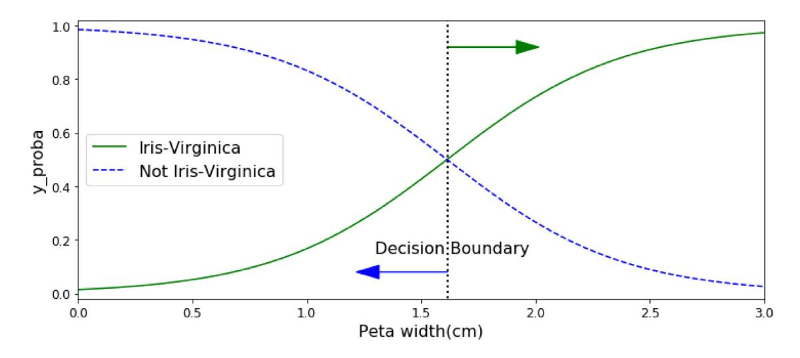

```
In [86]:
```

---

# S6-Evaluation Method of ML

```python
from sklearn.metrics import mean_squared_error, mean_absolute_error, r2_score  
import numpy as np  
  
# Assume that y_true is the true continuous value and y_pred is the continuous value predicted by the model  
y_true = np.array([3.0, -0.5, 2.0, 7.0, 4.5])  
y_pred = np.array([2.5, 0.0, 2.0, 8.0, 4.0])  
  
# MSE  
mse = mean_squared_error(y_true, y_pred)  
print(f"MSE: {mse}")  
  
# RMSE  
rmse = np.sqrt(mse)  
print(f"RMSE: {rmse}")  
  
# MAE  
mae = mean_absolute_error(y_true, y_pred)  
print(f"MAE: {mae}")  
  
#  R² 
r2 = r2_score(y_true, y_pred)  
print(f"R² Score: {r2}")
```

```
MSE: 0.35
RMSE: 0.5916079783099616
MAE: 0.5
R² Score: 0.9440894568690096

```

```python
from sklearn.metrics import confusion_matrix, classification_report, accuracy_score, precision_score, recall_score, f1_score  
  
# Suppose that y_true is the true category label and y_pred is the category label predicted by the model  
y_true = [1, 0, 1, 1, 0, 1, 0, 0, 1, 0, 1, 0, 1, 0, 0, 1, 0, 1, 0, 0, 1, 1, 0, 1, 0, 1, 1, 0, 0, 1, 0, 0, 1]  
y_pred = [1, 1, 1, 0, 0, 1, 0, 0, 1, 0, 1, 1, 1, 0, 0, 1, 0, 1, 1, 0, 1, 1, 0, 1, 1, 1, 1, 0, 0, 0, 0, 0, 1]  
  

```

```python
#  confusion matrix

cm = confusion_matrix(y_true, y_pred)  
print("confusion matrix:")  
print(cm) 
```

```
confusion matrix:
[[13  4]
 [ 2 14]]

```

```python
#  accuracy

acccy = accuracy_score(y_true, y_pred)  
print("accuracy:", accuracy)  
```

```
accuracy: 0.8181818181818182

```

```python
# precision  
precision = precision_score(y_true, y_pred)  
print("precision:", precision)  
```

```
precision: 0.7777777777777778

```

```python
# recall  
recall = recall_score(y_true, y_pred)  
print("recall:", recall)  
```

```
recall: 0.875

```

```python
# Print classification reports, including accuracy, accuracy, recall and F1 scores
report = classification_report(y_true, y_pred)  
print("classification reports:")  
print(report)
```

```
classification reports:
              precision    recall  f1-score   support

           0       0.87      0.76      0.81        17
           1       0.78      0.88      0.82        16

    accuracy                           0.82        33
   macro avg       0.82      0.82      0.82        33
weighted avg       0.82      0.82      0.82        33


```

---

# S8-Clustering

```python
import numpy as np
import os
%matplotlib inline
import matplotlib
import matplotlib.pyplot as plt
plt.rcParams['axes.labelsize'] = 14
plt.rcParams['xtick.labelsize'] = 12
plt.rcParams['ytick.labelsize'] = 12
import warnings
warnings.filterwarnings('ignore')
np.random.seed(42)
```

### Kmeans

```python
from sklearn.datasets import make_blobs

blob_centers = np.array(
    [[0.2,2.3],
     [-1.5,2.3],
     [-2.8,1.8],
     [-2.8,2.8],
     [-2.8,1.3]])

blob_std =np.array([0.4,0.3,0.1,0.1,0.1]) 
```

```python
X,y = make_blobs(n_samples=2000,centers=blob_centers,
                     cluster_std = blob_std,random_state=7)
```

```python
def plot_clusters(X, y=None):
    plt.scatter(X[:, 0], X[:, 1], c=y, s=1)
    plt.xlabel("$x_1$", fontsize=14)
    plt.ylabel("$x_2$", fontsize=14, rotation=0)
plt.figure(figsize=(8, 4))
plot_clusters(X)
plt.show()
```

```
<Figure size 576x288 with 1 Axes>
```

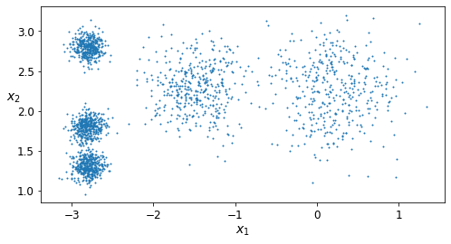

### Decision Boundary

```python
from sklearn.cluster import KMeans
k = 5
kmeans = KMeans(n_clusters = k,random_state=42)
y_pred =  kmeans.fit_predict(X)
```

```python
X.shape
```

```
array([[-2.69823941,  1.3454702 ],
       [-2.87459835,  1.8097575 ],
       [ 0.96077126,  1.17046777],
       ...,
       [-2.80303543,  2.72948115],
       [ 0.24057359,  2.40103109],
       [-2.63807768,  1.95621065]])
```

```python
X
```

```
array([[-2.69823941,  1.3454702 ],
       [-2.87459835,  1.8097575 ],
       [ 0.96077126,  1.17046777],
       ...,
       [-2.80303543,  2.72948115],
       [ 0.24057359,  2.40103109],
       [-2.63807768,  1.95621065]])
```

fit_predict(X) is consistent with the predicted result obtained by kmeans.labels_

```python
y_pred
```

```
array([4, 0, 1, ..., 2, 1, 0])
```

```python
kmeans.labels_ 
```

```
array([4, 0, 1, ..., 2, 1, 0])
```

```python
kmeans.cluster_centers_
```

```
array([[-2.80389616,  1.80117999],
       [ 0.20876306,  2.25551336],
       [-2.79290307,  2.79641063],
       [-1.46679593,  2.28585348],
       [-2.80037642,  1.30082566]])
```

```python
X_new = np.array([[0,2],[3,2],[-3,3],[-3,2.5]])
kmeans.predict(X_new)
```

```
array([1, 1, 2, 2])
```

```python
kmeans.transform(X_new)
```

```
array([[2.81093633, 0.32995317, 2.9042344 , 1.49439034, 2.88633901],
       [5.80730058, 2.80290755, 5.84739223, 4.4759332 , 5.84236351],
       [1.21475352, 3.29399768, 0.29040966, 1.69136631, 1.71086031],
       [0.72581411, 3.21806371, 0.36159148, 1.54808703, 1.21567622]])
```

```python
def plot_data(X):
    plt.plot(X[:, 0], X[:, 1], 'k.', markersize=2)

def plot_centroids(centroids, weights=None, circle_color='w', cross_color='k'):
    if weights is not None:
        centroids = centroids[weights > weights.max() / 10]
    plt.scatter(centroids[:, 0], centroids[:, 1],
                marker='o', s=30, linewidths=8,
                color=circle_color, zorder=10, alpha=0.9)
    plt.scatter(centroids[:, 0], centroids[:, 1],
                marker='x', s=50, linewidths=50,
                color=cross_color, zorder=11, alpha=1)

def plot_decision_boundaries(clusterer, X, resolution=1000, show_centroids=True,
                             show_xlabels=True, show_ylabels=True):
    mins = X.min(axis=0) - 0.1
    maxs = X.max(axis=0) + 0.1
    xx, yy = np.meshgrid(np.linspace(mins[0], maxs[0], resolution),
                         np.linspace(mins[1], maxs[1], resolution))
    Z = clusterer.predict(np.c_[xx.ravel(), yy.ravel()])
    Z = Z.reshape(xx.shape)

    plt.contourf(Z, extent=(mins[0], maxs[0], mins[1], maxs[1]),
                cmap="Pastel2")
    plt.contour(Z, extent=(mins[0], maxs[0], mins[1], maxs[1]),
                linewidths=1, colors='k')
    plot_data(X)
    if show_centroids:
        plot_centroids(clusterer.cluster_centers_)

    if show_xlabels:
        plt.xlabel("$x_1$", fontsize=14)
    else:
        plt.tick_params(labelbottom='off')
    if show_ylabels:
        plt.ylabel("$x_2$", fontsize=14, rotation=0)
    else:
        plt.tick_params(labelleft='off')
```

```python
plt.figure(figsize=(8, 4))
plot_decision_boundaries(kmeans, X)
plt.show()
```

```
<Figure size 576x288 with 1 Axes>
```

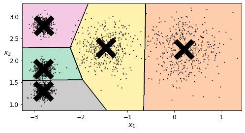

### Procedure

```python
kmeans_iter1 = KMeans(n_clusters = 5,init = 'random',n_init = 1,max_iter=1,random_state=1)
kmeans_iter2 = KMeans(n_clusters = 5,init = 'random',n_init = 1,max_iter=2,random_state=1)
kmeans_iter3 = KMeans(n_clusters = 5,init = 'random',n_init = 1,max_iter=3,random_state=1)

kmeans_iter1.fit(X)
kmeans_iter2.fit(X)
kmeans_iter3.fit(X)
```

```
KMeans(init='random', max_iter=3, n_clusters=5, n_init=1, random_state=1)
```

```python
plt.figure(figsize=(12,8))
plt.subplot(321)
plot_data(X)
plot_centroids(kmeans_iter1.cluster_centers_, circle_color='r', cross_color='k')
plt.title('Update cluster_centers')

plt.subplot(322)
plot_decision_boundaries(kmeans_iter1, X,show_xlabels=False, show_ylabels=False)
plt.title('Label')

plt.subplot(323)
plot_decision_boundaries(kmeans_iter1, X,show_xlabels=False, show_ylabels=False)
plot_centroids(kmeans_iter2.cluster_centers_,)

plt.subplot(324)
plot_decision_boundaries(kmeans_iter2, X,show_xlabels=False, show_ylabels=False)

plt.subplot(325)
plot_decision_boundaries(kmeans_iter2, X,show_xlabels=False, show_ylabels=False)
plot_centroids(kmeans_iter3.cluster_centers_,)

plt.subplot(326)
plot_decision_boundaries(kmeans_iter3, X,show_xlabels=False, show_ylabels=False)

plt.show()


```

```
<Figure size 864x576 with 6 Axes>
```

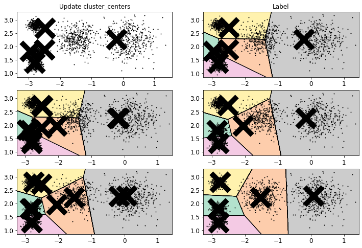

### UNSTABLE RESULTS

```python
def plot_clusterer_comparison(c1,c2,X):
    c1.fit(X)
    c2.fit(X)
    
    plt.figure(figsize=(12,4))
    plt.subplot(121)
    plot_decision_boundaries(c1,X)
    plt.subplot(122)
    plot_decision_boundaries(c2,X)
```

```python
c1 = KMeans(n_clusters = 5,init='random',n_init = 1,random_state=11)
c2 = KMeans(n_clusters = 5,init='random',n_init = 1,random_state=19)
plot_clusterer_comparison(c1,c2,X)

```

```
<Figure size 864x288 with 2 Axes>
```

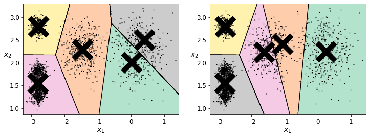

### Evaluation Method
- Inertia: how far each sample is from its center of mass

```python
kmeans.inertia_
```

```
211.5985372581684
```

```python
X_dist = kmeans.transform(X)
```

-transform obtains the distance from the current sample to the center of each cluster

```python
kmeans.transform(X)
```

```
array([[0.46779778, 3.04611916, 1.45402521, 1.54944305, 0.11146795],
       [0.07122059, 3.11541584, 0.99002955, 1.48612753, 0.51431557],
       [3.81713488, 1.32016676, 4.09069201, 2.67154781, 3.76340605],
       ...,
       [0.92830156, 3.04886464, 0.06769209, 1.40795651, 1.42865797],
       [3.10300136, 0.14895409, 3.05913478, 1.71125   , 3.23385668],
       [0.22700281, 2.8625311 , 0.85434589, 1.21678483, 0.67518173]])
```

```python
kmeans.labels_
```

```
array([4, 0, 1, ..., 2, 1, 0])
```

```python
X_dist[np.arange(len(X_dist)),kmeans.labels_]
```

```
array([0.11146795, 0.07122059, 1.32016676, ..., 0.06769209, 0.14895409,
       0.22700281])
```

```python
np.sum(X_dist[np.arange(len(X_dist)),kmeans.labels_]**2)
```

```
211.59853725816856
```

```python
kmeans.score(X)
```

```
-211.59853725816856
```

```python
c1.inertia_
```

```
223.2910857281904
```

```python
c2.inertia_
```

```
237.18985388275024
```

### DBSCAN

```python
from sklearn.datasets import make_moons
X, y = make_moons(n_samples=1000, noise=0.05, random_state=42)
```

```python
plt.plot(X[:,0],X[:,1],'b.')
```

```
[<matplotlib.lines.Line2D at 0x25307d21be0>]
```

```
<Figure size 432x288 with 1 Axes>
```

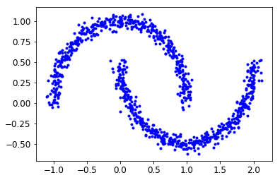

```python
from sklearn.cluster import DBSCAN
dbscan = DBSCAN(eps = 0.05,min_samples=5)
dbscan.fit(X)
```

```
DBSCAN(algorithm='auto', eps=0.05, leaf_size=30, metric='euclidean',
    metric_params=None, min_samples=5, n_jobs=None, p=None)
```

```python
dbscan.labels_[:10]
```

```
array([ 0,  2, -1, -1,  1,  0,  0,  0,  2,  5], dtype=int64)
```

```python
dbscan.core_sample_indices_[:10]
```

```
array([ 0,  4,  5,  6,  7,  8, 10, 11, 12, 13], dtype=int64)
```

```python
np.unique(dbscan.labels_)
```

```
array([-1,  0,  1,  2,  3,  4,  5,  6], dtype=int64)
```

```python
dbscan2 = DBSCAN(eps = 0.2,min_samples=5)
dbscan2.fit(X)
```

```
DBSCAN(algorithm='auto', eps=0.2, leaf_size=30, metric='euclidean',
    metric_params=None, min_samples=5, n_jobs=None, p=None)
```

```python
def plot_dbscan(dbscan, X, size, show_xlabels=True, show_ylabels=True):
    core_mask = np.zeros_like(dbscan.labels_, dtype=bool)
    core_mask[dbscan.core_sample_indices_] = True
    anomalies_mask = dbscan.labels_ == -1
    non_core_mask = ~(core_mask | anomalies_mask)

    cores = dbscan.components_
    anomalies = X[anomalies_mask]
    non_cores = X[non_core_mask]
    
    plt.scatter(cores[:, 0], cores[:, 1],
                c=dbscan.labels_[core_mask], marker='o', s=size, cmap="Paired")
    plt.scatter(cores[:, 0], cores[:, 1], marker='*', s=20, c=dbscan.labels_[core_mask])
    plt.scatter(anomalies[:, 0], anomalies[:, 1],
                c="r", marker="x", s=100)
    plt.scatter(non_cores[:, 0], non_cores[:, 1], c=dbscan.labels_[non_core_mask], marker=".")
    if show_xlabels:
        plt.xlabel("$x_1$", fontsize=14)
    else:
        plt.tick_params(labelbottom='off')
    if show_ylabels:
        plt.ylabel("$x_2$", fontsize=14, rotation=0)
    else:
        plt.tick_params(labelleft='off')
    plt.title("eps={:.2f}, min_samples={}".format(dbscan.eps, dbscan.min_samples), fontsize=14)
```

```python
plt.figure(figsize=(9, 3.2))

plt.subplot(121)
plot_dbscan(dbscan, X, size=100)

plt.subplot(122)
plot_dbscan(dbscan2, X, size=600, show_ylabels=False)

plt.show()
```

```
<Figure size 648x230.4 with 2 Axes>
```

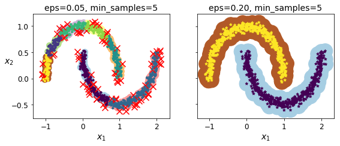